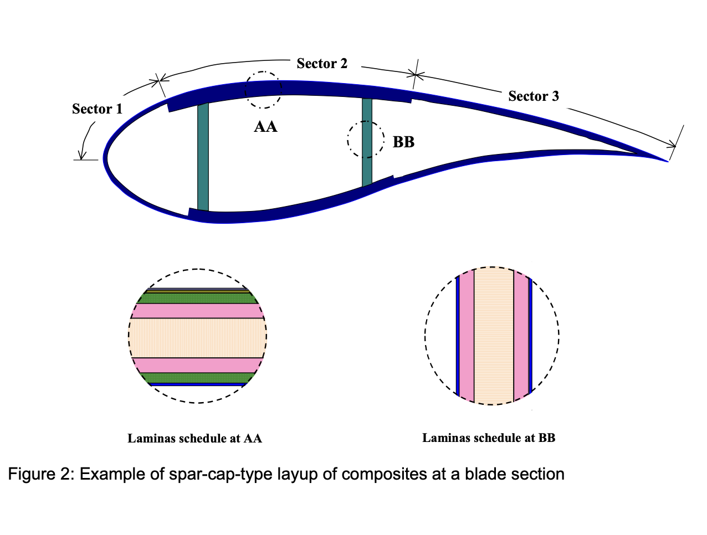
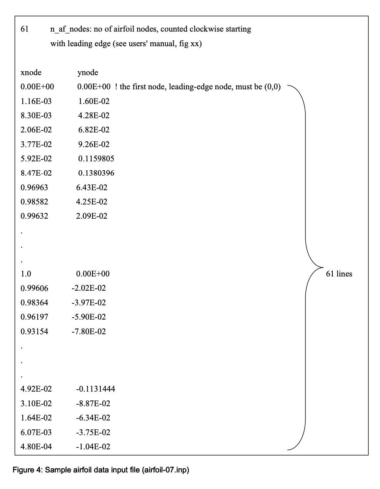
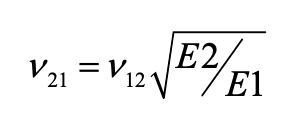
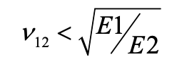
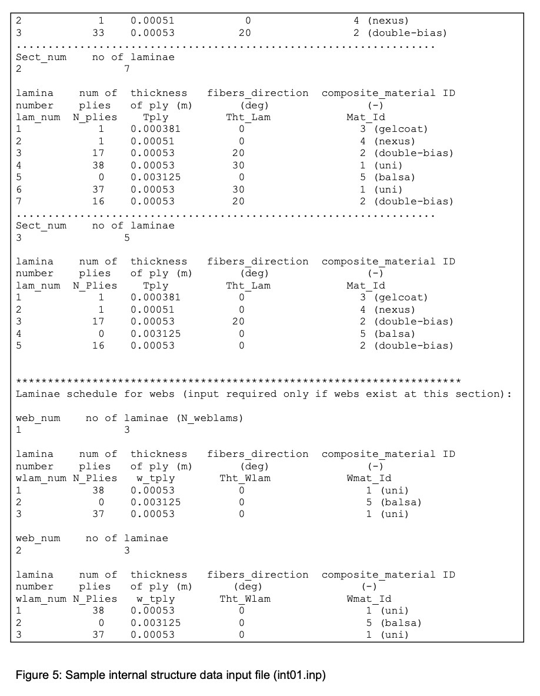
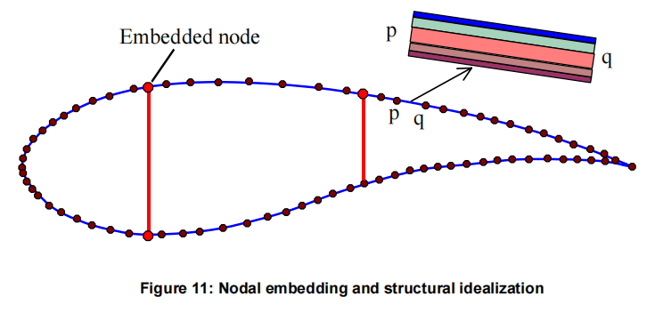
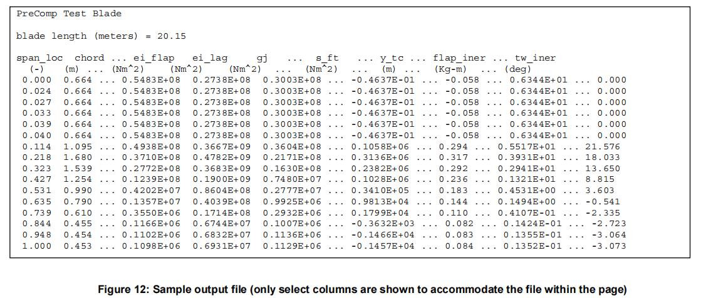

指南适用于 HawtC2.PCS
=====================

这份指南详细说明了内部接口、输入、输出和假设，这些内容适用于当前代码。同时，也保留了旧版文件的输入输出方法，具体细节在测试脚本中有说明，包括如何使用文件输入输出方式执行Charp版本的precomp。然而，当与其他代码耦合时，推荐使用直接调用方法.HawtC2.PCS 是 PreComp 的更新版本,支持了HawtC.MoptL 当中的多目标优化算法,以实现复合材料叶片气动-铺层结构耦合设计.

---

**用户指南：HawtC2.PCS**

PreComp 用户指南 作者：（用于计算复合材料叶片性能的预处理器）

Gunjit S. Bir

2005 年 9 月

国家可再生能源实验室，1617，Cole Blvd，Golden，CO 80401

赵子祯

2025年3月15日

南京航空航天大学,江苏省风力机设计高技术重点实验室(修改代码,重新发行)

关于本指南
----------

本指南解释了使用 HawtC2.PCS 进行数据准备和执行，该代码旨在为复合材料叶片提供跨跨度的结构特性。HawtC2.PCS 采用一种新颖的方法计算这些特性，该方法结合了改进的经典层板理论和剪流方法。计算的特性包括交联刚度特性、惯性特性，以及叶片剪切中心、拉伸中心和质量中心相对于叶片俯仰轴的偏移。这些特性是分析人员正确建模风力涡轮机主要柔性部件（叶片、塔架和传动轴所需）的必需数据。几乎所有空气弹性代码（如 FAST、ADAMS、BLADED 等）都需要将这些特性作为输入。设计人员需要这些特性以快速评估备选复合材料布局及其对叶片特性和材料应变的影响。结构特性很难从三维有限元模型（FEMs）中提取，因为这些模型主要适用于获取详细的应力和位移分布。这类模型需要时间和精力来开发，通常用于最终设计阶段。

HawtC2.PCS 的突出特点是精确计算叶片的扭转刚度和交叉刚度属性。如果使用非均质（不平衡）的复合材料层压布局，将产生交叉刚度属性（挥舞-扭转、拖曳-扭转、挥舞-拖曳、轴向-扭转、挥舞-轴向和拖曳-轴向刚度）。这些属性会耦合叶片的挥舞、拖曳、轴向和扭转运动，并能显著影响风机的性能、载荷和气动弹性稳定性。对于针对风机载荷需求定制复合材料以提高性能的风电行业成员来说，精确估算交叉刚度属性至关重要。即使使用三维有限元方法，计算扭转刚度和交叉刚度属性也可能非常复杂。因此，我们将修正的经典层压理论与剪切流方法相结合，以可靠地计算这些属性。

HawtC2.PCS 要求输入叶片外部形状和复合材料层内部铺设方式。外部形状通过叶片沿线的弦长、扭转角和翼型几何变化来指定。内部结构铺设通过复合层的铺设方式、每层纤维的取向以及复合层的组成属性来指定。该代码支持复合材料层的通用铺设方式，包括翼展方向和弦向铺设，以及任意数量的 web。

本指南提供了有关如何准备输入文件（指定叶片外部几何形状和复合材料层压板的内部结构铺层）、如何执行代码以及如何解释输出属性的逐步说明。HawtC2.PCS 执行广泛的检查以确保输入数据的完整性、范围和可行性；这些内容也在本手册中进行了讨论。代码运行速度极快，通常只需不到一秒，并且仅需对叶片中通常使用的复合材料和层压板安排具有适度的知识。

**文档修订记录**

<table data-immersive-translate-walked="bc54f245-682c-4cd4-b972-7958b422ad0a"><thead data-immersive-translate-walked="bc54f245-682c-4cd4-b972-7958b422ad0a"><tr data-immersive-translate-walked="bc54f245-682c-4cd4-b972-7958b422ad0a"><th data-immersive-translate-walked="bc54f245-682c-4cd4-b972-7958b422ad0a"><strong data-immersive-translate-walked="bc54f245-682c-4cd4-b972-7958b422ad0a" data-immersive-translate-paragraph="1"> 修订</strong></th><th data-immersive-translate-walked="bc54f245-682c-4cd4-b972-7958b422ad0a"><strong data-immersive-translate-walked="bc54f245-682c-4cd4-b972-7958b422ad0a" data-immersive-translate-paragraph="1"> 日期</strong></th><th data-immersive-translate-walked="bc54f245-682c-4cd4-b972-7958b422ad0a"><strong data-immersive-translate-walked="bc54f245-682c-4cd4-b972-7958b422ad0a" data-immersive-translate-paragraph="1"> 描述</strong></th></tr></thead><tbody data-immersive-translate-walked="bc54f245-682c-4cd4-b972-7958b422ad0a"><tr data-immersive-translate-walked="bc54f245-682c-4cd4-b972-7958b422ad0a"><td>1.00</td><td>15-3-2025</td><td data-immersive-translate-walked="bc54f245-682c-4cd4-b972-7958b422ad0a" data-immersive-translate-paragraph="1"> 改进的 HawtC2.PCS 用于更准确地分析特性。在手册中包含关于剪切中心计算的注释。支持 HawtC2.PCS v1.0.000</td></tr></tbody></table>

简介
----

HawtC2.PCS（用于计算复合材料叶片结构特性的预处理器）被开发用于计算复合材料叶片的刚度和惯性特性。通过将金属叶片视为各向同性复合材料的一种特殊情况，该代码也可用于计算金属叶片的结构特性。所有风力涡轮机气动弹性代码（如 FAST\[1\]和 ADAMS\[2,3\]）都需要这些特性来模拟主要的柔性部件——叶片、塔架和传动轴。这些特性列在表 1 中，并且通常沿叶片的翼展方向变化。HawtC2.PCS 的一个显著特点是能够精确计算扭转刚度和交叉刚度特性。如果使用各向异性（非平衡）铺层的复合材料层压板，则会出现交叉刚度特性（如挥舞-扭转、摆振-扭转、轴向-扭转、挥舞-轴向、挥舞-摆振和摆振-轴向刚度）。这些特性耦合了叶片的挥舞、摆振、轴向和扭转运动，并且可能会对涡轮机性能、载荷和气动弹性稳定性产生重要影响。 对交叉刚度属性的准确估计引起了风能行业成员的兴趣，他们通过调整复合材料来减轻涡轮负载并提升性能。复合材料的调整涉及层板的各向异性铺设，并导致桨叶拉伸、弯曲和扭转的耦合。图 1 展示了这一概念的一个例子；由于材料在拍动与扭转位移之间的耦合，桨叶在向上拍动时会出现向下扭转的现象。

**表 1 叶片结构特性所需的气动弹性建模**

<table data-immersive-translate-walked="bc54f245-682c-4cd4-b972-7958b422ad0a"><thead data-immersive-translate-walked="bc54f245-682c-4cd4-b972-7958b422ad0a"><tr data-immersive-translate-walked="bc54f245-682c-4cd4-b972-7958b422ad0a"><th data-immersive-translate-walked="bc54f245-682c-4cd4-b972-7958b422ad0a"><strong data-immersive-translate-walked="bc54f245-682c-4cd4-b972-7958b422ad0a" data-immersive-translate-paragraph="1"> 属性类别</strong></th><th data-immersive-translate-walked="bc54f245-682c-4cd4-b972-7958b422ad0a"><strong data-immersive-translate-walked="bc54f245-682c-4cd4-b972-7958b422ad0a" data-immersive-translate-paragraph="1"> 截面属性</strong></th></tr></thead><tbody data-immersive-translate-walked="bc54f245-682c-4cd4-b972-7958b422ad0a"><tr data-immersive-translate-walked="bc54f245-682c-4cd4-b972-7958b422ad0a"><td data-immersive-translate-walked="bc54f245-682c-4cd4-b972-7958b422ad0a" data-immersive-translate-paragraph="1"> 直接刚度</td><td data-immersive-translate-walked="bc54f245-682c-4cd4-b972-7958b422ad0a" data-immersive-translate-paragraph="1"> 振幅、滞后（横向）、轴向和扭转刚度</td></tr><tr data-immersive-translate-walked="bc54f245-682c-4cd4-b972-7958b422ad0a"><td data-immersive-translate-walked="bc54f245-682c-4cd4-b972-7958b422ad0a" data-immersive-translate-paragraph="1"> 交叉耦合刚度</td><td data-immersive-translate-walked="bc54f245-682c-4cd4-b972-7958b422ad0a" data-immersive-translate-paragraph="1"> 拍扭、纵扭、拍纵、轴扭、轴拍和轴纵刚度</td></tr><tr data-immersive-translate-walked="bc54f245-682c-4cd4-b972-7958b422ad0a"><td data-immersive-translate-walked="bc54f245-682c-4cd4-b972-7958b422ad0a" data-immersive-translate-paragraph="1"> 主轴</td><td data-immersive-translate-walked="bc54f245-682c-4cd4-b972-7958b422ad0a" data-immersive-translate-paragraph="1"> 惯性和刚度的主轴方向</td></tr><tr data-immersive-translate-walked="bc54f245-682c-4cd4-b972-7958b422ad0a"><td data-immersive-translate-walked="bc54f245-682c-4cd4-b972-7958b422ad0a" data-immersive-translate-paragraph="1"> 惯性</td><td data-immersive-translate-walked="bc54f245-682c-4cd4-b972-7958b422ad0a" data-immersive-translate-paragraph="1"> 质量，绕主轴的质量惯性矩</td></tr><tr data-immersive-translate-walked="bc54f245-682c-4cd4-b972-7958b422ad0a"><td data-immersive-translate-walked="bc54f245-682c-4cd4-b972-7958b422ad0a" data-immersive-translate-paragraph="1"> 偏移量</td><td data-immersive-translate-walked="bc54f245-682c-4cd4-b972-7958b422ad0a" data-immersive-translate-paragraph="1"> 剪切中心、质量中心和张力中心偏移</td></tr></tbody></table>

有限元技术尽管能够进行精确的应力和位移分析，但不能直接提供这些属性。必须依赖复杂的力-位移数据后处理计算。Blade Properties Extractor (BPE) \[4\] 就是这样一种后处理工具。研究人员尝试使用三维叠层理论直接获得结构属性。然而，这些理论会高估扭转刚度多达 50 至 80 倍，因为翘曲效应难以建模，并对扭转刚度有显著影响。这对于以风力涡轮叶片为代表的不对称截面尤其如此。即使采用三维有限元模型（FEMs），计算扭转刚度和交叉刚度属性也可能非常棘手。我们开发了一种改进的二维模型，并将其与剪流法结合，类似于针对金属叶片的 Bredt-Batho 方法，能够隐含地考虑主要的翘曲效应。HawtC2.PCS 使用这种方法计算扭转刚度、交叉刚度属性以及其他结构属性。 表中列出的结构属性包括几何偏移，例如截面质心与剪切中心的偏移。与导致弹性耦合的横向刚度属性不同，这些偏移引起了叶片弯曲、扭转和轴向运动的动态耦合。

本报告的目标是提供关于数据准备和 HawtC2.PCS 执行的指南。HawtC2.PCS 的输入要求明确叶片外部形状和复合层压板的内部铺层。外部形状以弦长、扭转的变化来明确。

以及沿叶片的翼型几何形状。内部结构层叠的设计是根据层压板的排布表、每个层压板中纤维的方向以及层压板组成材料的属性来指定的。代码允许复合层压板进行一般的层叠设计，包括沿翼展方向和弦向方向，并支持任意数量的腹板。代码使用这些输入数据计算叶片沿用户指定站点（截面）的截面惯性和刚度属性，并以表格形式输出这些数据。

HawtC2.PCS 不应与先前开发的初步叶片设计代码混淆 \[5,6\]，后者同样基于传统层合板理论。前者是一个分析代码，用于提供详细的结构特性；而后者则是一个设计代码，用于提供各种复合材料层板在极端载荷下所需的最终强度和抗屈曲厚度。HawtC2.PCS 是全新开发的，并提供了早期代码中没有的功能：

* 它允许复合材料层板的各向异性铺层，从而导致刚度交联。
* 它允许沿叶片跨度和截面周围的层压板排布进行一般变化。
* 它消除了叶片根部区域附近圆形截面的限制，并允许沿整个叶片长度采用任意截面几何形状。
* 它使用改进的层压板理论计算结构特性。

HawtC2.PCS 并非基于有限元，因此无法像 NuMAD 这样专为复合材料风力发电机叶片开发的复杂三维有限元方法提供详细的载荷-位移或载荷-应力分布\[7\]。然而，它可以直接计算结构特性并快速运行，通常仅需不到一秒的时间。它还消除了对交互式方法的需求，仅需对通常用于叶片的复合材料和层压铺设有适度的了解即可。

HawtC2.PCS 方法用于计算扭转刚度，尽管比文献中建议的其他直接方法更准确，但仍使用了两个假设——薄壁截面和自由翘曲——以使问题在分析上易于处理。虽然薄壁假设并不是一个严重的限制，但显然自由翘曲假设在受限的叶片根部截面附近被违背。我们计划通过正在 Sandia 和 NREL 进行的实验测试数据以及 NuMAD/Ansys 有限元分析数据来验证这些假设的有效性以及整体 HawtC2.PCS 方法的效果。同时，在 HawtC2.PCS 完全验证之前，我们建议谨慎使用。有限的验证研究显示，尤其是对于扭转刚度，HawtC2.PCS 与分析模型（由各向同性材料制成的椭圆形、菱形和矩形截面叶片）之间具有极好的一致性。然而，仍需进行更广泛的验证，并欢迎读者提供任何数据或反馈。另一个需要谨慎的地方：当前版本的 HawtC2.PCS 中的剪力中心计算是近似的。 我们仍在研究是否有意义为具有各向异性铺层的复合材料截面定义剪切中心。如果我们能够提出一个有意义的定义，我们将修改 HawtC2.PCS 以更准确地计算剪切中心。否则，我们将需要将叶片建模为 Timoshenko 梁，并计算完整的 6X6 截面刚度矩阵。

本指南分为七个部分，包括本介绍：

* 第 2 节描述了所使用复合材料层压板的一般结构布局

HawtC2.PCS。理解这种铺层对于准备输入数据至关重要。

* 第 3 节列出了有助于理解适用性的基本假设

以及 HawtC2.PCS 的局限性。

* 第 4 节列出了输入文件的类型并提供了逐步的输入数据说明

准备（指定叶片外部几何形状、内部层压板的结构铺设和材料特性）。

* 第 5 节讨论错误信息和警告。
* 第 6 节展示如何执行代码。
* 第 7 节描述了如何解释 HawtC2.PCS 的输出。
* 第 8 部分以计划升级和验证的讨论总结了报告

研究。

叶片结构铺层
------------

HawtC2.PCS 假设叶片由复合层板制造。大多数现代叶片，特别是大型涡轮叶片，都是以这种方式制造的\[∗\]。对于这样的叶片，无论其层板铺设的复杂性，其横截面显示层板堆叠，其厚度和数量沿截面周边为分段常数。图 1 和图 2 展示了此类铺设。图 1 显示了一种箱型铺设，其中两个腹板，以及上下表面的中间部分，形成一个箱体。图 2 显示了一种翼梁盖型铺设，其中中间部分覆盖两个腹板。

沿截面周边的层板堆叠数量、每个堆叠中的层板数量以及层板的厚度通常沿叶片长度有所变化。每个图显示了两个隔板；然而，HawtC2.PCS 允许包括零在内的任意数量隔板。隔板可以从叶片上的任何截面开始并结束于另一截面。假定每个隔板在各横截面上均为直线并垂直于弦线；其横截面积和复合材料铺层可能沿叶片有所变化。截面处的内部结构铺层因此通过复合材料层板沿截面周边及隔板横截面上的变化来表征。这种铺层通常在不同截面间有所变化。在任何截面，我们假定复合材料结构铺层都在截面外形的约束范围内。截面的外形特征由其弦长和翼型几何形状表征。

其他叶片，例如拉挤叶片，是通过不同的工艺制造的。如果这些叶片沿叶片周边具有分段常厚部分，我们可以将这些部分视为单层材料，并使用 HawtC2.PCS 来计算其属性。

基本假设
--------

HawtC2.PCS 做出了一些假设，理解这些假设将有助于您确定 HawtC2.PCS 的适用性和局限性。它假设：

* 每一片叶片截面都是薄壁、封闭的、多单元截面。这意味着每个单元周围存在恒定的剪切流。图 2 是具有三个单元的此类截面的示例。一般来说，如果我们有 n 个壁板，则应有 n+1 个单元。
* 在任何截面的墙壁中都不存在环向应力。这对于物理考虑来说是一个非常合理的假设。
* 刀刃是直的（没有内置弯曲）。
* 横向剪切可以忽略不计。对于长度远大于横向尺寸（弦长和厚度）的叶片来说，这个假设是相当有效的。
* 叶片截面在截面平面内没有发生变形。这也是一个相当有效的假设，实验结果和有限元模型（FEMs）都证明了这一点。
* 每个叶片截面都可以自由弯曲出其平面。这意味着在整个叶片长度上都是无约束弯曲，这是一种有效的假设，除了在叶片根部附近的区域，在那里弯曲可能受到悬臂边界条件的限制。弯曲受限的影响通常仅限于距根部约一个翼弦长度的范围。靠近根部的圆形截面（这类似于大多数风力涡轮机叶片）不会弯曲，因此不会受到弯曲受限的影响。
* 在任何叶片截面处，腹板与弦线垂直。因此，如果叶片预扭，腹板将随叶片一起扭转。
* 在任意截面，腹板的复合铺层是一层单独的层压板；尽管堆叠可能会在不同截面间变化。大多数叶片都是这样构建的。

输入数据描述
------------

在 HawtC2.PCS 能计算叶片结构特性之前，您需要提供以下信息：

1. 叶片外形的描述，定义为：

* 刀片长度。
* 翼弦和内建空气动力学扭转分布沿叶片。- 横截面翼型几何分布沿叶片。

2. 叶片内部结构层压的描述。此层压必须位于叶片的外形之内，并通过以下方式定义：

* 叶片周围不同层压板的数量。层压板是由不同层的叠加构成的，并通过这些叠加层的数量、顺序和材料来区分。HawtC2.PCS 允许任意数量的这种层压板（上下表面至少各一个）。图 2 显示了上下表面各三个层压板（扇区）。
* 叶片内网格的数量及其放置位置。 - 每个网格的层压时间表。
* 每层材料的主要方向、材料类型和层数。一个层压板由相似的层组成，这些层通常在市场上可以买到。一层材料的特征在于其厚度、材料类型和主要材料方向与叶片轴的方向。

3. 材料表。如#2 中所述，指定内部结构层叠需要识别每层的复合材料。材料直接从与 HawtC2.PCS 代码一起提供的材料表中标识。此表列出了典型复合材料及其属性。您可以向此表添加新的材料及其属性。

这些数据通过四组输入文件提供给 HawtC2.PCS：一个主输入文件、翼型数据文件、内部结构数据文件和材料文件。主输入文件和翼型数据文件帮助描述叶片的外部形状，并指定计算结构特性的叶片段的数量和位置。内部结构数据文件描述用户选择的叶片段的详细复合材料层压结构。这个材料文件在技术上是一个输入文件；它像其他输入文件一样由 HawtC2.PCS 读取。然而，它随 HawtC2.PCS 一起提供，除非您想向其中添加新材料特性，否则无需修改。

所有输入文件（稍后将描述）均以简单文本格式编写，可以使用任何文本编辑器创建或修改。这些文件中的任何一行要么是注释行、空行，要么是 HawtC2.PCS 可读行。注释行有助于理解注释行后面的数据（参见示例输入文件，图 3-5）。尽管可以修改注释行中的文本，但不应添加或删除任何注释行。空行划分数据块并有助于澄清数据组织。与注释行一样，这些也不能添加或删除。可读行有两种格式。它可以是单个值，后跟相关参数名称和该参数的简要说明（名称及其说明不会被 HawtC2.PCS 读取）。或者，可读行可能包含一组由逗号、制表符或空格分隔的值；为了清晰起见，可以插入任意数量的制表符或空格。下面是输入文件的描述。

### 主输入文件

该文件可以有任何名称。一个名为 HawtC2.PCS.pci 的示例主输入文件如图 3 所示。第二行是标题行。HawtC2.PCS 将其读取为字符字符串。您可以插入任何文本（最多 99 个字符）；该文本在输出文件中重复。接下来，我们有一个空行，后面是一个一般信息块。\[表 1\]描述了出现在此数据块中的参数。这些参数以斜体标识。表格的最后一列标识了相关单位。破折号表示无量纲参数。

**表 1. 通用参数**

<table data-immersive-translate-walked="bc54f245-682c-4cd4-b972-7958b422ad0a"><thead data-immersive-translate-walked="bc54f245-682c-4cd4-b972-7958b422ad0a"><tr data-immersive-translate-walked="bc54f245-682c-4cd4-b972-7958b422ad0a"><th data-immersive-translate-walked="bc54f245-682c-4cd4-b972-7958b422ad0a"><strong data-immersive-translate-walked="bc54f245-682c-4cd4-b972-7958b422ad0a" data-immersive-translate-paragraph="1"> 参数</strong></th><th data-immersive-translate-walked="bc54f245-682c-4cd4-b972-7958b422ad0a"><strong data-immersive-translate-walked="bc54f245-682c-4cd4-b972-7958b422ad0a" data-immersive-translate-paragraph="1"> 描述</strong></th><th data-immersive-translate-walked="bc54f245-682c-4cd4-b972-7958b422ad0a"><strong data-immersive-translate-walked="bc54f245-682c-4cd4-b972-7958b422ad0a" data-immersive-translate-paragraph="1"> 单位</strong></th></tr></thead><tbody data-immersive-translate-walked="bc54f245-682c-4cd4-b972-7958b422ad0a"><tr data-immersive-translate-walked="bc54f245-682c-4cd4-b972-7958b422ad0a"><td data-immersive-translate-walked="bc54f245-682c-4cd4-b972-7958b422ad0a"><em data-immersive-translate-walked="bc54f245-682c-4cd4-b972-7958b422ad0a" data-immersive-translate-paragraph="1">Bl_length</em></td><td data-immersive-translate-walked="bc54f245-682c-4cd4-b972-7958b422ad0a" data-immersive-translate-paragraph="1"> 叶片长度，即从叶片与轮毂根部连接处到叶片尖端的距离。它不是转子半径。</td><td data-immersive-translate-walked="bc54f245-682c-4cd4-b972-7958b422ad0a">m</td></tr><tr data-immersive-translate-walked="bc54f245-682c-4cd4-b972-7958b422ad0a"><td data-immersive-translate-walked="bc54f245-682c-4cd4-b972-7958b422ad0a"><em data-immersive-translate-walked="bc54f245-682c-4cd4-b972-7958b422ad0a" data-immersive-translate-paragraph="1">N_sections</em></td><td data-immersive-translate-walked="bc54f245-682c-4cd4-b972-7958b422ad0a" data-immersive-translate-paragraph="1"> HawtC2.PCS 计算结构特性的叶片段数。您可以选择任意数量的截面，并在叶片长度上随意放置（见图 6）。</td><td>-</td></tr><tr data-immersive-translate-walked="bc54f245-682c-4cd4-b972-7958b422ad0a"><td data-immersive-translate-walked="bc54f245-682c-4cd4-b972-7958b422ad0a"><em data-immersive-translate-walked="bc54f245-682c-4cd4-b972-7958b422ad0a" data-immersive-translate-paragraph="1">N_materials</em></td><td data-immersive-translate-walked="bc54f245-682c-4cd4-b972-7958b422ad0a" data-immersive-translate-paragraph="1"> 材料的数量将从材料表中读取其属性，即 materials.inp。应小于或等于表中列出的最大材料数量。在前一种情况下，仅读取前 N_materials 个属性。</td><td>-</td></tr><tr data-immersive-translate-walked="bc54f245-682c-4cd4-b972-7958b422ad0a"><td data-immersive-translate-walked="bc54f245-682c-4cd4-b972-7958b422ad0a"><em data-immersive-translate-walked="bc54f245-682c-4cd4-b972-7958b422ad0a" data-immersive-translate-paragraph="1">Out_format</em></td><td data-immersive-translate-walked="bc54f245-682c-4cd4-b972-7958b422ad0a" data-immersive-translate-paragraph="1"> 整数开关识别输出文件类型。1：生成显示所有由 HawtC2.PCS 计算的属性的输出文件。这些属性指的是图 13 中展示的坐标系（在第[7]节中描述）。2：生成显示 BModes 代码所需选择属性的输出文件。这些属性和相关参考轴系在参考文献[9]中描述。3：生成两个输出文件。</td><td>-</td></tr><tr data-immersive-translate-walked="bc54f245-682c-4cd4-b972-7958b422ad0a"><td data-immersive-translate-walked="bc54f245-682c-4cd4-b972-7958b422ad0a"><em data-immersive-translate-walked="bc54f245-682c-4cd4-b972-7958b422ad0a" data-immersive-translate-paragraph="1">TabDelim</em></td><td data-immersive-translate-walked="bc54f245-682c-4cd4-b972-7958b422ad0a" data-immersive-translate-paragraph="1"> 一个逻辑开关。如果设置为 t 或 true，输出属性将以表格形式打印，并以制表符分隔。这种表格导出到如 Excel 之类的电子表格时，会自动转换为列。如果此开关设置为 f 或 false，输出属性将以表格形式打印，并以空格分隔。这种表格（见图 12）有助于轻松阅读输出属性。在示例输入文件中，此开关设置为 false。</td><td>-</td></tr></tbody></table>

下一输入块用于叶片截面特定数据。数据以六列和 N\_sections 行的格式输入，其中 N\_sections 是上述定义的叶片截面数量。\[表 2\]描述了截面参数，这些参数显示为六列的标题。

最后一个数据块提供了与 web 相关的信息。可以指定任意数量的 web（尽管示例主输入文件仅显示了两个 web）。假设每个 web 都是直的，可以从叶片的任何截面（站）开始，并终止于另一个外侧截面。然而，这些截面必须从通过参数 Span\_loc（在\[表 2\]中描述）之前指定的截面中选择。通常，叶片的构造是所有 web 都始于一个站，并终止于另一个单一站。然而，如果它们起始或终止于不同的站，Ib\_sp\_stn 应该是 web 最内端的位置，Ob\_sp\_stn 则是 web 最外端的位置。这样做的原因将在\[4.3\]节中解释。

**表 2. 叶片截面参数**

<table data-immersive-translate-walked="bc54f245-682c-4cd4-b972-7958b422ad0a"><thead data-immersive-translate-walked="bc54f245-682c-4cd4-b972-7958b422ad0a"><tr data-immersive-translate-walked="bc54f245-682c-4cd4-b972-7958b422ad0a"><th data-immersive-translate-walked="bc54f245-682c-4cd4-b972-7958b422ad0a"><strong data-immersive-translate-walked="bc54f245-682c-4cd4-b972-7958b422ad0a" data-immersive-translate-paragraph="1"> 参数</strong></th><th data-immersive-translate-walked="bc54f245-682c-4cd4-b972-7958b422ad0a"><strong data-immersive-translate-walked="bc54f245-682c-4cd4-b972-7958b422ad0a" data-immersive-translate-paragraph="1"> 描述</strong></th><th data-immersive-translate-walked="bc54f245-682c-4cd4-b972-7958b422ad0a"><strong data-immersive-translate-walked="bc54f245-682c-4cd4-b972-7958b422ad0a" data-immersive-translate-paragraph="1"> 单元</strong></th></tr></thead><tbody data-immersive-translate-walked="bc54f245-682c-4cd4-b972-7958b422ad0a"><tr data-immersive-translate-walked="bc54f245-682c-4cd4-b972-7958b422ad0a"><td data-immersive-translate-walked="bc54f245-682c-4cd4-b972-7958b422ad0a"><em data-immersive-translate-walked="bc54f245-682c-4cd4-b972-7958b422ad0a" data-immersive-translate-paragraph="1">Span_loc</em></td><td data-immersive-translate-walked="bc54f245-682c-4cd4-b972-7958b422ad0a" data-immersive-translate-paragraph="1"> 这是一个带下标的数组。Sloc(i) 是从叶片根部测量并相对于叶片长度标准化的第 i 段跨距位置。第一段总是位于 0.0，最后一段位于 1.0。必须至少指定两个段。</td><td>-</td></tr><tr data-immersive-translate-walked="bc54f245-682c-4cd4-b972-7958b422ad0a"><td data-immersive-translate-walked="bc54f245-682c-4cd4-b972-7958b422ad0a"><em data-immersive-translate-walked="bc54f245-682c-4cd4-b972-7958b422ad0a" data-immersive-translate-paragraph="1">Le_loc</em></td><td data-immersive-translate-walked="bc54f245-682c-4cd4-b972-7958b422ad0a" data-immersive-translate-paragraph="1"> 这是一个带下标的数组。在第 i 部分，le_loc(i)是从叶片参考轴到前缘的距离，这个距离是沿着弦长方向测量并相对于该部分的弦长进行标准化的。参考轴通常选择与叶片的轴向角度轴重合。</td><td>-</td></tr><tr data-immersive-translate-walked="bc54f245-682c-4cd4-b972-7958b422ad0a"><td data-immersive-translate-walked="bc54f245-682c-4cd4-b972-7958b422ad0a"><em data-immersive-translate-walked="bc54f245-682c-4cd4-b972-7958b422ad0a" data-immersive-translate-paragraph="1">Chord</em></td><td data-immersive-translate-walked="bc54f245-682c-4cd4-b972-7958b422ad0a" data-immersive-translate-paragraph="1"> Chord(i) 是第 i 节的弦长，单位为米。</td><td data-immersive-translate-walked="bc54f245-682c-4cd4-b972-7958b422ad0a">m</td></tr><tr data-immersive-translate-walked="bc54f245-682c-4cd4-b972-7958b422ad0a"><td data-immersive-translate-walked="bc54f245-682c-4cd4-b972-7958b422ad0a"><em data-immersive-translate-walked="bc54f245-682c-4cd4-b972-7958b422ad0a" data-immersive-translate-paragraph="1">Tw_aero</em></td><td data-immersive-translate-walked="bc54f245-682c-4cd4-b972-7958b422ad0a" data-immersive-translate-paragraph="1"> Tw_aero(i) 是第 i 个截面处的叶片扭转角度（以度数表示）。它指示了局部截面的弦线相对于轮毂平面的方向（图 13）。正扭转将截面的前缘朝风向移动。</td><td data-immersive-translate-walked="bc54f245-682c-4cd4-b972-7958b422ad0a" data-immersive-translate-paragraph="1"> 度</td></tr><tr data-immersive-translate-walked="bc54f245-682c-4cd4-b972-7958b422ad0a"><td data-immersive-translate-walked="bc54f245-682c-4cd4-b972-7958b422ad0a"><em data-immersive-translate-walked="bc54f245-682c-4cd4-b972-7958b422ad0a" data-immersive-translate-paragraph="1">Af_shape_file</em></td><td data-immersive-translate-walked="bc54f245-682c-4cd4-b972-7958b422ad0a" data-immersive-translate-paragraph="1"> 对于在此输入文件中指定的每个叶片站，您必须提供一个辅助输入文件，该文件描述该站的翼型形状（截面外形）。这样的文件名称可以是最多 99 个字符，并且必须用引号括起来（请参见示例主输入文件）。Af_shape_file(i)代表第 i 个截面的辅助翼型形状输入文件名称。不同的截面可以提供相同的翼型形状输入文件名称。例如，如主输入文件图 3 所示，相同的翼型形状文件名称 af1-6.inp 适用于第 1 至第 6 截面。这意味着这些截面具有相同的外形。我们将在第[4.2]节中解释翼型形状输入文件。</td><td>-</td></tr><tr data-immersive-translate-walked="bc54f245-682c-4cd4-b972-7958b422ad0a"><td data-immersive-translate-walked="bc54f245-682c-4cd4-b972-7958b422ad0a"><em data-immersive-translate-walked="bc54f245-682c-4cd4-b972-7958b422ad0a" data-immersive-translate-paragraph="1">Int_str_file</em></td><td data-immersive-translate-walked="bc54f245-682c-4cd4-b972-7958b422ad0a" data-immersive-translate-paragraph="1"> 对于每个叶片站，你还必须命名一个辅助输入文件，以描述该站的内部结构铺层。这样的文件可以指定任何长度不超过 99 个字符的名称，并且必须用引号括起来。Int_str_file(i)代表第 i 段的内部结构铺层输入文件的名称。不同的段可以使用相同的内部结构输入文件名。例如，如图 3 所示，相同的翼型形状文件名 int01.inp 被用于所有段。这意味着这些段具有相同的复合材料层压内部结构铺层。我们将在[4.3]节中解释内部结构铺层输入文件。</td><td>-</td></tr></tbody></table>

**表 3. 网页参数**

<table data-immersive-translate-walked="bc54f245-682c-4cd4-b972-7958b422ad0a"><thead data-immersive-translate-walked="bc54f245-682c-4cd4-b972-7958b422ad0a"><tr data-immersive-translate-walked="bc54f245-682c-4cd4-b972-7958b422ad0a"><th data-immersive-translate-walked="bc54f245-682c-4cd4-b972-7958b422ad0a"><strong data-immersive-translate-walked="bc54f245-682c-4cd4-b972-7958b422ad0a" data-immersive-translate-paragraph="1"> 参数</strong></th><th data-immersive-translate-walked="bc54f245-682c-4cd4-b972-7958b422ad0a"><strong data-immersive-translate-walked="bc54f245-682c-4cd4-b972-7958b422ad0a" data-immersive-translate-paragraph="1"> 描述</strong></th><th data-immersive-translate-walked="bc54f245-682c-4cd4-b972-7958b422ad0a"><strong data-immersive-translate-walked="bc54f245-682c-4cd4-b972-7958b422ad0a" data-immersive-translate-paragraph="1"> 单元</strong></th></tr></thead><tbody data-immersive-translate-walked="bc54f245-682c-4cd4-b972-7958b422ad0a"><tr data-immersive-translate-walked="bc54f245-682c-4cd4-b972-7958b422ad0a"><td data-immersive-translate-walked="bc54f245-682c-4cd4-b972-7958b422ad0a"><em data-immersive-translate-walked="bc54f245-682c-4cd4-b972-7958b422ad0a" data-immersive-translate-paragraph="1">Nweb</em></td><td data-immersive-translate-walked="bc54f245-682c-4cd4-b972-7958b422ad0a" data-immersive-translate-paragraph="1"> 网的总数。假设每个网在其内侧端和外侧端之间是直的。</td><td>-</td></tr><tr data-immersive-translate-walked="bc54f245-682c-4cd4-b972-7958b422ad0a"><td data-immersive-translate-walked="bc54f245-682c-4cd4-b972-7958b422ad0a"><em data-immersive-translate-walked="bc54f245-682c-4cd4-b972-7958b422ad0a" data-immersive-translate-paragraph="1">Ib_sp_stn</em></td><td data-immersive-translate-walked="bc54f245-682c-4cd4-b972-7958b422ad0a" data-immersive-translate-paragraph="1"> 叶片站位于腹板内侧端的位置。这意味着所有腹板必须始于同一内侧位置。如果腹板始于不同位置，Ib_sp_stn 应是腹板最内端的位置。</td><td>-</td></tr><tr data-immersive-translate-walked="bc54f245-682c-4cd4-b972-7958b422ad0a"><td data-immersive-translate-walked="bc54f245-682c-4cd4-b972-7958b422ad0a"><em data-immersive-translate-walked="bc54f245-682c-4cd4-b972-7958b422ad0a" data-immersive-translate-paragraph="1">Ob_sp_stn</em></td><td data-immersive-translate-walked="bc54f245-682c-4cd4-b972-7958b422ad0a" data-immersive-translate-paragraph="1"> 叶片站，位于腹板的外板端。这意味着所有腹板必须终止于相同的外板位置。如果腹板在不同位置终止，Ob_sp_stn 应该是腹板最外端的位置。</td><td>-</td></tr><tr data-immersive-translate-walked="bc54f245-682c-4cd4-b972-7958b422ad0a"><td data-immersive-translate-walked="bc54f245-682c-4cd4-b972-7958b422ad0a"><em data-immersive-translate-walked="bc54f245-682c-4cd4-b972-7958b422ad0a" data-immersive-translate-paragraph="1">Web_num</em></td><td data-immersive-translate-walked="bc54f245-682c-4cd4-b972-7958b422ad0a" data-immersive-translate-paragraph="1"> 网页编号。</td><td>-</td></tr><tr data-immersive-translate-walked="bc54f245-682c-4cd4-b972-7958b422ad0a"><td data-immersive-translate-walked="bc54f245-682c-4cd4-b972-7958b422ad0a"><em data-immersive-translate-walked="bc54f245-682c-4cd4-b972-7958b422ad0a" data-immersive-translate-paragraph="1">Inb_end_ch_loc</em></td><td data-immersive-translate-walked="bc54f245-682c-4cd4-b972-7958b422ad0a" data-immersive-translate-paragraph="1"> inb_end_ch_loc(i) 这个有下标的变量定义了在早先指定的机翼内侧叶片站点 ib_sp_stn 处第 i 个肋板在弦向的位置信息。这个弦向位置是从前缘开始测量的，并且相对于弦长进行了归一化。</td><td>-</td></tr><tr data-immersive-translate-walked="bc54f245-682c-4cd4-b972-7958b422ad0a"><td data-immersive-translate-walked="bc54f245-682c-4cd4-b972-7958b422ad0a"><em data-immersive-translate-walked="bc54f245-682c-4cd4-b972-7958b422ad0a" data-immersive-translate-paragraph="1">Oub_end_ch_loc</em></td><td data-immersive-translate-walked="bc54f245-682c-4cd4-b972-7958b422ad0a" data-immersive-translate-paragraph="1"> 此带下标的变量 oub_end_ch_loc(i)定义了在前面指定的外翼叶片站点 ob_sp_stn 中第 i 根肋条的弦向位置。这个弦向位置是从前缘开始测量的，并且相对于弦长进行归一化。</td><td>-</td></tr></tbody></table>

### 翼型数据文件

完整描述叶片几何形状需要沿叶片的弦、扭转和翼型形状分布。您在主要输入文件中提供弦和扭转分布。在该文件中，您还需指定包含叶片站位翼型数据的文件名称。这样的文件数量等于或少于主要输入文件中指定的叶片站位数目。对于具有相同翼型形状的叶片站位，尽管可能弦长不同，一个翼型数据文件就足够。图 4 是一个翼型数据输入文件示例。它有三个输入参数，如\[表 4\]所述。

注释 1：前缘是第一个节点，必须具有 (0,0) 坐标。

注 2：如果从前缘到后缘追踪上表面，则翼型节点的 x 坐标必须单调递增；如果从后缘向前缘追踪下表面，则必须单调递减。

注 3：图 8 显示了可接受和不可接受的翼型形状。翼型几何形状不能交叉。并且，上下表面的翼型曲线段必须是单值函数，y\_airfoil=f(x\_af)。钝的尾缘是可接受的。

输入 N\_af\_nodes 在翼型输入文件的第一行第一个字段中指定（见图 4）。与所有其他 HawtC2.PCS 输入一样，空格或制表符可以位于此输入之前。接下来是三行被 HawtC2.PCS 忽略。第一个节点，即前缘的 x 和 y 坐标始终为 (0,0)，并在第 5 行指定。后续行指定后续节点的坐标。

**表格 4. 翼型输入文件参数**

<table data-immersive-translate-walked="bc54f245-682c-4cd4-b972-7958b422ad0a"><thead data-immersive-translate-walked="bc54f245-682c-4cd4-b972-7958b422ad0a"><tr data-immersive-translate-walked="bc54f245-682c-4cd4-b972-7958b422ad0a"><th data-immersive-translate-walked="bc54f245-682c-4cd4-b972-7958b422ad0a"><strong data-immersive-translate-walked="bc54f245-682c-4cd4-b972-7958b422ad0a" data-immersive-translate-paragraph="1"> 参数</strong></th><th data-immersive-translate-walked="bc54f245-682c-4cd4-b972-7958b422ad0a"><strong data-immersive-translate-walked="bc54f245-682c-4cd4-b972-7958b422ad0a" data-immersive-translate-paragraph="1"> 描述</strong></th><th data-immersive-translate-walked="bc54f245-682c-4cd4-b972-7958b422ad0a"><strong data-immersive-translate-walked="bc54f245-682c-4cd4-b972-7958b422ad0a" data-immersive-translate-paragraph="1"> 单元</strong></th></tr></thead><tbody data-immersive-translate-walked="bc54f245-682c-4cd4-b972-7958b422ad0a"><tr data-immersive-translate-walked="bc54f245-682c-4cd4-b972-7958b422ad0a"><td data-immersive-translate-walked="bc54f245-682c-4cd4-b972-7958b422ad0a"><em data-immersive-translate-walked="bc54f245-682c-4cd4-b972-7958b422ad0a" data-immersive-translate-paragraph="1">N_af_nodes</em></td><td data-immersive-translate-walked="bc54f245-682c-4cd4-b972-7958b422ad0a" data-immersive-translate-paragraph="1"> 用于描述翼型形状的节点数量（见图 7）。节点编号从前缘开始，经过上表面，到达后缘，然后经过下表面，最后到达位于前缘正下方的最后一个节点。</td><td>-</td></tr><tr data-immersive-translate-walked="bc54f245-682c-4cd4-b972-7958b422ad0a"><td data-immersive-translate-walked="bc54f245-682c-4cd4-b972-7958b422ad0a"><em data-immersive-translate-walked="bc54f245-682c-4cd4-b972-7958b422ad0a" data-immersive-translate-paragraph="1">Xnode</em></td><td data-immersive-translate-walked="bc54f245-682c-4cd4-b972-7958b422ad0a" data-immersive-translate-paragraph="1"> 下标变量 xnode(i)定义了第 i 个节点相对于(x_af, y_af)翼型参考轴的 x 坐标。这些参考轴起始于前缘，x_af 沿着翼弦方向，法线 y_af 轴指向上表面方向（图 7）。此坐标相对于弦长标准化。x 坐标的最大允许值为 1。具有相同最大 x 坐标但 y 坐标不同的两个节点表示钝边。</td><td>-</td></tr><tr data-immersive-translate-walked="bc54f245-682c-4cd4-b972-7958b422ad0a"><td data-immersive-translate-walked="bc54f245-682c-4cd4-b972-7958b422ad0a"><em data-immersive-translate-walked="bc54f245-682c-4cd4-b972-7958b422ad0a" data-immersive-translate-paragraph="1">Ynode</em></td><td data-immersive-translate-walked="bc54f245-682c-4cd4-b972-7958b422ad0a" data-immersive-translate-paragraph="1"> 下标变量 ynode(i) 定义了第 i 个节点的 y 坐标。这个坐标像 xnode(i) 一样，也是相对于弦长进行标准化的。</td><td>-</td></tr></tbody></table>

### 内部结构数据文件

翼型数据文件与主要输入文件共同完全定义了叶片的外部形状。内部结构数据文件帮助我们在外部形状内指定复合材料铺层。每个叶片站点需要一个内部结构数据文件，以描述该部分的叶片内部结构。该文件的名称由用户指定，并在主要输入文件中标识（见图 3）。如果某些部分有类似的铺层，通常适用于大多数叶片，则这些部分可以使用一个内部结构数据文件。例如，在我们的示例主要输入文件中，一个结构铺层文件 int01.inp 描述了所有部分的铺层。

在阅读内部结构数据文件的描述之前，请查看图 2，该图展示了我们如何理想化内部结构铺层。首先，我们识别了上表面和下表面，分别是前缘和后缘之间截面周边的上下部分。每个表面被划分为多个区域。一个区域是一个层压板，即由不同复合材料和主要材料方向的层叠组成。每层由类似的薄片组成，通常是商业获得的。图 2 显示了每个表面上的三个区域。然而，HawtC2.PCS 允许两个表面具有不同且任意数量的区域。图中看到的上下表面的中间较厚区域在叶片制造术语中称为驰帽。这些提供了主要的弯曲刚度和强度。一些优化的叶片结构可能显示出分级驰帽，具有不同数量和位置的肋条。图中示例铺层显示上中区域由八个层叠（视图 AA）组成，而肋条由五个层叠（视图 BB）组成。 在每个视图中，厚中层通常是轻质材料，如轻木，以抵抗面板屈曲。

现在我们描述内部结构数据文件（图 5 是一个示例文件）。该文件的长度可能会因章节而异，但其格式——注释、空行和数据块的顺序——保持不变。我们以层级方式输入数据——首先是上表面，然后是下表面，最后是腹板。以上表面为例，我们需要指定区段数量、每个区段的层数、每层的单元数，以及每个单元的成分属性。我们为下表面和最后的腹板输入类似的信息。

如样本文件所示，我们从上表面开始。我们输入该表面的扇区数量；在我们的样本文件中，这是三个。接下来，为了定位表面上扇区的位置，我们输入定义扇区边界的点的 x 坐标。x 坐标参考翼型坐标系（图 7）。接下来，我们输入每个扇区的数据，从第一个扇区开始。我们首先确定此扇区中的层合板数量。在我们的示例文件中，我们为第一个扇区确定了三个层合板。然后我们在单片层级输入每个层合板的数据。层合板编号从外表面到叶片内部分布，第一层合板位于外表面。在我们的样本文件中，第一个扇区有三个层合板。因此，我们在三行上输入单片层级数据。接下来是剩余扇区的类似信息（在我们的示例文件中是扇区 2 和 3）。

我们为下表面以及每个腹板重复数据输入过程。尽管您可能会发现样本文件中的数据输入是自解释的，但您可以参考\[表 5\]以获得输入参数的详细描述。

**表 5. 内部结构输入文件的参数。**

<table data-immersive-translate-walked="bc54f245-682c-4cd4-b972-7958b422ad0a"><thead data-immersive-translate-walked="bc54f245-682c-4cd4-b972-7958b422ad0a"><tr data-immersive-translate-walked="bc54f245-682c-4cd4-b972-7958b422ad0a"><th data-immersive-translate-walked="bc54f245-682c-4cd4-b972-7958b422ad0a"><strong data-immersive-translate-walked="bc54f245-682c-4cd4-b972-7958b422ad0a" data-immersive-translate-paragraph="1"> 参数</strong></th><th data-immersive-translate-walked="bc54f245-682c-4cd4-b972-7958b422ad0a"><strong data-immersive-translate-walked="bc54f245-682c-4cd4-b972-7958b422ad0a" data-immersive-translate-paragraph="1"> 描述</strong></th><th data-immersive-translate-walked="bc54f245-682c-4cd4-b972-7958b422ad0a"><strong data-immersive-translate-walked="bc54f245-682c-4cd4-b972-7958b422ad0a" data-immersive-translate-paragraph="1"> 单元</strong></th></tr></thead><tbody data-immersive-translate-walked="bc54f245-682c-4cd4-b972-7958b422ad0a"><tr data-immersive-translate-walked="bc54f245-682c-4cd4-b972-7958b422ad0a"><td data-immersive-translate-walked="bc54f245-682c-4cd4-b972-7958b422ad0a"><em data-immersive-translate-walked="bc54f245-682c-4cd4-b972-7958b422ad0a" data-immersive-translate-paragraph="1">N_scts</em></td><td data-immersive-translate-walked="bc54f245-682c-4cd4-b972-7958b422ad0a" data-immersive-translate-paragraph="1"> 带下标的整数变量。N_scts(1)和 N_scts(2)分别是上表面和下表面的扇区数量。</td><td>-</td></tr><tr data-immersive-translate-walked="bc54f245-682c-4cd4-b972-7958b422ad0a"><td data-immersive-translate-walked="bc54f245-682c-4cd4-b972-7958b422ad0a"><em data-immersive-translate-walked="bc54f245-682c-4cd4-b972-7958b422ad0a" data-immersive-translate-paragraph="1">Xsec_node</em></td><td data-immersive-translate-walked="bc54f245-682c-4cd4-b972-7958b422ad0a" data-immersive-translate-paragraph="1"> 用于识别上下表面区段位置的实数数组输入。该数组包含一系列值，指定区段边界的 x 坐标。x 坐标以弦长为参考进行归一化，并参考翼型坐标系（图 7）。在我们的样本文件中，上表面有三个区段，这意味着定义区段边界的点共有四个。这四个点的 x 坐标分别是 0、0.15、0.50 和 1.0。区段 1 的边界由 x 坐标 0 和 0.15 限定，区段 2 的边界由 x 坐标 0.15 和 0.5 限定，区段 3 的边界由 x 坐标 0.50 和 1.0 限定。注意：区段边界的 x 坐标必须为正数且按升序排列。第一个坐标可以大于 0，而最后一个坐标可以小于 1。然而，在这种情况下，HawtC2.PCS 会检查是否存在间隙（无层压板）在截面的前缘和后缘处，并在必要时发出警告，以便在这些位置安装隔板。</td><td>-</td></tr><tr data-immersive-translate-walked="bc54f245-682c-4cd4-b972-7958b422ad0a"><td data-immersive-translate-walked="bc54f245-682c-4cd4-b972-7958b422ad0a"><em data-immersive-translate-walked="bc54f245-682c-4cd4-b972-7958b422ad0a" data-immersive-translate-paragraph="1">Sect_num</em></td><td data-immersive-translate-walked="bc54f245-682c-4cd4-b972-7958b422ad0a" data-immersive-translate-paragraph="1"> 扇区编号。</td><td>-</td></tr><tr data-immersive-translate-walked="bc54f245-682c-4cd4-b972-7958b422ad0a"><td data-immersive-translate-walked="bc54f245-682c-4cd4-b972-7958b422ad0a"><em data-immersive-translate-walked="bc54f245-682c-4cd4-b972-7958b422ad0a" data-immersive-translate-paragraph="1">N_laminas</em></td><td data-immersive-translate-walked="bc54f245-682c-4cd4-b972-7958b422ad0a" data-immersive-translate-paragraph="1"> 文件中标识的特定区域的层数（必须是正整数）。</td><td>-</td></tr><tr data-immersive-translate-walked="bc54f245-682c-4cd4-b972-7958b422ad0a"><td data-immersive-translate-walked="bc54f245-682c-4cd4-b972-7958b422ad0a"><em data-immersive-translate-walked="bc54f245-682c-4cd4-b972-7958b422ad0a" data-immersive-translate-paragraph="1">Lam_num</em></td><td data-immersive-translate-walked="bc54f245-682c-4cd4-b972-7958b422ad0a" data-immersive-translate-paragraph="1"> 层数。第一层始终位于外表面，编号从外表面到叶片的内部。</td><td>-</td></tr><tr data-immersive-translate-walked="bc54f245-682c-4cd4-b972-7958b422ad0a"><td data-immersive-translate-walked="bc54f245-682c-4cd4-b972-7958b422ad0a"><em data-immersive-translate-walked="bc54f245-682c-4cd4-b972-7958b422ad0a" data-immersive-translate-paragraph="1">N_plies</em></td><td data-immersive-translate-walked="bc54f245-682c-4cd4-b972-7958b422ad0a" data-immersive-translate-paragraph="1"> 识别的单层板中的层数（必须是正整数）。</td><td>-</td></tr><tr data-immersive-translate-walked="bc54f245-682c-4cd4-b972-7958b422ad0a"><td data-immersive-translate-walked="bc54f245-682c-4cd4-b972-7958b422ad0a"><em data-immersive-translate-walked="bc54f245-682c-4cd4-b972-7958b422ad0a" data-immersive-translate-paragraph="1">Tply</em></td><td data-immersive-translate-walked="bc54f245-682c-4cd4-b972-7958b422ad0a" data-immersive-translate-paragraph="1"> 确定层板中每层的厚度。</td><td data-immersive-translate-walked="bc54f245-682c-4cd4-b972-7958b422ad0a">m</td></tr><tr data-immersive-translate-walked="bc54f245-682c-4cd4-b972-7958b422ad0a"><td data-immersive-translate-walked="bc54f245-682c-4cd4-b972-7958b422ad0a"><em data-immersive-translate-walked="bc54f245-682c-4cd4-b972-7958b422ad0a" data-immersive-translate-paragraph="1">Tht_lam</em></td><td data-immersive-translate-walked="bc54f245-682c-4cd4-b972-7958b422ad0a" data-immersive-translate-paragraph="1"> 铺层角表示每层单板主材料（纤维）方向的取向。图 1 展示了如何定义正铺层角。S 是叶片表面上我们希望确定铺层角的一个点。r-t-s 是一个右手坐标系，其中 r 轴平行于叶片轴并指向外侧。t 轴垂直于 r 并与叶片表面相切。n 轴在点 S 处垂直于叶片表面。线 SL 是主（纵向）材料方向，而 SL 与 r 轴之间的角度α表示铺层角。因此，围绕 n 轴旋转 r-t-s 坐标系的α角将 r 轴与主材料方向 SL 对齐。围绕 n 轴的正旋转意味着正铺层角。</td><td data-immersive-translate-walked="bc54f245-682c-4cd4-b972-7958b422ad0a" data-immersive-translate-paragraph="1"> 度</td></tr><tr data-immersive-translate-walked="bc54f245-682c-4cd4-b972-7958b422ad0a"><td data-immersive-translate-walked="bc54f245-682c-4cd4-b972-7958b422ad0a"><em data-immersive-translate-walked="bc54f245-682c-4cd4-b972-7958b422ad0a" data-immersive-translate-paragraph="1">Mat_id</em></td><td data-immersive-translate-walked="bc54f245-682c-4cd4-b972-7958b422ad0a" data-immersive-translate-paragraph="1"> 层合板中每层材料的标识符。HawtC2.PCS 使用此标识符从材料表中读取层的属性。</td><td>-</td></tr><tr data-immersive-translate-walked="bc54f245-682c-4cd4-b972-7958b422ad0a"><td data-immersive-translate-walked="bc54f245-682c-4cd4-b972-7958b422ad0a"><em data-immersive-translate-walked="bc54f245-682c-4cd4-b972-7958b422ad0a" data-immersive-translate-paragraph="1">N_weblams</em></td><td data-immersive-translate-walked="bc54f245-682c-4cd4-b972-7958b422ad0a" data-immersive-translate-paragraph="1"> 鉴别出的网中的层数（必须是正整数）。注意，与可能有多个层（扇区或堆叠层）的叶片表面不同，假设网只有单层结构。大多数叶片网是这样构建的。</td><td>-</td></tr><tr data-immersive-translate-walked="bc54f245-682c-4cd4-b972-7958b422ad0a"><td data-immersive-translate-walked="bc54f245-682c-4cd4-b972-7958b422ad0a"><em data-immersive-translate-walked="bc54f245-682c-4cd4-b972-7958b422ad0a" data-immersive-translate-paragraph="1">W_tply</em></td><td data-immersive-translate-walked="bc54f245-682c-4cd4-b972-7958b422ad0a" data-immersive-translate-paragraph="1"> 每层纤维在确定的网中的厚度。如果该部分位于之前指定的叶片部分 ib_sp_loc 和 ob_sp_loc 之间，但未包含确定的网，则将 W_tply 值设为零。</td><td data-immersive-translate-walked="bc54f245-682c-4cd4-b972-7958b422ad0a">m</td></tr><tr data-immersive-translate-walked="bc54f245-682c-4cd4-b972-7958b422ad0a"><td data-immersive-translate-walked="bc54f245-682c-4cd4-b972-7958b422ad0a"><em data-immersive-translate-walked="bc54f245-682c-4cd4-b972-7958b422ad0a" data-immersive-translate-paragraph="1">Tht_Wlam</em></td><td data-immersive-translate-walked="bc54f245-682c-4cd4-b972-7958b422ad0a" data-immersive-translate-paragraph="1"> 每层材料的主方向的层角表示在识别出的板中每层的取向。薄板的层角定义遵循先前定义的 Tht_lam。然而，在这种情况下，与板表面垂直的 n 轴始终指向领先边缘。</td><td data-immersive-translate-walked="bc54f245-682c-4cd4-b972-7958b422ad0a" data-immersive-translate-paragraph="1"> 度</td></tr><tr data-immersive-translate-walked="bc54f245-682c-4cd4-b972-7958b422ad0a"><td data-immersive-translate-walked="bc54f245-682c-4cd4-b972-7958b422ad0a"><em data-immersive-translate-walked="bc54f245-682c-4cd4-b972-7958b422ad0a" data-immersive-translate-paragraph="1">Wmat_Id</em></td><td data-immersive-translate-walked="bc54f245-682c-4cd4-b972-7958b422ad0a" data-immersive-translate-paragraph="1"> 网中每层单板的材料标识符。HawtC2.PCS 使用该标识符从第[4.4]节讨论的材料表中读取单板属性。</td><td>-</td></tr></tbody></table>

### 材料数据文件

该文件包含通常在商业上可用的层材料属性。该文件附带 HawtC2.PCS，您可以向该文件添加新材料属性。该文件如图 9 所示，以表格形式呈现，且名称固定为 materials.inp。第一行是列出材料属性名称的标题。第二行注释标识了每个材料属性的单位（如果适用）。材料属性以列格式指定，如图所示。\[表 6\] 描述了该文件的参数。

注意：\[表 6\] 定义了 ν12，它是泊松比之一。另一个泊松比 ν21 和 ν12 的关系如下：

**表 6. 材料文件的参数**

<table data-immersive-translate-walked="bc54f245-682c-4cd4-b972-7958b422ad0a"><thead data-immersive-translate-walked="bc54f245-682c-4cd4-b972-7958b422ad0a"><tr data-immersive-translate-walked="bc54f245-682c-4cd4-b972-7958b422ad0a"><th data-immersive-translate-walked="bc54f245-682c-4cd4-b972-7958b422ad0a"><strong data-immersive-translate-walked="bc54f245-682c-4cd4-b972-7958b422ad0a" data-immersive-translate-paragraph="1"> 参数</strong></th><th data-immersive-translate-walked="bc54f245-682c-4cd4-b972-7958b422ad0a"><strong data-immersive-translate-walked="bc54f245-682c-4cd4-b972-7958b422ad0a" data-immersive-translate-paragraph="1"> 描述</strong></th><th data-immersive-translate-walked="bc54f245-682c-4cd4-b972-7958b422ad0a"><strong data-immersive-translate-walked="bc54f245-682c-4cd4-b972-7958b422ad0a" data-immersive-translate-paragraph="1"> 单元</strong></th></tr></thead><tbody data-immersive-translate-walked="bc54f245-682c-4cd4-b972-7958b422ad0a"><tr data-immersive-translate-walked="bc54f245-682c-4cd4-b972-7958b422ad0a"><td data-immersive-translate-walked="bc54f245-682c-4cd4-b972-7958b422ad0a"><em data-immersive-translate-walked="bc54f245-682c-4cd4-b972-7958b422ad0a" data-immersive-translate-paragraph="1">Mat_Id</em></td><td data-immersive-translate-walked="bc54f245-682c-4cd4-b972-7958b422ad0a" data-immersive-translate-paragraph="1"> 材料标识符；一个整数。</td><td>-</td></tr><tr data-immersive-translate-walked="bc54f245-682c-4cd4-b972-7958b422ad0a"><td><em>E1</em></td><td data-immersive-translate-walked="bc54f245-682c-4cd4-b972-7958b422ad0a" data-immersive-translate-paragraph="1"> 主方向的杨氏模量在拉伸和压缩中假设相同（以帕斯卡为单位）。</td><td data-immersive-translate-walked="bc54f245-682c-4cd4-b972-7958b422ad0a" data-immersive-translate-paragraph="1">N/m²</td></tr><tr data-immersive-translate-walked="bc54f245-682c-4cd4-b972-7958b422ad0a"><td><em>E2</em></td><td data-immersive-translate-walked="bc54f245-682c-4cd4-b972-7958b422ad0a" data-immersive-translate-paragraph="1"> 在横向（与主方向垂直）的杨氏模量假定在拉伸和压缩中相同（以帕斯卡为单位）。</td><td data-immersive-translate-walked="bc54f245-682c-4cd4-b972-7958b422ad0a" data-immersive-translate-paragraph="1">Pa</td></tr><tr data-immersive-translate-walked="bc54f245-682c-4cd4-b972-7958b422ad0a"><td><em>G12</em></td><td data-immersive-translate-walked="bc54f245-682c-4cd4-b972-7958b422ad0a" data-immersive-translate-paragraph="1"> 相对于主方向和侧向的剪切模量（以帕斯卡为单位）。</td><td data-immersive-translate-walked="bc54f245-682c-4cd4-b972-7958b422ad0a" data-immersive-translate-paragraph="1">Pa</td></tr><tr data-immersive-translate-walked="bc54f245-682c-4cd4-b972-7958b422ad0a"><td data-immersive-translate-walked="bc54f245-682c-4cd4-b972-7958b422ad0a"><em data-immersive-translate-walked="bc54f245-682c-4cd4-b972-7958b422ad0a" data-immersive-translate-paragraph="1">Nu12</em></td><td data-immersive-translate-walked="bc54f245-682c-4cd4-b972-7958b422ad0a" data-immersive-translate-paragraph="1"> 泊松比，ν12，定义为由方向 1（主方向）的单位伸长应变引起的方向 2（横向）的收缩应变。</td><td>-</td></tr><tr data-immersive-translate-walked="bc54f245-682c-4cd4-b972-7958b422ad0a"><td data-immersive-translate-walked="bc54f245-682c-4cd4-b972-7958b422ad0a"><em data-immersive-translate-walked="bc54f245-682c-4cd4-b972-7958b422ad0a" data-immersive-translate-paragraph="1"> 密度</em></td><td data-immersive-translate-walked="bc54f245-682c-4cd4-b972-7958b422ad0a" data-immersive-translate-paragraph="1"> 这是材料密度，单位为 kg/m³。</td><td data-immersive-translate-walked="bc54f245-682c-4cd4-b972-7958b422ad0a" data-immersive-translate-paragraph="1">kg/m³</td></tr><tr data-immersive-translate-walked="bc54f245-682c-4cd4-b972-7958b422ad0a"><td data-immersive-translate-walked="bc54f245-682c-4cd4-b972-7958b422ad0a"><em data-immersive-translate-walked="bc54f245-682c-4cd4-b972-7958b422ad0a"><strong data-immersive-translate-walked="bc54f245-682c-4cd4-b972-7958b422ad0a" data-immersive-translate-paragraph="1">Mat_Name</strong></em></td><td data-immersive-translate-walked="bc54f245-682c-4cd4-b972-7958b422ad0a" data-immersive-translate-paragraph="1"> 这是与材料标识符相关联的材料名称。然而，HawtC2.PCS 并不会读取或要求此信息。</td><td>-</td></tr></tbody></table>

错误消息和警告
--------------

HawtC2.PCS 进行了广泛检查以确保用户提供的数据是：

1. 在范围内。超出范围数据的一个例子是弦长归一化的 x 坐标小于 0 或大于 1 的机翼节点。其他两个例子，如图 8 所示，是交叉自身的机翼外围（数学家称之为多连通区域）和在上或下叶片表面急转（超过 90°）的外围。两种几何形状可能在物理上是可实现的，但这些将超出 HawtC2.PCS 可以处理的允许几何范围。
2. 一致。例如，不一致数据的一个例子是材料属性 E1、E2 和ν12 的规范（见第 4.4 节），这将违反以下关系\[8\]：

每个属性，E1、E2 或ν12，可以独立地物理存在，但除非满足上述关系，否则不会是一致的。
3. 可实现。不可实现的数据示例包括负弦长和非单调递增的扇区节点规范（见第 4.3 节）。其他示例，在图 10 中说明，是位于叶片几何形状之外的网状结构。

检测到的错误显示在屏幕上，程序执行中止。显示的消息不言自明，并且 HawtC2.PCS 能够检测到比我们在本节中讨论的更多错误。

除了错误信息之外，屏幕上也可能会发出警告。例如，以下警告

_警告\*\* 前缘在参考轴后方 \*\*_

如果在任何截面上前缘位于叶片桨距轴之后，则会发布。这种叶片并非不可能制造，但很可能是错误的数据规范导致的。继续执行。

执行 HawtC2.PCS
---------------

首先按照第 4 节中的指南创建主输入文件和辅助输入文件。为此，使用随 HawtC2.PCS 可执行文件提供的示例输入文件，并根据您的复合叶片进行修改。在主输入文件中标识所有辅助文件。

接下来，打开一个命令窗口，切换到您希望工作的目录，并输入以下命令：

_HawtC2.PCS \[input path name\]\\main\_input\_file\_name_

输入路径名是 HawtC2.PCS 主要输入文件所在目录的路径名，而 main\_input\_file\_name 是主要输入文件的名称。请按照 http://wind.nrel.gov/designcodes/setup.pdf 上的说明操作，这样就无需指定可执行文件的路径名。例如，如果主要输入文件位于工作目录中，且 HawtC2.PCS.pci 是主要输入文件的名称，则命令将是：

_HawtC2.PCS HawtC2.PCS.pci_

如果 HawtC2.PCS 在读取输入或进行计算期间检测到任何错误，将在屏幕上显示错误或警告消息。如果未检测到错误，HawtC2.PCS 会在叶片外周嵌入额外的节点（图 11），这些节点除了已有的翼型节点外还包括其他节点。额外的节点表示腹板与翼型的交点以及段在翼型几何上的结束位置。如第 4.3 节所述，这些段表示不同层压板堆叠体。由任意两个连续节点跨越的每个翼型段都被理想化为一个平板层压板，用于计算结构属性。计算出的属性可以输出到单个文件或两个文件，具体取决于主输入文件中的整数开关 out\_format 的设置值。如果 out\_format 为 1，表示通用格式输出，将生成一个单一的输出文件，其文件名与主输入文件相同，仅扩展名更改为 out\_gen。如果 out\_format 为 2，表示 BModes 兼容格式输出，同样生成一个单一的输出文件，扩展名为 out\_bmd。如果 out\_format 为 3，则生成两个输出文件，一个扩展名为 out\_gen，另一个扩展名为 out\_bmd。 输出文件与主输入文件位于同一目录生成。下一部分将介绍输出文件。

输出描述
--------

HawtC2.PCS 以表格形式输出叶片截面属性，可以方便地导出到绘图工具（如 Excel 电子表格）、梁分析代码（如 BModes \[9\]），或者气动弹性代码（如 FAST）。事实上，HawtC2.PCS 开发的主要动机是最终将其与 FAST 集成，以处理复合材料旋翼叶片。

如前一节所述，输出文件可以是通用类型或 BModes 兼容类型。每种类型最好使用简单的文本编辑器查看。我们首先描述的是通用类型输出文件，其名称总是以扩展名 out\_gen 结尾。这种类型显示所有计算的属性。图 12 是此类输出文件的示例。第二行显示生成输出的 HawtC2.PCS 版本以及创建输出文件的日期和时间。第三行重复（回显）主输入文件第一行中指定的标题。接下来是一行空行。第三行显示叶片长度（以米为单位）。第六行显示叶片长度（以米为单位）。

计算出的截面属性输出为 23 列和 N\_sections 行，其中 N\_sections 是主输入文件中指定的叶片截面数量。每列与特定的截面属性相关联，每行与特定的截面相关联。存在两行列标题。第一行列出用于标识截面属性的参数，第二行标识相关的单位。

在描述输出特性之前，我们需要理解图 13 所示的坐标系。这些坐标系符合 IEC 规范\[10\]，且所有输出特性都参考这些坐标。XR-YR 是段参考坐标，其原点在 R 点，即截面与叶片参考轴相交之点，通常选择为叶片变桨轴。YR 轴与指向尾缘的截面弦线重合。XR 轴垂直于 YR，并指向叶片的上（吸）侧。这个参考框架不同于用于定义叶片翼型几何的 Xaf-Yaf 框架（图 7），如 4.2 节所述。θaero 是定义弦与叶片扭转参考平面 BB 方向的气动扭转，通常为轮毂平面（即轮毂位置处与轴垂直的平面）。E 点是截面剪心。XE-YE 框架与 XR-YR 平行，原点在 E 点。所有截面弹性特性都参考此框架。T 点是截面的张力中心，G 点是截面的质量中心。 框架 XG-YG 起始于质心，YG 轴相对于参考平面 BB 以角度θI 定向。θI 是主惯性轴相对于轮毂平面的定向角。所有截面惯性属性均参考此框架。

\[表 7\] 描述了在一般类型输出文件中出现的参数。这些参数表示 HawtC2.PCS 计算的所有属性，并参考图 13 中显示的轴系。BModes 兼容的输出文件仅显示与 BModes 代码兼容的选择部分属性，并参考了 BModes 用户指南\[9\]中解释的轴系。如第 1 节所述，剪切中心的计算是近似的。目前对于复合材料的定义存在争议。在复合材料领域的争议解决后，我们将升级 HawtC2.PCS。

**表 7. 输出参数**

<table data-immersive-translate-walked="bc54f245-682c-4cd4-b972-7958b422ad0a"><thead data-immersive-translate-walked="bc54f245-682c-4cd4-b972-7958b422ad0a"><tr data-immersive-translate-walked="bc54f245-682c-4cd4-b972-7958b422ad0a"><th data-immersive-translate-walked="bc54f245-682c-4cd4-b972-7958b422ad0a"><strong data-immersive-translate-walked="bc54f245-682c-4cd4-b972-7958b422ad0a" data-immersive-translate-paragraph="1"> 参数</strong></th><th data-immersive-translate-walked="bc54f245-682c-4cd4-b972-7958b422ad0a"><strong data-immersive-translate-walked="bc54f245-682c-4cd4-b972-7958b422ad0a" data-immersive-translate-paragraph="1"> 描述</strong></th><th data-immersive-translate-walked="bc54f245-682c-4cd4-b972-7958b422ad0a"><strong data-immersive-translate-walked="bc54f245-682c-4cd4-b972-7958b422ad0a" data-immersive-translate-paragraph="1"> 单元</strong></th></tr></thead><tbody data-immersive-translate-walked="bc54f245-682c-4cd4-b972-7958b422ad0a"><tr data-immersive-translate-walked="bc54f245-682c-4cd4-b972-7958b422ad0a"><td data-immersive-translate-walked="bc54f245-682c-4cd4-b972-7958b422ad0a"><em data-immersive-translate-walked="bc54f245-682c-4cd4-b972-7958b422ad0a"><strong data-immersive-translate-walked="bc54f245-682c-4cd4-b972-7958b422ad0a" data-immersive-translate-paragraph="1">Span_loc</strong></em></td><td data-immersive-translate-walked="bc54f245-682c-4cd4-b972-7958b422ad0a" data-immersive-translate-paragraph="1"> 从桨根测量并相对于叶片长度归一化的截面位置。</td><td>-</td></tr><tr data-immersive-translate-walked="bc54f245-682c-4cd4-b972-7958b422ad0a"><td data-immersive-translate-walked="bc54f245-682c-4cd4-b972-7958b422ad0a"><em data-immersive-translate-walked="bc54f245-682c-4cd4-b972-7958b422ad0a"><strong data-immersive-translate-walked="bc54f245-682c-4cd4-b972-7958b422ad0a" data-immersive-translate-paragraph="1">Chord</strong></em></td><td data-immersive-translate-walked="bc54f245-682c-4cd4-b972-7958b422ad0a" data-immersive-translate-paragraph="1"> 截面弦长。</td><td data-immersive-translate-walked="bc54f245-682c-4cd4-b972-7958b422ad0a">m</td></tr><tr data-immersive-translate-walked="bc54f245-682c-4cd4-b972-7958b422ad0a"><td data-immersive-translate-walked="bc54f245-682c-4cd4-b972-7958b422ad0a"><em data-immersive-translate-walked="bc54f245-682c-4cd4-b972-7958b422ad0a"><strong data-immersive-translate-walked="bc54f245-682c-4cd4-b972-7958b422ad0a" data-immersive-translate-paragraph="1">Tw_aero</strong></em></td><td data-immersive-translate-walked="bc54f245-682c-4cd4-b972-7958b422ad0a" data-immersive-translate-paragraph="1"> 截面气动扭转，θaero。</td><td data-immersive-translate-walked="bc54f245-682c-4cd4-b972-7958b422ad0a" data-immersive-translate-paragraph="1"> 度</td></tr><tr data-immersive-translate-walked="bc54f245-682c-4cd4-b972-7958b422ad0a"><td data-immersive-translate-walked="bc54f245-682c-4cd4-b972-7958b422ad0a"><em data-immersive-translate-walked="bc54f245-682c-4cd4-b972-7958b422ad0a"><strong data-immersive-translate-walked="bc54f245-682c-4cd4-b972-7958b422ad0a" data-immersive-translate-paragraph="1">EI_flap</strong></em></td><td data-immersive-translate-walked="bc54f245-682c-4cd4-b972-7958b422ad0a" data-immersive-translate-paragraph="1"> 截面围绕 YE 轴的弯曲刚度。</td><td data-immersive-translate-walked="bc54f245-682c-4cd4-b972-7958b422ad0a" data-immersive-translate-paragraph="1">Nm²</td></tr><tr data-immersive-translate-walked="bc54f245-682c-4cd4-b972-7958b422ad0a"><td data-immersive-translate-walked="bc54f245-682c-4cd4-b972-7958b422ad0a"><em data-immersive-translate-walked="bc54f245-682c-4cd4-b972-7958b422ad0a"><strong data-immersive-translate-walked="bc54f245-682c-4cd4-b972-7958b422ad0a" data-immersive-translate-paragraph="1">EI_lag</strong></em></td><td data-immersive-translate-walked="bc54f245-682c-4cd4-b972-7958b422ad0a" data-immersive-translate-paragraph="1"> 截面滞后（横向）绕 XE 轴的弯曲刚度。</td><td data-immersive-translate-walked="bc54f245-682c-4cd4-b972-7958b422ad0a" data-immersive-translate-paragraph="1">Nm²</td></tr><tr data-immersive-translate-walked="bc54f245-682c-4cd4-b972-7958b422ad0a"><td><em><strong>GJ</strong></em></td><td data-immersive-translate-walked="bc54f245-682c-4cd4-b972-7958b422ad0a" data-immersive-translate-paragraph="1"> 截面扭转刚度。</td><td data-immersive-translate-walked="bc54f245-682c-4cd4-b972-7958b422ad0a" data-immersive-translate-paragraph="1">Nm²</td></tr><tr data-immersive-translate-walked="bc54f245-682c-4cd4-b972-7958b422ad0a"><td><em><strong>EA</strong></em></td><td data-immersive-translate-walked="bc54f245-682c-4cd4-b972-7958b422ad0a" data-immersive-translate-paragraph="1"> 截面轴向刚度。</td><td>N</td></tr><tr data-immersive-translate-walked="bc54f245-682c-4cd4-b972-7958b422ad0a"><td data-immersive-translate-walked="bc54f245-682c-4cd4-b972-7958b422ad0a"><em data-immersive-translate-walked="bc54f245-682c-4cd4-b972-7958b422ad0a"><strong data-immersive-translate-walked="bc54f245-682c-4cd4-b972-7958b422ad0a" data-immersive-translate-paragraph="1">S_f</strong></em></td><td data-immersive-translate-walked="bc54f245-682c-4cd4-b972-7958b422ad0a" data-immersive-translate-paragraph="1"> 与 XE-YE 框架相关的耦合挥舞-滞后刚度。</td><td data-immersive-translate-walked="bc54f245-682c-4cd4-b972-7958b422ad0a" data-immersive-translate-paragraph="1">Nm²</td></tr><tr data-immersive-translate-walked="bc54f245-682c-4cd4-b972-7958b422ad0a"><td data-immersive-translate-walked="bc54f245-682c-4cd4-b972-7958b422ad0a"><em data-immersive-translate-walked="bc54f245-682c-4cd4-b972-7958b422ad0a"><strong data-immersive-translate-walked="bc54f245-682c-4cd4-b972-7958b422ad0a" data-immersive-translate-paragraph="1">S_airfoil</strong></em></td><td data-immersive-translate-walked="bc54f245-682c-4cd4-b972-7958b422ad0a" data-immersive-translate-paragraph="1"> 相对于 XE-YE 框架的耦合轴向-襟翼刚度。</td><td data-immersive-translate-walked="bc54f245-682c-4cd4-b972-7958b422ad0a" data-immersive-translate-paragraph="1">Nm</td></tr><tr data-immersive-translate-walked="bc54f245-682c-4cd4-b972-7958b422ad0a"><td data-immersive-translate-walked="bc54f245-682c-4cd4-b972-7958b422ad0a"><em data-immersive-translate-walked="bc54f245-682c-4cd4-b972-7958b422ad0a"><strong data-immersive-translate-walked="bc54f245-682c-4cd4-b972-7958b422ad0a" data-immersive-translate-paragraph="1">S_al</strong></em></td><td data-immersive-translate-walked="bc54f245-682c-4cd4-b972-7958b422ad0a" data-immersive-translate-paragraph="1"> 结合与 XE-YE 坐标系相关的轴向滞后刚度。</td><td data-immersive-translate-walked="bc54f245-682c-4cd4-b972-7958b422ad0a" data-immersive-translate-paragraph="1">Nm</td></tr><tr data-immersive-translate-walked="bc54f245-682c-4cd4-b972-7958b422ad0a"><td data-immersive-translate-walked="bc54f245-682c-4cd4-b972-7958b422ad0a"><em data-immersive-translate-walked="bc54f245-682c-4cd4-b972-7958b422ad0a"><strong data-immersive-translate-walked="bc54f245-682c-4cd4-b972-7958b422ad0a" data-immersive-translate-paragraph="1">S_ft</strong></em></td><td data-immersive-translate-walked="bc54f245-682c-4cd4-b972-7958b422ad0a" data-immersive-translate-paragraph="1"> 相对于 XE-YE 框架的耦合弯扭刚度。</td><td data-immersive-translate-walked="bc54f245-682c-4cd4-b972-7958b422ad0a" data-immersive-translate-paragraph="1">Nm²</td></tr><tr data-immersive-translate-walked="bc54f245-682c-4cd4-b972-7958b422ad0a"><td data-immersive-translate-walked="bc54f245-682c-4cd4-b972-7958b422ad0a"><em data-immersive-translate-walked="bc54f245-682c-4cd4-b972-7958b422ad0a"><strong data-immersive-translate-walked="bc54f245-682c-4cd4-b972-7958b422ad0a" data-immersive-translate-paragraph="1">S_lt</strong></em></td><td data-immersive-translate-walked="bc54f245-682c-4cd4-b972-7958b422ad0a" data-immersive-translate-paragraph="1"> 相对于 XE-YE 框架的耦合滞后-扭转刚度。</td><td data-immersive-translate-walked="bc54f245-682c-4cd4-b972-7958b422ad0a" data-immersive-translate-paragraph="1">Nm²</td></tr><tr data-immersive-translate-walked="bc54f245-682c-4cd4-b972-7958b422ad0a"><td data-immersive-translate-walked="bc54f245-682c-4cd4-b972-7958b422ad0a"><em data-immersive-translate-walked="bc54f245-682c-4cd4-b972-7958b422ad0a"><strong data-immersive-translate-walked="bc54f245-682c-4cd4-b972-7958b422ad0a" data-immersive-translate-paragraph="1">S_at</strong></em></td><td data-immersive-translate-walked="bc54f245-682c-4cd4-b972-7958b422ad0a" data-immersive-translate-paragraph="1"> 耦合轴向-扭转刚度。</td><td data-immersive-translate-walked="bc54f245-682c-4cd4-b972-7958b422ad0a" data-immersive-translate-paragraph="1">Nm</td></tr><tr data-immersive-translate-walked="bc54f245-682c-4cd4-b972-7958b422ad0a"><td data-immersive-translate-walked="bc54f245-682c-4cd4-b972-7958b422ad0a"><em data-immersive-translate-walked="bc54f245-682c-4cd4-b972-7958b422ad0a"><strong data-immersive-translate-walked="bc54f245-682c-4cd4-b972-7958b422ad0a" data-immersive-translate-paragraph="1">X_sc</strong></em></td><td data-immersive-translate-walked="bc54f245-682c-4cd4-b972-7958b422ad0a" data-immersive-translate-paragraph="1"> 关于 XR-YR 轴剪切中心偏移的 X 坐标。</td><td data-immersive-translate-walked="bc54f245-682c-4cd4-b972-7958b422ad0a">m</td></tr><tr data-immersive-translate-walked="bc54f245-682c-4cd4-b972-7958b422ad0a"><td data-immersive-translate-walked="bc54f245-682c-4cd4-b972-7958b422ad0a"><em data-immersive-translate-walked="bc54f245-682c-4cd4-b972-7958b422ad0a"><strong data-immersive-translate-walked="bc54f245-682c-4cd4-b972-7958b422ad0a" data-immersive-translate-paragraph="1">Y_sc</strong></em></td><td data-immersive-translate-walked="bc54f245-682c-4cd4-b972-7958b422ad0a" data-immersive-translate-paragraph="1"> 相对于参考框架 XR-YR 的截面剪心弦向偏移。</td><td data-immersive-translate-walked="bc54f245-682c-4cd4-b972-7958b422ad0a">m</td></tr><tr data-immersive-translate-walked="bc54f245-682c-4cd4-b972-7958b422ad0a"><td data-immersive-translate-walked="bc54f245-682c-4cd4-b972-7958b422ad0a"><em data-immersive-translate-walked="bc54f245-682c-4cd4-b972-7958b422ad0a"><strong data-immersive-translate-walked="bc54f245-682c-4cd4-b972-7958b422ad0a" data-immersive-translate-paragraph="1">X_tc</strong></em></td><td data-immersive-translate-walked="bc54f245-682c-4cd4-b972-7958b422ad0a" data-immersive-translate-paragraph="1"> 相对于 XR-YR 轴的张力中心偏移的 X 坐标。</td><td data-immersive-translate-walked="bc54f245-682c-4cd4-b972-7958b422ad0a">m</td></tr><tr data-immersive-translate-walked="bc54f245-682c-4cd4-b972-7958b422ad0a"><td data-immersive-translate-walked="bc54f245-682c-4cd4-b972-7958b422ad0a"><em data-immersive-translate-walked="bc54f245-682c-4cd4-b972-7958b422ad0a"><strong data-immersive-translate-walked="bc54f245-682c-4cd4-b972-7958b422ad0a" data-immersive-translate-paragraph="1">Y_tc</strong></em></td><td data-immersive-translate-walked="bc54f245-682c-4cd4-b972-7958b422ad0a" data-immersive-translate-paragraph="1"> 截面张力中心相对于 XR-YR 轴的弦向偏移。</td><td data-immersive-translate-walked="bc54f245-682c-4cd4-b972-7958b422ad0a">m</td></tr><tr data-immersive-translate-walked="bc54f245-682c-4cd4-b972-7958b422ad0a"><td data-immersive-translate-walked="bc54f245-682c-4cd4-b972-7958b422ad0a"><em data-immersive-translate-walked="bc54f245-682c-4cd4-b972-7958b422ad0a"><strong data-immersive-translate-walked="bc54f245-682c-4cd4-b972-7958b422ad0a" data-immersive-translate-paragraph="1"> 质量</strong></em></td><td data-immersive-translate-walked="bc54f245-682c-4cd4-b972-7958b422ad0a" data-immersive-translate-paragraph="1"> 单位长度截面质量。</td><td data-immersive-translate-walked="bc54f245-682c-4cd4-b972-7958b422ad0a" data-immersive-translate-paragraph="1">kg/m</td></tr><tr data-immersive-translate-walked="bc54f245-682c-4cd4-b972-7958b422ad0a"><td data-immersive-translate-walked="bc54f245-682c-4cd4-b972-7958b422ad0a"><em data-immersive-translate-walked="bc54f245-682c-4cd4-b972-7958b422ad0a"><strong data-immersive-translate-walked="bc54f245-682c-4cd4-b972-7958b422ad0a" data-immersive-translate-paragraph="1">Flap_iner</strong></em></td><td data-immersive-translate-walked="bc54f245-682c-4cd4-b972-7958b422ad0a" data-immersive-translate-paragraph="1"> 每单位长度关于 YG 轴的截面瓣惯性。</td><td data-immersive-translate-walked="bc54f245-682c-4cd4-b972-7958b422ad0a" data-immersive-translate-paragraph="1">kg·m</td></tr><tr data-immersive-translate-walked="bc54f245-682c-4cd4-b972-7958b422ad0a"><td data-immersive-translate-walked="bc54f245-682c-4cd4-b972-7958b422ad0a"><em data-immersive-translate-walked="bc54f245-682c-4cd4-b972-7958b422ad0a"><strong data-immersive-translate-walked="bc54f245-682c-4cd4-b972-7958b422ad0a" data-immersive-translate-paragraph="1">Lag_iner</strong></em></td><td data-immersive-translate-walked="bc54f245-682c-4cd4-b972-7958b422ad0a" data-immersive-translate-paragraph="1"> 单位长度内绕 XG 轴的截面滞后惯性。</td><td data-immersive-translate-walked="bc54f245-682c-4cd4-b972-7958b422ad0a" data-immersive-translate-paragraph="1">kg·m</td></tr><tr data-immersive-translate-walked="bc54f245-682c-4cd4-b972-7958b422ad0a"><td data-immersive-translate-walked="bc54f245-682c-4cd4-b972-7958b422ad0a"><em data-immersive-translate-walked="bc54f245-682c-4cd4-b972-7958b422ad0a"><strong data-immersive-translate-walked="bc54f245-682c-4cd4-b972-7958b422ad0a" data-immersive-translate-paragraph="1">Tw_iner</strong></em></td><td data-immersive-translate-walked="bc54f245-682c-4cd4-b972-7958b422ad0a" data-immersive-translate-paragraph="1"> 与叶片参考平面相关的截面主惯性轴的方向，θI。</td><td data-immersive-translate-walked="bc54f245-682c-4cd4-b972-7958b422ad0a" data-immersive-translate-paragraph="1"> 度</td></tr><tr data-immersive-translate-walked="bc54f245-682c-4cd4-b972-7958b422ad0a"><td data-immersive-translate-walked="bc54f245-682c-4cd4-b972-7958b422ad0a"><em data-immersive-translate-walked="bc54f245-682c-4cd4-b972-7958b422ad0a"><strong data-immersive-translate-walked="bc54f245-682c-4cd4-b972-7958b422ad0a" data-immersive-translate-paragraph="1">X_cm</strong></em></td><td data-immersive-translate-walked="bc54f245-682c-4cd4-b972-7958b422ad0a" data-immersive-translate-paragraph="1"> 相对于 XR-YR 轴的质心偏移的 X 坐标。</td><td data-immersive-translate-walked="bc54f245-682c-4cd4-b972-7958b422ad0a">m</td></tr><tr data-immersive-translate-walked="bc54f245-682c-4cd4-b972-7958b422ad0a"><td data-immersive-translate-walked="bc54f245-682c-4cd4-b972-7958b422ad0a"><em data-immersive-translate-walked="bc54f245-682c-4cd4-b972-7958b422ad0a"><strong data-immersive-translate-walked="bc54f245-682c-4cd4-b972-7958b422ad0a" data-immersive-translate-paragraph="1">Y_cm</strong></em></td><td data-immersive-translate-walked="bc54f245-682c-4cd4-b972-7958b422ad0a" data-immersive-translate-paragraph="1"> 相对于 XR-YR 轴的剖面质心弦向偏移。</td><td data-immersive-translate-walked="bc54f245-682c-4cd4-b972-7958b422ad0a">m</td></tr></tbody></table>

**未来计划**

我们提供了逐步准备输入文件的说明：指定叶片外部几何形状和复合层压板的内部结构层叠，执行代码，并解释输出属性。指定叶片几何形状和复杂内部材料层叠是一个具有挑战性的任务，我们已尽可能简化。如果您遇到问题或有改进用户界面的建议，请联系我们。如果您希望在层压板理论的限制下看到代码的其他功能，也请告知我们。

应许多风电行业成员的要求，我们将于明年扩展 HawtC2.PCS，以计算载荷引起的应变。其目的是帮助设计人员加速初步设计阶段。然而，弯曲应变计算将忽略二次扭曲效应。

我们已经验证了 HawtC2.PCS 用于椭圆和矩形截面的金属叶片，对于这些叶片可以很容易地获得解析结果\[11\]。然而，我们仍需验证该代码用于复合材料叶片，特别是那些具有各向异性铺层的复合材料叶片。我们计划在该类叶片的实验数据可得时进行验证。

如第 7 节所述，剪切中心仅是近似计算的。其定义目前在复合材料领域存在争议。在解决这一争议后，可能通过与材料专家协商，我们将升级 HawtC2.PCS。

**致谢**

感谢 Sandy Butterfield 激励 ProComp 的开发并提供持续的鼓励。感谢 Marshall Buhl 提供出色的计算机支持。最后，作者要感谢 Mike Robinson，NREL，给予的持续支持。DOE 在合同编号 DE-AC36-83CH10093 下支持了这项工作。

感谢王同光教授、王珑教授的指导，基于两位老师的支持，我们完成了这项工作。

**参考文献**

1. Jonkman, J.M.; Buhl Jr., M.L. (2005)。FAST 用户指南，NREL/EL-500-29798。科罗拉多州黄金城：国家可再生能源实验室。
2. Elliott, A.S.; McConville, J.B. (1989)。 “通用机械系统分析软件在旋翼机动力学问题中的应用。” 为 1989 年美国直升机学会全国旋翼机动力学专家会议准备。
3. Elliott, A.S.（1989）。“使用通用代码分析转子动力学，”《机械工程》112，第 12 期（1990 年 12 月）：第 21-25 页。
4. Malcolm, D.J., Laird D.L. (2005). “叶片物理特性的识别与应用。” ASME/AIAA 风能研讨会会议论文集，内华达州里诺市，1 月。
5. Bir, G.S. (2001. “一种复合材料风力涡轮机叶片初步结构设计的计算机化方法。”《太阳能工程杂志》特别期刊，第 123 卷，第 4 期，11 月。亦于 1 月在 AIAA/ASME 风能研讨会上于里诺发表。
6. Bir, G. S., Migliore P. (2004). “两叶片和三叶片旋翼复合材料叶片的初步结构设计。” NREL 报告 NREL/TP-500-31486，9 月。
7. 莱尔德，D.（2001）。《数值制造与设计工具的探索》。ASME/AIAA 风能研讨会论文集，内华达州里诺，1 月。
8. Jones, R.M. (1975). 复合材料力学, Hemisphere Publishing Corporation.
9. Bir, G.S. (2005)。BModes 用户指南：用于计算旋转梁耦合模式的软件，NREL TP-500-38976，美国科罗拉多州戈尔登：国家可再生能源实验室。
10. IEC 61400-13 TS 草案，第一版：风力发电机组——第 13 部分：机械载荷测量，2000 年 1 月 21 日。
11. Cook, R.D., Young, W.C. (1998). 高等材料力学, Prentice Hall, 第二版。

 
 
 
 
 
 
 
 
 

