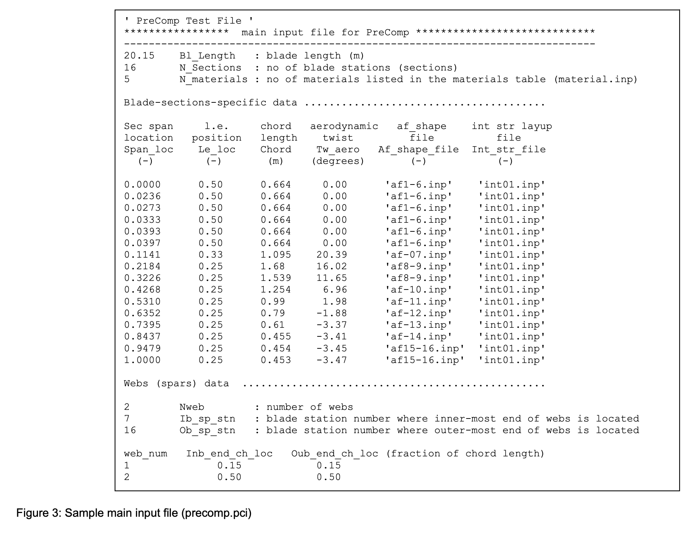
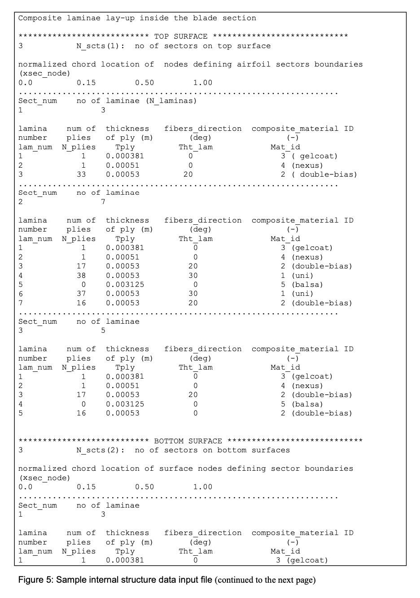
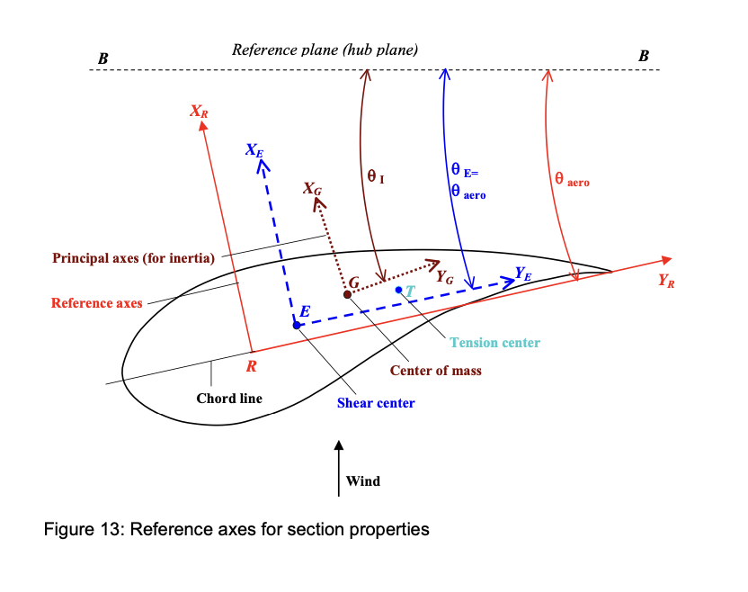
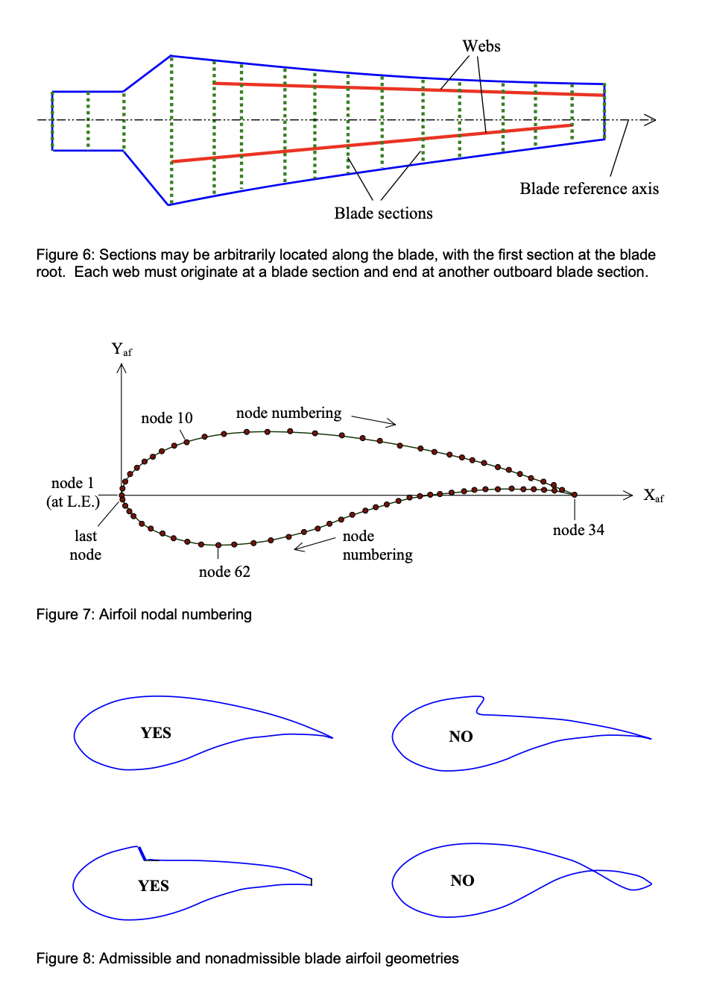
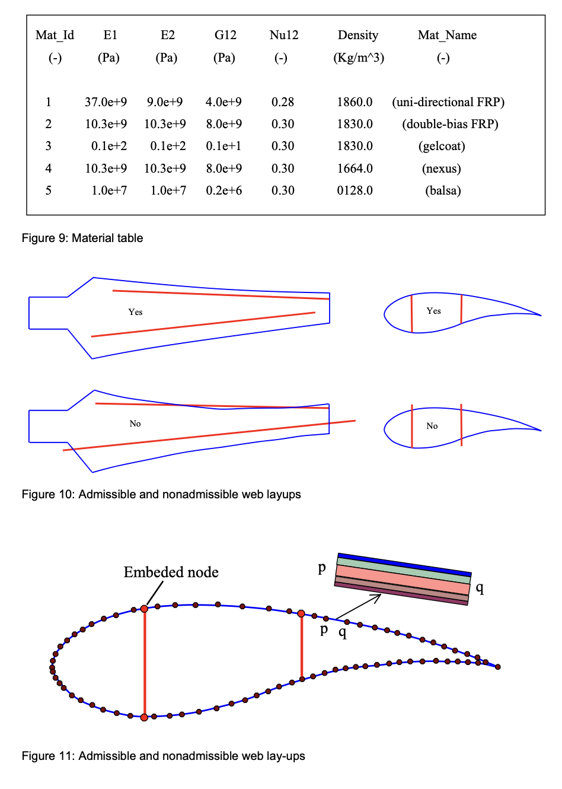
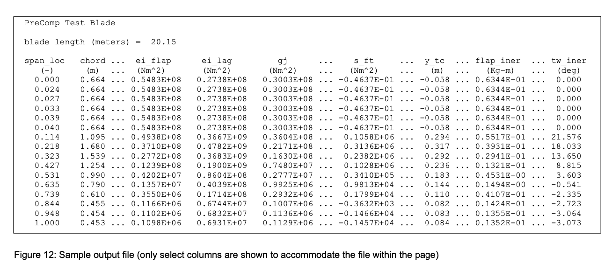

# HawtC2.PCS用户使用手册

这份指南详细说明了内部接口、输入、输出和假设，这些内容适用于当前代码。同时，也保留了旧版文件的输入输出方法，具体细节在测试脚本中有说明，包括如何使用文件输入输出方式执行Charp版本的precomp。然而，当与其他代码耦合时，推荐使用直接调用方法.HawtC2.PCS 是 PreComp 的更新版本,支持了HawtC.MoptL 当中的多目标优化算法,以实现复合材料叶片气动-铺层结构耦合设计.

---

**HawtC2.PCS 用户指南**

（复合材料叶片截面结构属性计算程序,与IVABS功能一致）

Gunjit S. Bir

September 2005

National Renewable Energy Laboratory, 1617, Cole Blvd, Golden, CO 80401

赵子祯

2025年3月15日

南京航空航天大学,江苏省风力机设计高技术重点实验室(修改代码,重新发行)

## 关于本指南

本指南解释了如何使用HawtC2.PCS进行数据准备和执行。HawtC2.PCS是一个代码，用于提供复合叶片的跨截面结构属性。HawtC2.PCS通过结合改进的经典层压板理论与剪切流方法计算这些属性。计算的属性包括交叉耦合刚度属性、惯性属性和叶片剪切中心、张力中心和质心相对于叶片桨轴的偏移量。分析师需要这些属性来正确模拟风力涡轮机的主要柔性部件——叶片、塔架和传动轴。几乎所有气动弹性代码（如FAST、ADAMS、BLADED等）都需要这些属性作为输入。设计师需要这些属性来快速评估不同的复合布局及其对叶片属性和材料应变的影响。从三维有限元模型（FEM）中提取结构属性很困难，这些模型主要用于获取详细的应力和位移分布。此外，开发此类模型需要时间和精力，并且通常仅用于最终设计阶段。

HawtC2.PCS的显著特点是能够准确计算叶片扭转刚度和交叉刚度属性。如果使用各向异性（不平衡）的复合层压板铺层，则会出现交叉刚度属性（如襟翼-扭转、滞后-扭转、襟翼-滞后、轴向-扭转、襟翼-轴向和滞后-轴向刚度）。这些属性耦合了叶片的襟翼、滞后、轴向和扭转运动，并可能显著影响涡轮机的性能、载荷和气动弹性稳定性。对于希望定制复合材料以减轻涡轮机载荷并提高性能的风电行业成员来说，准确估计交叉刚度属性很重要。即使使用三维有限元模型，扭转刚度和交叉刚度属性的计算也可能很棘手。因此，我们结合了改进的二维模型与剪切流方法，以可靠地计算这些属性。

HawtC2.PCS要求描述叶片的外部形状和复合层压板的内部铺层作为输入。外部形状根据叶片沿展向的弦长、扭转和翼型几何变化来指定。内部结构铺层根据层压板铺层计划、每层中纤维的取向以及层压板组成材料的属性来指定。该代码允许叶片的复合层压板进行一般铺层，包括展向和弦向铺层，以及任意数量的腹板。

本指南提供了逐步说明，包括如何准备输入文件（指定叶片外部几何形状和复合层压板的内部结构铺层）、如何执行代码以及如何解释输出属性。HawtC2.PCS会对输入数据的完整性、范围和可行性进行广泛检查，这些也将在本手册中讨论。代码运行速度快，通常只需几分之一秒，并且只需要对复合材料和层压板铺层计划有基本的了解。

**文档修订记录**

| **修订版本** | **日期** | **描述**                                                                                                                               |
| ------------------ | -------------- | --------------------------------------------------------------------------------------------------------------------------------------------------- |
| 1.00               | 15-3-2025    | 对HawtC2.PCS进行了修改，以进行更精确的属性分析。在手册中加入了关于剪切中心计算的说明。支持HawtC2.PCS v1.0.000

## 引言

HawtC2.PCS（‌Pre‌-processor for computing ‌Comp‌osite blade structural properties）是用于计算复合叶片刚度和惯性属性的预处理器。该代码也可用于计算金属叶片的结构属性，将其视为各向同性复合材料的一种特殊情况。所有风力涡轮机气动弹性代码，如FAST[1]和ADAMS[2,3]，都需要这些属性来模拟主要柔性部件——叶片、塔架和传动轴。这些属性列在表1中，并且通常沿叶片展向变化。HawtC2.PCS的一个显著特点是能够准确计算扭转刚度和交叉刚度属性。这些交叉刚度属性（如襟翼-扭转、滞后-扭转、轴向-扭转、襟翼-轴向、襟翼-滞后和滞后-轴向刚度）在使用各向异性（不平衡）的复合层压板铺层时会出现。这些属性耦合了叶片的伸展、弯曲和扭转运动，并可能显著影响涡轮机的性能、载荷和气动弹性稳定性。对于希望定制复合材料以减轻涡轮机载荷并提高性能的风电行业成员来说，准确估计这些交叉刚度属性很重要。

**‌表1 气动弹性建模所需的叶片结构属性**

| **属性类别** | **截面属性 Properties**                                                        |
| ----------------------------- | ----------------------------------------------------------------------------------- |
| 直接刚度(Direct stiffnesses)           | Flap, lag (edgewise), axial, and torsion stiffnesses                                |
| 交叉耦合刚度(Cross-coupled stiffnesses)     | Flap-twist, lag-twist, flap-lag, axial-twist, axial-flap, and axial-lag stiffnesses |
| 主轴(Principal axes)                | Orientation of principal axes for inertia and for stiffness                         |
| 惯性(Inertias)                      | Mass, mass moments of inertia about the principal axes                              |
| 偏移量(Offsets)                       | Shear-center, center-of-mass, and tension-center offsets                            |

有限元技术尽管能够进行准确的应力和位移分析，但无法直接得出这些属性。必须依赖计算复杂的力-位移数据后处理。叶片属性提取器, BPE [4], 是此类后处理工具的一个例子。研究人员曾尝试使用三维层压板理论来直接获得结构属性，但这些理论通常会高估扭转刚度，有时高达50-80倍，因为难以建模的翘曲效应会显著影响扭转刚度。这对于由不对称截面（风力涡轮机叶片的典型特征）组成的叶片尤其如此。即使使用三维有限元模型，扭转刚度和交叉刚度属性的计算也可能很棘手。因此，我们开发了一个改进的二维模型，并将其与剪切流方法相结合，类似于金属叶片的Bredt-Batho方法，该方法隐式考虑了主要的翘曲效应。HawtC2.PCS使用这种方法来计算扭转刚度、交叉刚度属性和其他结构属性。表1中列出的结构属性还包括几何偏移量，如截面质心相对于剪切中心的偏移量。与导致弹性耦合的交叉刚度属性不同，这些偏移量会导致叶片弯曲、扭转和轴向运动的动态耦合。

本报告的目的是提供关于数据准备和HawtC2.PCS执行的指南。HawtC2.PCS的输入要求指定叶片的外部形状和复合层压板的内部铺层。外部形状根据沿叶片的弦长、扭转和翼型几何变化来指定。内部结构铺层根据层压板铺层计划、每层中纤维的取向以及层压板组成材料的属性来指定。该代码允许用户指定的叶片沿展向的任意截面处进行一般性的复合层压板铺层，并输出这些属性的表格形式。

HawtC2.PCS不应与早期开发的初步叶片设计代码混淆 [5,6], 后者也基于经典层压板理论。前者是提供详细结构属性的分析代码。后者是设计代码，提供用于极限强度和抗屈曲能力的各种复合层压板的厚度。HawtC2.PCS是全新开发的，并提供了早期代码中没有的功能：

- 它允许复合层压板的各向异性铺层，从而导致刚度交叉耦合。
- 它允许层压板铺层计划在叶片展向和截面周围的一般性变化。
- 它消除了叶片根部附近圆形截面的限制，并允许整个叶片长度上的任意截面几何形状。
- 它使用改进的层压板理论计算结构属性。

HawtC2.PCS不是基于有限元的，因此不能像复杂的三维有限元方法（如为复合风力涡轮机叶片开发的NuMAD）那样提供详细的载荷-位移或载荷-应力分布 [7].  然而，它直接计算结构属性，并且运行速度快，通常只需几分之一秒。它还消除了对交互式方法的需求，并且只需要对叶片中通常使用的复合材料和层压板铺层计划有基本的了解。

HawtC2.PCS计算扭转刚度的方法虽然比文献中建议的其他直接方法更准确，但仍然使用两个假设——薄壁截面和自由翘曲——以使问题在分析上易于处理。尽管薄壁假设不是一个严重的限制，但自由翘曲假设在叶片根部附近的约束截面处显然不成立。我们计划使用Sandia和NREL的实验数据以及NuMAD/Ansys有限元模型的分析数据来检查这些假设的有效性和整体HawtC2.PCS方法的有效性。同时，我们建议在HawtC2.PCS得到充分验证之前谨慎使用。有限的验证研究表明，特别是对于由各向同性材料制成的椭圆形、菱形和矩形截面叶片，HawtC2.PCS与解析模型之间在扭转刚度方面存在极好的一致性。然而，还需要进行更广泛的验证，并欢迎读者提供任何数据或反馈。另一个需要注意的事项是：当前版本的HawtC2.PCS中剪切中心的计算是近似的。我们仍在调查对于具有复合材料各向异性铺层的截面，定义一个剪切中心是否有意义。如果我们能得出一个有意义的定义，我们将修改HawtC2.PCS以更准确地计算剪切中心。否则，我们需要将叶片建模为Timoshenko梁，并计算完整的6x6截面刚度矩阵。

本指南分为七个部分，包括本引言：

- **Section 2** 描述了HawtC2.PCS使用的复合层压板的一般结构铺层。理解这种铺层对于准备输入数据至关重要。

- **Section 3** 列出了有助于理解HawtC2.PCS的适用性和局限性的基本假设。

- **Section 4** 列出了输入文件的类型，并提供了输入数据准备（指定叶片外部几何形状、复合层压板的内部结构铺层和材料属性）的逐步说明。

- **Section 5** 讨论了错误消息和警告。‌
- **Section 6** 展示了如何执行代码。‌
- **Section 7** 描述了如何解释HawtC2.PCS输出。
- **Section 8** 以讨论计划的升级和验证研究为报告作结。

## 叶片结构铺层

HawtC2.PCS假设叶片由复合层压板制成。大多数现代叶片，尤其是大型涡轮叶片，都是这样制造的。对于这样的叶片，无论其层压板铺层有多复杂，其横截面都会显示层压板的堆叠，其厚度和数量在截面周围是分段恒定的。图1和图2展示了这样的铺层示例。图1显示了一种箱型铺层，其中两个腹板与上下表面的中部一起形成一个箱体。图2显示了一种腹板帽型铺层，其中中部盖住了两个腹板。

沿叶片长度，截面周围的层压板堆叠数量、每层中的层压板数量以及层压板的厚度通常会发生变化。每个图都显示了两个腹板；然而，HawtC2.PCS允许任意数量的腹板，包括零个。腹板可以从叶片上的任何截面开始，在任何其他截面结束。假设每个腹板在每个截面都是直的，并且与弦垂直；其横截面尺寸和复合铺层可能沿叶片长度变化。因此，截面的内部结构铺层由沿截面周围和腹板横截面堆叠的复合层压板的变化来表征。这种铺层通常从一个截面变化到另一个截面。在任何截面上，我们都假设复合结构铺层位于截面外部形状的范围内。截面的外部形状由其弦长和翼型几何形状来表征。

其他叶片，如拉挤成型叶片，采用不同的工艺制造。如果这些叶片的特征是沿叶片周围的分段恒定厚度扇区，我们可以将这些扇区视为层压板，并使用HawtC2.PCS计算其属性。

## 基本假设

HawtC2.PCS做出了一些假设，了解这些假设将有助于您了解HawtC2.PCS的适用性和局限性。它假设：

- 每个叶片截面都是薄壁的、封闭的、多胞截面。这意味着每个胞元周围的剪切流是恒定的。图2是具有三个胞元的此类截面的示例。一般来说，如果有n个腹板，则应有n+1个胞元。
- 截面任何壁中都没有环向应力。这对于物理考虑来说是相当有效的假设。
- 叶片是直的（没有内置曲率）。
- 横向剪切可以忽略不计。对于长度远大于横向尺寸（弦长和厚度）的叶片，这一假设相当有效。
- 叶片截面在横截面平面内不会变形。这也是一个相当有效的假设，由实验结果和有限元模型证实。
- 每个叶片截面都可以自由翘曲出其平面。这意味着在整个叶片长度上都是无约束翘曲，除了在叶片根部的附近区域，由于悬臂边界条件，翘曲可能受到约束。约束翘曲的影响通常局限于离根部约一个弦长的范围内。大多数风力涡轮机叶片在根部附近都有一个圆形截面，它不会翘曲，因此不会受到约束翘曲的影响。
- 腹板在任何叶片截面上都与弦垂直。因此，如果叶片有预扭转，腹板就会与叶片一起扭转。
- 在任何截面上，腹板的复合材料铺层都是单一层压板堆叠；尽管堆叠可能会从一个截面变化到另一个截面。大多数叶片都是这样建造的。

## 输入数据描述

在HawtC2.PCS能够计算叶片结构属性之前，您需要提供以下信息：

1. **叶片外部形状的描述**，由以下定义：
   - 叶片长度。
   - 沿叶片的弦长和内置气动扭转分布。
   - 沿叶片的截面翼型几何分布。
2. **叶片内部结构铺层的描述**。此铺层必须位于叶片外部形状的范围内，并由以下定义：
   - 沿叶片周边不同的层压板数量。层压板是一叠层片，并由该堆叠中层片的数量、顺序和材料区分。HawtC2.PCS允许任意数量的此类层压板（上下表面至少各一个）。图2显示了上下表面各有三个层压板（扇区）。
   - 腹板的数量和它们在叶片中的位置。
   - 每个腹板的层片计划。
   - 每个层片的主材料方向、材料类型和层数。层片由相似的铺层组成，这些铺层通常是商业上可获得的。铺层由其厚度、材料类型和主材料方向相对于叶片轴线的方向来表征。

3. **材料表**。如第2点所述，指定内部结构铺层需要识别每个层片的复合材料。材料直接从与HawtC2.PCS代码一起提供的材料表中识别。该表列出了典型的复合材料及其属性。您可以向该表中添加新材料及其属性。

这些数据通过四组输入文件提供给HawtC2.PCS：主输入文件、翼型数据文件、内部结构数据文件和材料文件。主输入文件和翼型数据文件帮助描述叶片外部形状并指定计算结构属性的叶片截面位置。内部结构数据文件描述了用户选定叶片截面的详细复合材料层压板铺层。材料文件从技术上讲是一个输入文件；它像其他输入文件一样被HawtC2.PCS读取。但是，它随HawtC2.PCS一起提供，除非您要添加新材料属性，否则无需修改它。

所有输入文件均采用简单的文本格式编写，可以使用任何文本编辑器创建或修改。这些文件中的每一行要么是注释行，要么是空白行，要么是HawtC2.PCS可读的行。注释行有助于理解后续数据（请参见示例输入文件，图3-5）。尽管可以更改注释行中的文本，但不应添加或删除任何注释行。空白行划分数据块并有助于澄清数据组织。与注释行一样，这些行也不能添加或删除。可读行可以有两种格式。它可能有一个后跟相关参数名称和该参数简要描述的单个值（HawtC2.PCS不读取名称和描述）。或者，可读行可能包含由逗号、制表符或空格分隔的一组值；可以插入任意数量的制表符或空格以增加清晰度。

### 主输入.pci文件格式 

此文件可以有任何名称。一个示例主输入文件，称为HawtC2.PCS.pci，如图3所示。第二行是标题行。HawtC2.PCS将其读取为字符串。您可以插入任何文本（最多99个字符）；该文本将在输出文件中重复。接下来是一个空白行，后跟一个一般信息块。[表1]描述了此数据块中出现的参数。参数以*斜体*标识。表的最后一列标识了相关单位。破折号表示无量纲参数。

**表1. 一般参数**

**表1. 一般参数**

| **参数** | **描述** | **单位** |
| ------------------- | ------------------------------------------------------------------------------------------------------------------------------------------------------------------------------------------------------------------------------------------------------------------------------------------------------------------------------------------------------------------------------------------------------------------------------------------------------ | -------------- |
| *Bl_length* | 叶片长度，即叶片与轮毂根部附件到叶片尖端的距离。它不是转子半径。 | m |
| *N_sections* | HawtC2.PCS计算结构属性的叶片截面数量。您可以选择任意数量的截面并将它们任意放置在叶片长度上（见图6）。 | - |
| *N_materials* | 将从材料表*materials.inp*中读取其属性的材料数量。它应小于或等于表中列出的最大材料数量。在前者的情况下，仅读取前*N_materials*个属性。 | - |
| *Out_format* | 整数开关，用于标识输出文件的类型。1：生成显示HawtC2.PCS计算的所有属性的输出文件。这些属性指的是图13中所示的轴系（在第7节中描述）。2：生成显示BModes代码所需的选定属性的输出文件。这些属性和相关参考轴在参考文献‌:ml-citation{ref="2" data="citationList"}中描述。3：生成两个输出文件，一个具有*out_gen*扩展名，另一个具有*out_bmd*扩展名。 | - |
| *TabDelim* | 逻辑开关。如果设置为*t*或*true*，则作为表格打印的输出属性将以制表符分隔。当导出到如Excel的电子表格时，这样的表格会自动转换为列。如果此开关设置为*f*或*false*，则作为表格打印的输出属性将以空格分隔。这样的表格（见图12）有助于轻松读取输出属性。在示例输入文件中，此开关设置为*false*。 | - |

下一个输入块是特定于叶片截面的数据。数据以六列和*N_sections*行的形式输入，其中*N_sections*是上面定义的叶片截面数量。[表2]描述了显示为六列标题的截面参数。

最后一个数据块提供了与腹板相关的信息。可以指定任意数量的腹板（尽管示例主输入文件仅显示两个腹板）。每个腹板都假设是直的，并且可以在叶片的任何截面开始并在任何其他外截面结束。这些截面必须从通过参数*Span_loc*（在[表2]中描述）指定的截面中选择。通常，叶片的构造使得所有腹板都在单个站位开始并在另一个单个站位结束。但是，如果它们在不同的站位开始或结束，*Ib_sp_stn*应该是腹板最内端的位置，*Ob_sp_stn*应该是腹板最外端的位置。第4.3节将解释原因。

**表2. 叶片截面参数**

| **参数** | **描述** | **单位** |
| ------------------- | ----------------------------------------------------------------------------------------------------------------------------------------------------------------------------------------------------------------------------------------------------------------------------------------------------------------------------------------------------------------------------------------------------------------------------------------------------------------------------------------------------------------------------------------------------------------------------------------------------------------------------------------------------------------------------------------------------------------------------------------------------------------------------------- | -------------- |
| *Span_loc* | 这是一个下标数组。*Sloc(i)*是第*i*个截面的展向位置，从叶片根部测量并相对于叶片长度归一化。第一个截面总是位于*0.0*，最后一个位于*1.0*。必须至少指定两个截面。 | - |
| *Le_loc* | 这是一个下标数组。在第*i*个截面上，*le_loc(i)*是前缘到叶片参考轴的距离，沿该截面弦长归一化测量。参考轴通常选择与叶片桨距轴重合。 | - |
| *Chord* | *Chord(i)*是第*i*个截面的弦长（米）。 | m |
| *Tw_aero* | *Tw_aero(i)*是第*i*个截面的叶片扭转（度）。它表示局部截面弦线与轮毂平面（图13）之间的方向。正向扭转使截面前缘进入风中。 | deg |
| *Af_shape_file* | 对于主输入文件中指定的每个叶片站位，您必须提供一个辅助输入文件，该文件描述该站位的翼型形状（截面外部形状）。可以为此类文件指定任何最多99个字符的名称，并且必须用引号括起来（请参见示例主输入文件）。*Af_shape_file(i)*表示第*i*个截面的辅助翼型形状输入文件的名称。不同的截面可能具有相同名称的翼型形状输入文件，表示这些截面具有相同的外部形状。例如，如图3所示，主输入文件中的翼型形状文件名为, *af1-6.inp*, 用于部分1至6. 这意味着这些部分具有相同的外部形状。我们将在第[4.2]节中解释翼型形状输入文件. | -              |
| *Int_str_file*    |对于每个叶片截面, 您还必须命名一个辅助输入文件，描述该位置的内部结构叠层。可以为这样的文件指定任何名称，并且必须用引号括起来.*Int_str_file(i)* 表示第*i*节的内部结构叠层输入文件的名称。可以为不同部分提供相同的内部结构输入文件名. 例如，如图3所示，所有部分都提供了相同的翼型文件名,*int01.inp*, 这意味着这些部分具有相同的复合层内部结构叠层。我们将在第[4.3]节中解释内部结构叠层输入文件。

**Table 3.  腹板参数**

| **‌参数名称** | **‌描述**| **单位** |
| ------------------- | ------------------------------------------------------------------------------------------------------------------------------------------------------------------------------------------------------------------------------------------------------------------------------------ | -------------- |
| *Nweb*            | 腹板总数。每个腹板假定在其内端和外端之间是直的,尽管为了防止应力集中,可能会有一些倒角                                                                                                                                                                            | -              |
| *Ib_sp_stn*       | 腹板内端所在的叶片站位。这意味着所有腹板必须在同一内端位置起源。如果腹板在内端位置不同,*Ib_sp_stn* 应为最内侧腹板端部的位置。                                       | -              |
| *Ob_sp_stn*       | 腹板外端所在的叶片站位。这意味着所有腹板必须在同一外端位置终止。如果腹板在外端位置不同,*Ob_sp_stn* 应为最外侧腹板端部的位置。                                                 | -              |
| *Web_num*         | 腹板编号.                                                                                                                                                                                                                                                                          | -              |
| *Inb_end_ch_loc*  | 腹板在其内端叶片站位,由*inb_end_ch_loc(i)*指定的弦向位置第*i*个腹板的上端位置,该弦向位置从前缘测量，并根据弦长进行标准化。  | -              |
| *Oub_end_ch_loc*  | 腹板在其外端叶片站位,由*oub_end_ch_loc(i)*指定的弦向位置第*i*个腹板的下端位置. 该弦向位置从前缘测量，并根据弦长进行标准化。 | -              |

### Airfoil Data File

A complete description of blade geometry needs chord, twist, and airfoil shape distribution along the blade.  You provide the chord and twist distributions in the main input file.  In that file, you also specify the names of files that contain airfoil shapes data at the blade stations.  The number of such files is equal to or less than the number of blade stations specified in the main input file.  For blade stations with the same airfoil shape, though possibly different chord lengths, a single airfoil data file suffices.  Figure 4 is a sample airfoil-data input file.   It has three input parameters described in [Table 4].

Note 1:  The leading edge is a first node and must have (0,0) coordinates.

Note 2:  The x-coordinate of the airfoil nodes must monotonically increase if we trace the upper surface from the leading edge to the trailing edge, and monotonically decrease if we trace the lower surface from the trailing edge toward the leading edge.

Note 3:  Figure 8 shows admissible and non-admissible airfoil shapes.  Airfoil geometry cannot cross itself.  Also, the airfoil curve segments on the upper and lower surfaces must be single- valued functions, *y\_airfoil=f(x\_af)*.  A blunt trailing edge is admissible.

The input, *N\_af\_nodes*, is specified in the first field of the first line in the airfoil input file (see Figure 4).  As with all other HawtC2.PCS inputs, spaces or tabs may precede this input.  This is followed by three lines ignored by HawtC2.PCS.  The x- and y-coordinates of the first node, the leading edge, are always *(0,0)* and are specified on line 5.  The following lines specify coordinates of the subsequent nodes.

**Table 4 .  Airfoil Input File Parameters**

| **Parameter** | **Description**                                                                                                                                                                                                                                                                                                                                                                                                                                                                                                                                 | **Unit** |
| ------------------- | ----------------------------------------------------------------------------------------------------------------------------------------------------------------------------------------------------------------------------------------------------------------------------------------------------------------------------------------------------------------------------------------------------------------------------------------------------------------------------------------------------------------------------------------------------- | -------------- |
| *N_af_nodes*      | Number of nodes that describe the airfoil shape (see Figure 7). The node numbering begins at the leading edge, moves over the top surface, reaches the trailing edge, moves over the lower surface, and finally arrives at the last node, just below the leading edge.                                                                                                                                                                                                                                                                                | -              |
| *Xnode*           | Subscripted variable with*xnode(i)* defining the x-coordinate of the *i*th node with respect to *(x_af, y_af)* airfoil reference axes. These reference axes originate at the leading edge with *x_af* directed along the section chord, and the normal, *y_af* axis, pointing toward the upper-surface side (Figure 7). This coordinate is normalized with respect to chord length. The maximum permissible value for an x-coordinate is 1. Two nodes with the same maximum x-coordinate, but different y-coordinates specify a blunt edge. | -              |
| *Ynode*           | Subscripted variable with*ynode(i)* defining the y-coordinate of the *i*th node. This coordinate, like *xnode(i)*, is also normalized with respect to chord length.                                                                                                                                                                                                                                                                                                                                                                             | -              |

### Internal Structure Data File

The airfoil data files, together with the main input file, completely define the blade’s external shape.  Internal structure data files help us specify the composite layup within the external shape.  Each blade station needs an internal structure data file that describes the blade internal structure as seen at that section.  The name of this file is user specifiable and is identified in the main input file (see Figure 3).  If some sections have similar layups, which is likely for most blades, a single internal structure data file may be used for these sections.  As an example, in our sample main input file, a single structural layup file, *int01.inp*, describes the layup for all sections.

Before reading the description of the internal structure data file, see Figure 2, which shows how we idealize the internal structure layup.  First, we identify the upper and lower surfaces, which are the upper and the lower parts, respectively, of the section periphery between the leading and the trailing edges.  Each surface is divided into sectors.  A sector is a laminate, i.e., a stack of laminas of different composite materials and principal material directions.  Each lamina is composed of similar plies, which are typically commercially obtained.  Figure 2 shows three sectors each on the upper and lower surfaces.  HawtC2.PCS, however, allows different and arbitrary numbers of sectors for the two surfaces.  The thick middle sectors, seen on the upper and lower surfaces in the figure, are called *spar-caps* in blade manufacturing jargon.  These provide the main bending stiffness and strength.  Some optimized blade structures may show stepped spar- caps with different number and placement of webs.  The sample layup in the figure shows that the upper middle sector is composed of eight laminas (view AA) and the web is composed of five laminas (view BB).  The thick middle lamina in each view is usually a light material such as balsa that resists panel buckling.

Now we describe the internal structure data file (Figure 5 is a sample file).  The length of this file may differ from section to section, but its format―sequence of comment, blank lines, and data blocks―stays the same.  We enter data in a hierarchical fashion—first for the upper surface, next for the lower surface, and finally for the webs.  For the upper surface, for example, we specify number of sectors, number of laminas in each sector, number of plies in each lamina, and constituent properties of each ply.  We enter similar information for the lower surface and finally for the webs.

As the sample file shows, we begin with the upper surface.  We enter the number of sectors for this surface; this is three in our sample file.  Next, to locate placement of sectors on the surface, we enter x-coordinate of the points that define the sector boundaries.  The x-coordinate is referenced to the airfoil coordinate frame (Figure 7).  Next, we enter data for each sector, starting with sector 1.  We first identify the number of laminas in this sector.  In our example file, we identify three laminas for the first sector.  Then we enter data for each lamina at the plies level.  The lamina numbering proceeds from the exterior surface to the blade interior, with the first lamina at the exterior surface.  In our sample file, we have three laminas for the first sector.  Therefore, we enter lamina-level data on three lines.  This is followed by similar information for the remaining sectors (sectors 2 and 3 in our example file).

We repeat the data entry procedure for the lower surface and finally for each web.  Though you may find that the data entry is self-explanatory in the sample file, you may refer to [Table 5] for a detailed description of the input parameters.

**Table 5.  Parameters for the Internal Structure Input File.**

| **Parameter** | **Description**                                                                                                                                                                                                                                                                                                                                                                                                                                                                                                                                                                                                                                                                                                                                                                                                                                                                                                                                                                                                                                                           | **Unit** |
| ------------------- | ------------------------------------------------------------------------------------------------------------------------------------------------------------------------------------------------------------------------------------------------------------------------------------------------------------------------------------------------------------------------------------------------------------------------------------------------------------------------------------------------------------------------------------------------------------------------------------------------------------------------------------------------------------------------------------------------------------------------------------------------------------------------------------------------------------------------------------------------------------------------------------------------------------------------------------------------------------------------------------------------------------------------------------------------------------------------------- | -------------- |
| *N_scts*          | Subscripted integer variable.*N_scts(1)* and *N_scts(2)* are the number of sectors on the upper and lower surfaces, respectively.                                                                                                                                                                                                                                                                                                                                                                                                                                                                                                                                                                                                                                                                                                                                                                                                                                                                                                                                           | -              |
| *Xsec_node*       | Real array input that identifies locations of sectors on the upper and lower surfaces. The array contains a sequence of values that specify x-coordinates of the sector boundaries. The x-coordinate is normalized with respect to the chord length and is referenced to the airfoil coordinate frame (Figure 7). In our sample file, we have three sectors on the upper surface, which imply four points that define sector boundaries. The x-coordinates of these four points are 0, 0.15, 0.50, and 1.0. Sector 1 is bounded by x-coordinates*0* and *0.15*, sector 2 is bounded by x-coordinates *0.15* and *0.5*, and sector 3 is bounded between x-coordinates *0.50* and *1.0*. Note: The x-coordinates of sector boundaries must be positive and in ascending order. The first coordinate may be greater than 0 and the last less than 1. In this case, however, HawtC2.PCS checks to determine whether there is a gap (no laminate) at the leading and trailing edges of the section and, if necessary, issues a warning to place webs at those locations. | -              |
| *Sect_num*        | Sector number.                                                                                                                                                                                                                                                                                                                                                                                                                                                                                                                                                                                                                                                                                                                                                                                                                                                                                                                                                                                                                                                                  | -              |
| *N_laminas*       | Number of laminas for a particular sector identified in the file (must be a positive integer).                                                                                                                                                                                                                                                                                                                                                                                                                                                                                                                                                                                                                                                                                                                                                                                                                                                                                                                                                                                  | -              |
| *Lam_num*         | The lamina number. The first lamina is always at the exterior surface and the numbering proceeds from the exterior surface to the interior of the blade.                                                                                                                                                                                                                                                                                                                                                                                                                                                                                                                                                                                                                                                                                                                                                                                                                                                                                                                        | -              |
| *N_plies*         | Number of plies in an identified lamina (must be a positive integer).                                                                                                                                                                                                                                                                                                                                                                                                                                                                                                                                                                                                                                                                                                                                                                                                                                                                                                                                                                                                           | -              |
| *Tply*            | The thickness of each ply in an identified lamina.                                                                                                                                                                                                                                                                                                                                                                                                                                                                                                                                                                                                                                                                                                                                                                                                                                                                                                                                                                                                                              | m              |
| *Tht_lam*         | Ply angle representing orientation of the principal material (fiber) direction of each ply of a lamina. Figure 1 shows how a positive ply angle is defined. S is a point on the blade surface at which we wish to determine the ply angle. The*r-t-s* is a right-hand coordinate system with *r* axis parallel to the blade axis and pointing outboard. The *t* axis is normal to *r* and tangent to the blade surface. The *n* axis is normal to the blade surface at point S. Line SL is the principal (longitudinal) material direction and α, the angle between SL and *r* axis, represents the ply angle. A rotation α of the *r-t-s* axes system about the *n* axis thus aligns the *r* axis with principal material direction SL. A positive rotation about the *n* axis implies a positive ply angle.                                                                                                                                                                                                                                             | deg            |
| *Mat_id*          | Material identifier for each ply in a lamina. HawtC2.PCS uses this identifier to read ply properties from a materials table.                                                                                                                                                                                                                                                                                                                                                                                                                                                                                                                                                                                                                                                                                                                                                                                                                                                                                                                                                    | -              |
| *N_weblams*       | Number of laminas in an identified web (must be a positive integer). Note that unlike the blade surfaces, which may have multiple laminates (sectors or stacks of laminas), a web is assumed to have only a single laminate. Most blade webs are built this way.                                                                                                                                                                                                                                                                                                                                                                                                                                                                                                                                                                                                                                                                                                                                                                                                                | -              |
| *W_tply*          | The thickness of each ply in an identified web. If this section lies within the blade sections*ib_sp_loc* and *ob_sp_loc* specified earlier, but does not have the identified web, set *W_tply* value to zero.                                                                                                                                                                                                                                                                                                                                                                                                                                                                                                                                                                                                                                                                                                                                                                                                                                                            | m              |
| *Tht_Wlam*        | The ply angle representing orientation of principal material direction of each ply in an identified web. The definition of ply angle for a web lamina follows that of*Tht_lam* defined earlier. In this case, however, the *n* axis, normal to the web surface, always points to the leading edge.                                                                                                                                                                                                                                                                                                                                                                                                                                                                                                                                                                                                                                                                                                                                                                          | deg            |
| *Wmat_Id*         | Material identifier for each ply in a web. HawtC2.PCS uses this identifier to read ply properties from a materials table, discussed in Section [4.4].                                                                                                                                                                                                                                                                                                                                                                                                                                                                                                                                                                                                                                                                                                                                                                                                                                                                                                                           | -              |

### Materials Data File

This file contains material properties of plies typically available commercially.  The file comes with HawtC2.PCS and you may add new-material properties to this file.  This file, shown in Figure 9, is in tabular form and has a fixed name, *materials.inp*.  Its first line is a header that lists material property names.  The second comment line identifies units for each material property, if applicable.  The material properties are specified in a columnar format as seen in the figure.  [Table 6] describes the parameters for this file.

Note: [Table 6] defines ν*12*, which is one of the Poisson’s ratios.  The other, ν*21*, is related to ν*12* as follows:

**Table 6.  Parameters for the Material File**

| **Parameter**    | **Description**                                                                                                                                                    | **Unit** |
| ---------------------- | ------------------------------------------------------------------------------------------------------------------------------------------------------------------------ | -------------- |
| *Mat_Id*             | Material identifier; an integer.                                                                                                                                         | -              |
| *E1*                 | Young’s modulus in the principal direction and assumed to be the same in tension and compression (in Pascal, ie.).                                                      | N/m²          |
| *E2*                 | Young’s modulus in the lateral direction (normal to the principal direction) and is assumed to be the same in tension and compression (in Pascal).                      | Pa             |
| *G12*                | The shear modulus with respect to the principal and lateral directions (in Pascal).                                                                                      | Pa             |
| *Nu12*               | Poisson’s ratio, ν*12*, defined as the contraction strain in direction 2 (lateral direction) caused by unit extensional strain in direction 1 (principal direction). | -              |
| *Density*            | This is the material density in kg/m³.                                                                                                                                  | kg/m³         |
| ***Mat_Name*** | This is the material name associated with the material identifier. However, it is not read or required by HawtC2.PCS.                                                    | -              |

## Error Messages and Warnings

HawtC2.PCS performs extensive checks to ensure that the user-supplied data are:

1. ***Within range***.  An example of out-of-range data would be an airfoil node whose chord- normalized *x*-coordinate is less than *0* or more than *1*.  Two other examples, illustrated in Figure 8, are an airfoil periphery that crosses itself (enclosing what mathematicians call a multiconnected region), and a periphery that turns sharply (more than 90°) either on the upper or lower blade surface.  Both geometries may be physically realizable, but these will be outside the range of permissible geometries that HawtC2.PCS can handle.
2. ***Consistent***.  An example of inconsistent data would be specification of material properties, *E1*, *E2*, and ν*12*, (see Section 4.4) that would violate the following relation [8]:

   

   Each property, *E1*, *E2*, or ν*12*, may be physically viable independently, but would not be consistent unless it satisfies the above relation.
3. ***Realizable***.  Examples of unrealizable data are negative chord length and a specification of sector nodes that is not monotonically ascending (see Section 4.3).  Other examples, illustrated in Figure 10, are webs that lie outside the blade geometry.

   Detected errors are displayed on the screen and the program execution aborts.  The displayed messages are self-explanatory and HawtC2.PCS can detect more errors than we can discuss in this section.

   Besides error messages, warnings also may be issued on the screen.  For example, the following warning

   *WARNING\*\* leading edge aft of reference axis \*\**

   is issued if, at any section, the leading edge is aft of the blade pitch axis.  Such a blade is not impossible to construct, but it would most likely be a result of wrong data specification.  The execution proceeds.

## Executing HawtC2.PCS

First follow the guidelines in Section 4 to create the main and auxiliary input files.  To do this, use the sample input files supplied with the HawtC2.PCS executable and modify it to suit your composite blade.  Identify all auxiliary files in the main input file.

Next, open a command window, change over to the directory you wish to work in, and issue the following command:

*HawtC2.PCS  [input path name]\main\_input\_file\_name*

where *input path name* is the path name for the directory in which the HawtC2.PCS main input file resides, and *main\_input\_file\_name* is the name of the main input file.  Follow the instructions at [http://wind.nrel.gov/designcodes/setup.pdf](http://wind.nrel.gov/designcodes/setup.pdf), and that will eliminate the need to specify the executable path name.  For example, if the main input files reside in the working directory, and *HawtC2.PCS.pci* is the name of the main input file, then the command would be:

*HawtC2.PCS  HawtC2.PCS.pci*

If HawtC2.PCS detects any errors, either during input reading or during computations, errors or warning messages will be issued on the screen.  If no errors are detected, HawtC2.PCS embeds extra nodes in the blade periphery (Figure 11), in addition to the airfoil nodes, which already exist.  The extra nodes represent intersection of webs with the airfoil and the end location of sectors over the airfoil geometry.  The sectors, as explained in section 4.3, represent distinct stack of laminas.  Each airfoil segment, spanned by any two consecutive nodes, is idealized as a flat laminate for computing structural properties.  The computed properties are output to either a single file or two files depending on how the integer switch *out\_format* is set in the main input file.  If *out\_format* is 1 signifying a general-format output, a single output file is generated whose name is the same as that of the main input file except that the extension is changed to *out\_gen*.  If *out\_format* is 2 signifying a BModes-compatible output, a single output file is again generated with extension *out\_bmd*.  If *out\_format* is 3, two output files are generated, one with extension *out\_gen* and the other with *out\_bmd*.  Each output file is generated in the same directory in which the main input file resides.  The next section describes the output files.

## Output Description

HawtC2.PCS outputs blade section properties in tabular form, which may be readily exported to a plotting utility such as an Excel Spreadsheet, to a beam analysis code such as BModes [9], or to an aeroelastic code such as FAST.  In fact, the main motivation for HawtC2.PCS development is to eventually integrate it with FAST to handle composite rotor blades.

As mentioned in the previous section, an output file is either general type or BModes-compatible type.  Each type is best viewed using a simple text editor.  We first describe the general-type output file, whose name always ends with the extension *out\_gen*.  This type shows all the computed properties.  Figure 12 is a sample of such an output file.  The second line shows the HawtC2.PCS version that generates the output along with the date and time at which it creates the output file. The third line repeats (echoes) the *title* specified in the first line of the main input file.  A blank line follows.  The third line shows the blade length in meters.  The sixth line shows the blade length in meters.

The computed section properties are output in 23 columns and *N\_sections* rows, where *N\_sections* is the number of blade sections specified in the main input file.  Each column is associated with a particular section property and each row with a particular section.  There are two rows of column headers.  The first row lists parameters that identify section properties and the second row identifies the associated units.

Before we describe the output properties, we need to understand the axes systems shown in Figure 13.  These axes conform to the IEC specifications [10] and all output properties are referred to these axes.  The *XR-YR* are the section reference axes with origin at *R*, where point *R* is the intersection of the section with the blade reference axis, usually selected to be the blade pitch axis.  The *YR* axis coincides with the section chord points toward the trailing edge.  The *XR* axis is normal to *YR* and points toward the upper (suction) side of the blade.  This reference frame is different from the *Xaf-Yaf* frame (Figure 7) that is used to define the blade airfoil geometry as described in Section 4.2.  The θ*aero* is the aerodynamic twist that defines the orientation of the chord with respect to a blade-twist reference plane *BB*, usually the hub plane (plane normal to the shaft at the hub location).  Point E is the section shear center.  The *XE-YE* frame is parallel to *XR- YR* with origin at *E*.  All the section elastic properties are referred to this frame.  Point *T* is the tension center of the section, and point *G* is the section center of mass.  The frame *XG-YG* originates at the center of mass with *YG* axis oriented at an angle θ*I* with respect to the reference plane BB.  The θ*I* is the orientation of the principal inertia axes with respect to hub plane.  All the section inertia properties are referred to this frame.

[Table 7] describes parameters that appear in a general-type output file.  These parameters represent all properties computed by HawtC2.PCS and refer to axes systems shown in Figure 13.  BModes-compatible output file shows only select section properties, which are compatible with the BModes code and refer to axes system explained the BModes User’s Guide [9]. As noted in the Section 1, the computation of shear center is approximate. Its definition for composite materials is currently controversial. After this controversy is settled in the composites field, we will upgrade HawtC2.PCS.

**Table 7.  Ouput Parameters**

| **Parameter**     | **Description**                                                                                      | **Unit** |
| ----------------------- | ---------------------------------------------------------------------------------------------------------- | -------------- |
| ***Span_loc***  | Span location of the section measured from the blade root and normalized with respect to the blade length. | -              |
| ***Chord***     | Chord length of the section.                                                                               | m              |
| ***Tw_aero***   | Section aerodynamic twist, θ*aero*.                                                                     | deg            |
| ***EI_flap***   | Section flap bending stiffness about the*YE* axis.                                                       | Nm²           |
| ***EI_lag***    | Section lag (edgewise) bending stiffness about the*XE* axis.                                             | Nm²           |
| ***GJ***        | Section torsion stiffness.                                                                                 | Nm²           |
| ***EA***        | Section axial stiffness.                                                                                   | N              |
| ***S_f***       | Coupled flap-lag stiffness with respect to the*XE-YE* frame.                                             | Nm²           |
| ***S_airfoil*** | Coupled axial-flap stiffness with respect to the*XE-YE* frame.                                           | Nm             |
| ***S_al***      | Coupled axial-lag stiffness with respect to the*XE-YE* frame.                                            | Nm             |
| ***S_ft***      | Coupled flap-torsion stiffness with respect to the*XE-YE* frame.                                         | Nm²           |
| ***S_lt***      | Coupled lag-torsion stiffness with respect to the*XE-YE* frame.                                          | Nm²           |
| ***S_at***      | Coupled axial-torsion stiffness.                                                                           | Nm             |
| ***X_sc***      | X-coordinate of the shear-center offset with respect to the*XR-YR* axes.                                 | m              |
| ***Y_sc***      | Chordwise offset of the section shear-center with respect to the reference frame,*XR-YR*.                | m              |
| ***X_tc***      | X-coordinate of the tension-center offset with respect to the*XR-YR* axes.                               | m              |
| ***Y_tc***      | Chordwise offset of the section tension-center with respect to the*XR-YR* axes.                          | m              |
| ***Mass***      | Section mass per unit length.                                                                              | kg/m           |
| ***Flap_iner*** | Section flap inertia about the*YG* axis per unit length.                                                 | kg·m          |
| ***Lag_iner***  | Section lag inertia about the*XG* axis per unit length.                                                  | kg·m          |
| ***Tw_iner***   | Orientation of the section principal inertia axes with respect to the blade reference plane, θ*I*.      | deg            |
| ***X_cm***      | X-coordinate of the center-of-mass offset with respect to the*XR-YR* axes.                               | m              |
| ***Y_cm***      | Chordwise offset of the section center of mass with respect to the*XR-YR* axes.                          | m              |

**Future Plans**

We have provided step-by-step instructions for preparing input files:  specifying blade external geometry and internal structural layup of composite laminates, executing the code, and interpreting the output properties.  Specifying blade geometry and complex internal materials layup is a challenging task that we have tried to simplify as much as possible.  If you encounter problems or have suggestions to improve the user interface, contact us.  Also, let us know if you would like to see additional capabilities in the code within the constraints of the laminate theory.

As requested by several wind industry members, we will extend HawtC2.PCS next year to compute load-induced strains.  The objective is to help designers accelerate the preliminary design phase.  The flexural strain computations, however, will ignore the secondary warping effects.

We have already verified HawtC2.PCS for metallic blades with elliptical and rectangular sections for which analytical results may be readily obtained [11].  However, we still have to verify the code for composite blades, particularly those with anisotropic layup of composites.  We plan to do so when experimental data become available for such blades.

As discussed in the Section 7, the shear center is computed only approximately. Its definition is currently controversial in the composites field. After this controversy is settled, probably in consultation with material experts, we will upgrade HawtC2.PCS.

**Acknowledgments**

Thanks are due to Sandy Butterfield for motivating the development of HawtC2.PCS and providing sustained encouragement.  Thanks go  to Marshall Buhl for his excellent computer support.  Finally, the author would like to thank Mike Robinson, NREL, for his constant support.  DOE supported this work under contract number DE-AC36-83CH10093.

**References**

1. Jonkman,  J.M.;  Buhl  Jr.,  M.L.  (2005).  *FAST  User's  Guide*,  NREL/EL-500-29798. Golden, Colorado: National Renewable Energy Laboratory.
2. Elliott, A.S.; McConville, J.B. (1989).  “Application of a General-Purpose Mechanical Systems Analysis Code to Rotorcraft Dynamics Problems.”  Prepared for the American Helicopter Society National Specialists’ Meeting on Rotorcraft Dynamics, 1989.
3. Elliott,  A.S.   (1989).   “Analyzing  Rotor  Dynamics  with  a  General-Purpose  Code,” *Mechanical Engineering* 112, no. 12 (December 1990): pp. 21-25.
4. Malcolm, D.J., Laird D.L.  (2005).  “Identification and Use of Blade Physical Properties.”  Proceedings of the ASME/AIAA Wind Energy Symposium, Reno, Nevada, January.
5. Bir,  G.S.   (2001.   “A  Computerized  Method  for  Preliminary  Structural  Design  of Composite Wind Turbine Blades.” Special Issue of the Journal of Solar Engineering, Volume 123, Number 4, November.  Also presented at the AIAA/ASME Wind Energy Symposium, Reno, January.
6. Bir, G. S., Migliore P.  (2004).  “Preliminary Structural Design of Composite Blades for Two- and Three-Blade Rotors.” NREL Report NREL/TP-500-31486, September.
7. Laird, D.  (2001).  “A Numerical Manufacturing and Design Tool Odyssey.” Proceedings of the ASME/AIAA Wind Energy Symposium, Reno, Nevada, January.
8. Jones,  R.M.   (1975).   *Mechanics  of  Composite  Materials*,  Hemisphere  Publishing Corporation.
9. Bir, G.S.  (2005).  User’s Guide to BModes; Software for Computing Rotating Beam Coupled Modes, NREL TP-500-38976, Golden, Colorado: National Renewable Energy Laboratory.
10. Draft IEC 61400-13 TS, Ed. 1: Wind turbine generator systems – Part 13: Measurements of mechanical loads, Jan 21, 2000.
11. Cook, R.D., Young, W.C. (1998).  *Advanced Mechanics of Materials*, Prentice Hall, 2nd edition.

