***Powered by [hawtC2](http://www.HawtC.cn) @CopyRigtt 赵子祯***
<br/>
<br/>
<br/>
! <center> </center>
<br>
<br/>
<br/>

# <center> ***HawtC2 理论手册与使用验证报告***  </center>

<br/>
<br/>
<br/>
<br/>
<br/>
<br/>
<br/>
<br/>
<br/>
<br/>
<br/>
<br/>
<br/>

### </center>目录</center>

- [ ***HawtC2 理论手册与使用验证报告***  ](#-hawtc2-理论手册与使用验证报告--)
    - [目录](#目录)
  - [引言](#引言)
  - [1 术语缩略表](#1-术语缩略表)
  - [2 气动力计算方法与实现(AeroL)](#2-气动力计算方法与实现aerol)
    - [2.1 BEM算法](#21-bem算法)
      - [2.1.1 稳态BEM方法](#211-稳态bem方法)
      - [2.1.2 非定常BEM方法](#212-非定常bem方法)
      - [2.1.3 Glauert校正](#213-glauert校正)
    - [2.2 自由涡尾迹模型(AeroL.FVW)](#22-自由涡尾迹模型aerolfvw)
    - [2.3 统一动量理论](#23-统一动量理论)
    - [2.4 支撑结构上的气动载荷](#24-支撑结构上的气动载荷)
    - [2.5 轮毂和机舱上的气动载荷](#25-轮毂和机舱上的气动载荷)
    - [2.6 塔影效应](#26-塔影效应)
      - [2.6.1 势流塔影模型](#261-势流塔影模型)
      - [2.6.2 Powles塔阴影模型](#262-powles塔阴影模型)
    - [2.7 三维旋转效应](#27-三维旋转效应)
    - [2.8 动态失速模型](#28-动态失速模型)
    - [2.9 功率曲线计算](#29-功率曲线计算)
      - [2.9.1 稳态功率曲线](#291-稳态功率曲线)
      - [2.9.2 考虑柔性变形的功率曲线](#292-考虑柔性变形的功率曲线)
  - [3 风环境与大气风工程(WindL)](#3-风环境与大气风工程windl)
    - [3.1 谱模型](#31-谱模型)
      - [3.1.1 Karmal 模型](#311-karmal-模型)
      - [3.1.2 Von Karman 模型](#312-von-karman-模型)
      - [3.1.3 改进的 Von Karman 模型](#313-改进的-von-karman-模型)
    - [3.2 风廓线模型](#32-风廓线模型)
      - [3.2.1 Log对数风廓线模型](#321-log对数风廓线模型)
      - [3.2.2 Power 幂指风廓线数模型](#322-power-幂指风廓线数模型)
    - [3.3 时域风生成方法](#33-时域风生成方法)
      - [3.3.1 谐波叠加法](#331-谐波叠加法)
      - [3.3.2 IFFT 直接生成法](#332-ifft-直接生成法)
    - [3.4 风模型](#34-风模型)
  - [4 海洋动力学(HydroL)](#4-海洋动力学hydrol)
  - [5 截面参数有限元(PCS)](#5-截面参数有限元pcs)
    - [5.1 前言](#51-前言)
    - [5.2 理论方法](#52-理论方法)
      - [5.2.1 坐标与参数](#521-坐标与参数)
      - [5.2.2 截面平衡方程](#522-截面平衡方程)
        - [5.2.2.1 位移与应变表达](#5221-位移与应变表达)
        - [5.2.2.2 虚功原理](#5222-虚功原理)
      - [5.2.3 平衡方程的解](#523-平衡方程的解)
    - [5.3 实现方法](#53-实现方法)
    - [5.4 验证对比](#54-验证对比)
    - [5.5 文本输入定义与使用](#55-文本输入定义与使用)
    - [5.6 API使用方法](#56-api使用方法)
  - [6 结构动力学](#6-结构动力学)
    - [6.1 多体动力学(MBDL)](#61-多体动力学mbdl)
    - [6.2 有限元(FEML)](#62-有限元feml)
      - [6.2.1	线性模态叠加法AMM](#621线性模态叠加法amm)
        - [6.2.1.1 前言](#6211-前言)
          - [6.2.1.1.1 无阻尼系统的自由振动](#62111-无阻尼系统的自由振动)
          - [6.2.1.1.2 粘性阻尼系统的自由振动](#62112-粘性阻尼系统的自由振动)
        - [6.2.1.2	模态分析的基本概念](#6212模态分析的基本概念)
        - [6.2.1.3 模态叠加理论](#6213-模态叠加理论)
    - [6.3 非线性有限元梁(BeamL)](#63-非线性有限元梁beaml)
      - [6.3.1 共旋非线性梁理论(CRT)](#631-共旋非线性梁理论crt)
      - [6.3.2 几何精确梁理论GEBT](#632-几何精确梁理论gebt)
    - [6.3.3 非线性梁与MBD的耦合方法](#633-非线性梁与mbd的耦合方法)
    - [6.4 支持结构动力学(SubFEML)](#64-支持结构动力学subfeml)
    - [6.4.3 支持结构与MBD的耦合方法](#643-支持结构与mbd的耦合方法)
    - [6.5 TMDI动力学](#65-tmdi动力学)
      - [6.5.1 塔架TMDI](#651-塔架tmdi)
      - [6.5.2 叶片TMDI](#652-叶片tmdi)
  - [7 岩土工程动力学(SoilL)](#7-岩土工程动力学soill)
    - [7.1 土壤刚度](#71-土壤刚度)
    - [7.2 线性弹簧模型](#72-线性弹簧模型)
    - [7.3 阻尼-缓冲器模型](#73-阻尼-缓冲器模型)
    - [7.4 非线性弹簧模型](#74-非线性弹簧模型)
  - [8 控制理论(ControL)](#8-控制理论control)
    - [8.1 简单的变桨控制](#81-简单的变桨控制)
        - [最优控制曲线](#最优控制曲线)
        - [区域 1](#区域-1)
        - [区域 1.5](#区域-15)
        - [区域 2](#区域-2)
        - [区域 2.5](#区域-25)
        - [区域 3](#区域-3)
    - [8.2 Bladed接口控制器](#82-bladed接口控制器)
    - [8.3 DTU-HAWC2接口控制器](#83-dtu-hawc2接口控制器)
    - [8.4 NREL-OpenFAST接口控制器](#84-nrel-openfast接口控制器)
  - [9 疲劳与极限载荷后处理(PostL)](#9-疲劳与极限载荷后处理postl)
  - [10 风力机智能模块(WTAI)](#10-风力机智能模块wtai)
    - [10.1 目标预测器](#101-目标预测器)
      - [10.1.1 贝叶斯神经网络](#1011-贝叶斯神经网络)
        - [10.1.1.1 基础理论](#10111-基础理论)
        - [10.1.1.2 API 接口调用](#10112-api-接口调用)
      - [10.1.2 BP神经网络](#1012-bp神经网络)
        - [10.1.2.1 基础理论](#10121-基础理论)
        - [10.1.2.2 API 接口调用](#10122-api-接口调用)
    - [10.2 时域预测器](#102-时域预测器)
  - [11 多目标优化(MoptL)](#11-多目标优化moptl)
  - [12 应用程序接口(APIL)](#12-应用程序接口apil)
  - [13 CLI系统介绍与使用](#13-cli系统介绍与使用)
    - [13.1 CLI 命令行工具](#131-cli-命令行工具)
      - [13.1.1 Put 命令](#1311-put-命令)
      - [13.1.2 Tool 命令](#1312-tool-命令)
        - [13.1.2.1.	convertyaml 命令](#13121convertyaml-命令)
        - [13.1.2.2 Addyaml 命令](#13122-addyaml-命令)
        - [13.1.2.3	GenMainyaml 命令](#13123genmainyaml-命令)
        - [13.1.2.4 Interpolate插值命令](#13124-interpolate插值命令)
  - [致谢](#致谢)
  - [软件许可与开发](#软件许可与开发)
      - [ 参考文献](#-参考文献)

## 引言

## 1 术语缩略表

## 2 气动力计算方法与实现(AeroL)

### 2.1 BEM算法

#### 2.1.1 稳态BEM方法

#### 2.1.2 非定常BEM方法

#### 2.1.3 Glauert校正

### 2.2 自由涡尾迹模型(AeroL.FVW)

### 2.3 统一动量理论

### 2.4 支撑结构上的气动载荷

### 2.5 轮毂和机舱上的气动载荷

### 2.6 塔影效应

#### 2.6.1 势流塔影模型

#### 2.6.2 Powles塔阴影模型

### 2.7 三维旋转效应

### 2.8 动态失速模型

### 2.9 功率曲线计算

#### 2.9.1 稳态功率曲线

基于BEM方法耦合Glauert校正以及叶尖与叶根损失修正模型,可以获取叶片的稳态功率......
下图给出了HawtC与bladed 4.11 的计算结果对比，验证了该方法的准确性

!<center>


<figcaption>图：HawtC与Bladed的计算结果对比</figcaption>
</center>

#### 2.9.2 考虑柔性变形的功率曲线

## 3 风环境与大气风工程(WindL)

### 3.1 谱模型

#### 3.1.1 Karmal 模型

#### 3.1.2 Von Karman 模型

#### 3.1.3 改进的 Von Karman 模型

### 3.2 风廓线模型

#### 3.2.1 Log对数风廓线模型

对数风廓线公式用于描述近地表风速随高度的变化，特别是在中性稳定条件下的大气边界层。该公式为:

$$
U(z)=\frac{u_*}{\kappa} \ln \left(\frac{z}{z_0}\right)
$$

其中:

- $U(z)$: 高度z处的风速
- $u_*$ : 摩擦速度，反映了地表与空气之间的动量交换。描述了地表摩擦对风速影响的一个参数，与地表的摩擦力成正比
- $\kappa$ : 冯·卡门常数，约为 0.4
- $z_0$ : 粗糙度长度，表示地表特性（如植被、建筑物等），粗糙度长度是一个表征地表粗糙程度的参数，不同的地表类型（如城市、森林、海洋等）有不同的粗糙度长度
- $z$ : 高度，从地表向上的垂直距离

该公式的应用条件为:

- 中性稳定条件：对数风廓线公式主要适用于中性稳定度条件，即大气中的热量和动量混合较为均匀，没有明显的热对流或下沉气流
- 平坦、均匀地形：适用于地形变化不大的区域。

#### 3.2.2 Power 幂指风廓线数模型

幂律风廓线是描述大气边界层内风速随高度变化的一种数学模型。它适用于不同的大气稳定度条件和地形，是一种统计规律，通常用于长期连续观测取平均值时的风廓线描述。公式如下：

$$
U(z)=U_{\mathrm{ref}}\left(\frac{z}{z_{\mathrm{ref}}}\right)^\alpha
$$

其中：

- $U(z)$: 高度z处的风速
- $z_{\mathrm{ref}}$ : 参考高度
- $U_{\mathrm{ref}}$ : 参考风速$z_{\mathrm{ref}}$处的风速
- $\alpha$ : 风廓线指数，通常取值为0.16-0.25，表示风速随高度的变化的指数。
- $z$ : 高度，从地表向上的垂直距离
  该模型可用于不同的地表粗糙度和大气稳定条件，常用于风资源评估和工程设计， 值越大，表示地表越粗糙或大气越稳定。通常在0.1到0.4之间。陆上一般0.2，海上0.15

### 3.3 时域风生成方法

#### 3.3.1 谐波叠加法

#### 3.3.2 IFFT 直接生成法

### 3.4 风模型

## 4 海洋动力学(HydroL)

## 5 截面参数有限元(PCS)

### 5.1 前言

对于有限元梁方法,截面刚度和惯性特性作为直接输入提供。然而，通常情况下，我们需要从输入的几何和材料特性中计算这些截面特性。尤其是大型柔性叶片,截面参数的准确是叶片载荷分析的关键.

研究基于 Giavotto 等人(ANISOTROPIC BEAM THEORY AND APPLICATIONS)所描述的二维有限元方法,建立了二维结构截面的特性参数分析方法,该方法不仅适用于长柔风力机叶片,同样适用于机翼、桥梁、系泊、钢缆等。这种方法比基于经典层压理论的方法要准确得多，尤其是在耦合和横向刚度方面，并且在较厚的截面上更为准确。研究使用了双线性四边形（Q4）单元，并提出了一种网格自动化技术,大幅减少了工程人员的工作量。在编程技术上，采用了内存预分配技术，并以稀疏格式存储，减少了内存的使用，我们还在线性求解中保存矩阵分解并使用稀疏求解器。其次，网格自动化方法考虑了翼型/厚度尺寸变化时属性的离散跳跃，提高了计算精度。

使用HawtC.PCS 的主要用途是风力机翼型，我们提供了网格自动化方法，用于生成参数化翼型的节点和单元。此方法不需要理解节点和单元的格式，而只需了解参数化翼型的几何参数。网格也样允许开发者自定义网格，以实现精细化操作。
PCS当中实现了PreComp所实现的经典层板理论方法,与Giavotto等人提出的有限元方法。关于经典的层板理论可以参考PCS手册，这里只重点描述高精度有限元方法的理论实现。

### 5.2 理论方法

本章描述了翼型截面分析工具HawtC.PCS实现的基础理论。本章组织如下。在第一节,引入了一些一般定义，包括坐标的描述。随后描述了梁的运动学。横截面上一点的位移被描述 为刚体运动和考虑横截面变形的翘曲位移的总和，该思想与共旋非线性梁方法一致。引入了遵循典型有限元方法的翘曲二维离散化。然后在推导单位长度外部和内部虚功表达式时应用虚功原理。进而建立了横截面的平衡方程。并进一步推导了横截面刚度矩阵的解析方程，基于该方程得到横截面的刚度特性，可以计算出剪切中心和弹性中心的位置，这对于非线性梁分析至关重要。

#### 5.2.1 坐标与参数

材料坐标$(e_1, e_2, e_3)$如下图所示：主轴$e_1$沿层的主纤维方向，侧轴$e_2$位于铺层当中但垂直于主轴，垂直于主侧轴的轴为$e_3$。
!<center>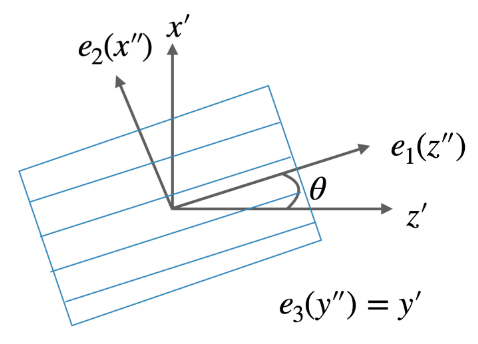</center>

截面坐标系$(x^{\prime}, y^{\prime}, z^{\prime})$如下图所示:
!<center>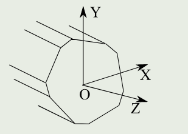</center>

对比二者的定义，当铺层角度$F$为0时，二者的坐标系方向完全一致，但对于叶片来说，铺层角度往往不为0。同样的，由于翼型的气动扭角和结构扭角，横截面坐标系与梁的坐标$(X,Y,Z)$同样存在扭转关系，该关系如下图所示：
!<center>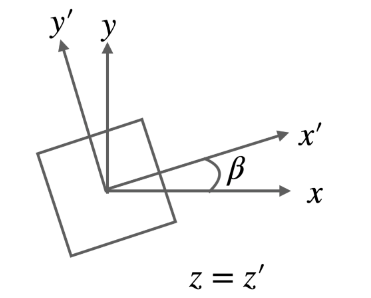</center>
基于上述坐标的定义，正交各向异性复合材料的材料参数需要独立的10个变量来描述。这些参数如下表所示:

| 参数          | 意义                                                     | 单位                         |
| ------------- | -------------------------------------------------------- | ---------------------------- |
| $E_i$       | 沿$i$轴的杨氏模量                                      | $p_a$                      |
| $G_{i j}$   | 在法向为$i$的平面上沿$j$ 方向的剪切模量             | $p_a$                      |
| $\nu_{i j}$ | 是当沿$i$方向施加拉伸时对应于$j$方向上的收缩的泊松比 | -                            |
| $\rho$      | 截面线质量                                               | $\mathrm{kg} / \mathrm{m}$ |

由于对称性，$\nu_{i j}E_j=\nu_{j i }E_i$。

#### 5.2.2 截面平衡方程

##### 5.2.2.1 位移与应变表达

截面积为$A$上一点$p$在截面坐标系下的的位移可以描述为：$\left[\begin{array}{lll}p_x & p_y & p_z\end{array}\right]^T$，根据材料力学，3D坐标系下的应变分量可以描述为：

$$
\left\{\begin{array}{l}\epsilon_x=\frac{\partial u_x}{\partial x} \\ \epsilon_y=\frac{\partial u_y}{\partial y} \\ \gamma_{x y}=\frac{\partial u_x}{\partial y}+\frac{\partial u_y}{\partial x} \\ \gamma_{x z}=\frac{\partial u_x}{\partial z}+\frac{\partial u_z}{\partial x} \\ \gamma_{y z}=\frac{\partial u_y}{\partial z}+\frac{\partial u_z}{\partial y} \\ \epsilon_z=\frac{\partial u_z}{\partial z}\end{array}\right.
$$

其中$\gamma_{i j}$表示为工程应变，考虑到小角度假设，该表达式可表达为：

$$
\left.\begin{array}{rl}\boldsymbol{\epsilon}^T & =\left[\begin{array}{lllll}\epsilon_{x x} & \epsilon_{y y} &2\epsilon_{x y} &2\epsilon_{x z} &2\epsilon_{y z}\end{array} \epsilon_{z z}\right.\end{array}\right]
$$

$$
\boldsymbol{\sigma}^T=\left[\begin{array}{llllll}\sigma_{x x} & \sigma_{y y} & \sigma_{x y} & \sigma_{x z} & \sigma_{y z} & \sigma_{z z}\end{array}\right]
$$

其中$\sigma_{i j}$表示应变张量，针对线弹性问题，应力与应变可以通过胡可定律描述二者的关系：

$$
\sigma=\mathbf{Q} \epsilon
$$

如下图所示，取截面平面上的微元，使得该微元做非平面运动的应力分量为：

$$
\mathbf{p}^T=\left[\begin{array}{lll}\sigma_{x z} & \sigma_{y z} & \sigma_{z z}\end{array}\right]
$$

该应力在梁截面上的积分为作用在截面上的力，该力等价为一个力$T$与力矩$M$，因此转换矩阵$n$可以描述为力T作用点的相对坐标原点的相对位置矩阵

$$
\mathbf{n}=\left[\begin{array}{ccc}0&0& y \\0&0& -x \\ -y & x &0\end{array}\right]
$$

该截面的力矢量可以表述为：

$$
\boldsymbol{F}=\left[\mathbf{T}^T \mathbf{M}^T\right]^T=\int_A \mathbf{Z}^T \mathbf{p d A}
$$

其中，转换矩阵$\mathbf{Z}=\left[\mathbf{I}_3\mid \mathbf{n}^T\right]$可以描述为：

$$
\mathbf{Z}=\left[\begin{array}{cccccc}1&0&0&0&0& -y \\0&1&0&0&0& x \\0&0&1& y & -x &0\end{array}\right]
$$

!<center>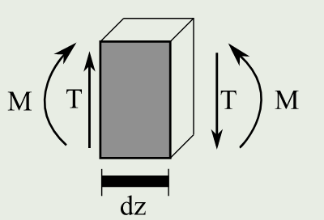</center>
如果该微元发生很小的位移形变，那么该运动可以描述为微元刚性运动与弹性位移的叠加，如下图所示：

!<center>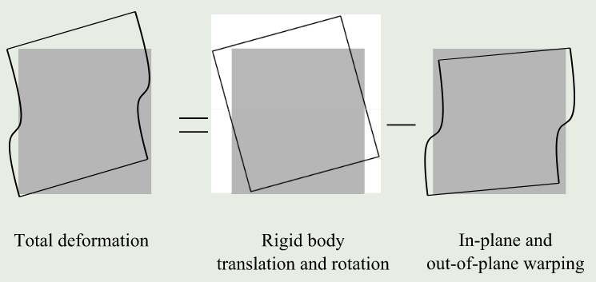</center>
因此，截面上微元的形变可以描述为：

$$
\mathbf{s}=\mathbf{v}+\mathbf{g}
$$

其中$\mathbf{v}=\left[v_x, v_y, v_z\right]^T$是微元与对应截面刚体位移相关的矢量，$\mathbf{g}=\left[g_x, g_y, g_z\right]^T$是微元对应截面的翘曲位移相关的矢量。而参考点上的位移可以描述为：

$$
\mathbf{r}^T=\left[\begin{array}{llllll} \chi_x &  \chi_y &  \chi_z &  \phi_x &  \phi_y &  \phi_z\end{array}\right]
$$

因此，微元的位移与参考点位移存在以下转换关系：

$$
\mathbf{s}=\mathbf{Z r}+\mathbf{g}
$$

根据连续介质力学，应变 $\boldsymbol{\epsilon}$ 由位移的梯度定义为：

$$
\boldsymbol{\epsilon}=\mathbf{B} \mathbf{s}+\mathbf{S} \frac{\partial \mathbf{s}}{\partial z}
$$

其中$\mathbf{B}$和$\mathbf{S}$可以表示为：

$$
\left[\begin{array}{c}\epsilon_{x x} \\ \epsilon_{y y} \\2\epsilon_{x y} \\2\epsilon_{x z} \\2\epsilon_{y z} \\ \epsilon_{z z}\end{array}\right]=\underbrace{\left[\begin{array}{ccc}\partial / \partial x &0&0\\0& \partial / \partial y &0\\ \partial / \partial y & \partial / \partial x &0\\0&0& \partial / \partial x \\0&0& \partial / \partial y \\0&0&0\end{array}\right]}_{\mathbf{B}}\left[\begin{array}{c}s_x \\ s_y \\ s_z\end{array}\right]+\underbrace{\left[\begin{array}{lll}0&0&0\\0&0&0\\0&0&0\\1&0&0\\0&1&0\\0&0&1\end{array}\right]}_{\mathbf{S}}\left[\begin{array}{l}\partial s_x / \partial z \\ \partial s_y / \partial z \\ \partial s_z / \partial z\end{array}\right]
$$

将公式$\mathbf{s}=\mathbf{Z r}+\mathbf{g}$代入上式可得：

$$
\boldsymbol{\epsilon}=\mathbf{B Z r}+\mathbf{S Z} \frac{\partial \mathbf{r}}{\partial z}+\mathbf{B g}+\mathbf{S} \frac{\partial \mathbf{g}}{\partial z}
$$

上式可以进一步表达为：

$$
\boldsymbol{\epsilon}=\mathbf{S Z} \psi+\mathbf{B g}+\mathbf{S} \frac{\partial \mathbf{g}}{\partial z}
$$

其中$\psi=\mathbf{T}_r \mathbf{r}+\frac{\partial \mathbf{r}}{\partial z}$，且

$$
\mathbf{T}_r=\left[\begin{array}{cccccc}0&0&0&0& -1&0\\0&0&0&1&0&0\\0&0&0&0&0&0\\0&0&0&0&0&0\\0&0&0&0&0&0\\0&0&0&0&0&0\end{array}\right]
$$

应变参数$\psi$的物理意义是相邻截面刚性位移而引起的应变，其向量表达式为：

$$
\boldsymbol{\psi}=\left[\tau_x, \tau_y, \tau_z, \kappa_x, \kappa_y, \kappa_z\right]^T
$$

式中：

- $\tau_x=\frac{\partial \chi_x}{\partial z}-\varphi_y$ 表示截面在$x$方向上的剪切应变
- $\tau_y=\frac{\partial \chi_y}{\partial z}+\varphi_x$ 表示截面在$y$方向上的剪切应变
- $\tau_z=\frac{\partial \chi_x}{\partial z}$ 表示截面在$z$方向上的轴向应变
- $\kappa_x=\frac{\partial \varphi_x}{\partial z}$ 表示截面围绕$x$的曲率
- $\kappa_y=\frac{\partial \varphi_y}{\partial z}$ 表示截面围绕$y$的曲率
- $\kappa_z=\frac{\partial \varphi_z}{\partial z}$ 表示截面扭转
  刚性和旋转位移的表达较为简单，对于翘曲位移$g$可以通过有限元方法进行离散化，单元内的点的翘曲位移可以通过4节点单元的节点翘曲$u_i$位移和形函数$N_i$表示，如下式所示：

$$
\mathbf{g}(x, y, z)=\mathbf{N}_i(x, y) \mathbf{u}\left(x_i, y_i, z\right)
$$

因此，应变位移关系可以通过形函数表示为：

$$
\boldsymbol{\epsilon}=\mathbf{S Z} \psi+\mathbf{B N u}+\mathbf{S N} \frac{\partial \mathbf{u}}{\partial z}
$$

##### 5.2.2.2 虚功原理

为了保持静态平衡,虚功原理要求内部弹性力所做的内部虚功$W_i$与作用在截面上的外力所做的外部虚功$W_e$相同,对于截面参数,可以忽略体积力和面力。因此,截面应力所做的功就是外部功。

1）外部虚功
单位长度上的外力虚功的变分表达式为：

$$
\delta \frac{\partial W_e}{\partial z}=\int_A \frac{\partial\left(\delta \mathbf{s}^T \mathbf{p}\right)}{\partial z} \mathrm{dA}
$$

将位移表达式（$\mathbf{s}=\mathbf{Z r}+\mathbf{g}$）代入上式可得：

$$
\begin{aligned} \delta \frac{\partial W_e}{\partial z} & =\int_A \frac{\partial\left(\delta(\mathbf{Z r}+\mathbf{g})^T \mathbf{p}\right)}{\partial z} \mathrm{dA}\\ & =\underbrace{\delta \frac{\partial \mathbf{r}^T}{\partial z} \int_A \mathbf{Z}^T \mathbf{p} \mathrm{dA}+\delta \mathbf{r}^T \int_A \mathbf{Z}^T \frac{\partial \mathbf{p}}{\partial z} \mathrm{dA}}_{\text {刚性位移所做的功 }} \\ & +\underbrace{\delta \frac{\partial \mathbf{u}^T}{\partial z} \int_A \mathbf{N}^T \mathbf{p} \mathrm{dA}+\delta \mathbf{u}^T \int_A \mathbf{N}^T \frac{\partial \mathbf{p}^T}{\partial z} \mathrm{dA}}_{\text {翘曲位移所做的功 }}\end{aligned}
$$

其中的刚性位移所做的功可以通过公式($\boldsymbol{F}=\left[\mathbf{T}^T \mathbf{M}^T\right]^T=\int_A \mathbf{Z}^T \mathbf{p d A}$)简化为:

$$
\delta \frac{\partial \mathbf{r}^T}{\partial z} \boldsymbol{F}+\delta \mathbf{r}^T \frac{\partial \boldsymbol{F}}{\partial z}
$$

为了建立与应变参数$$的关系，上式可以通过数学变化为：

$$
\begin{aligned} \delta \frac{\partial \mathbf{r}^T}{\partial z} \boldsymbol{F}+\delta \mathbf{r}^T \frac{\partial \boldsymbol{F}}{\partial z} & =\delta \frac{\partial \mathbf{r}^T}{\partial z} \boldsymbol{F}+\delta \mathbf{r}^T \frac{\partial \boldsymbol{F}}{\partial z}+\delta \mathbf{r}^T \mathbf{T}_r^t \boldsymbol{F}-\delta \mathbf{r}^T \mathbf{T}_r^T \boldsymbol{F} \\ & =\delta \mathbf{r}^T \frac{\partial \boldsymbol{F}}{\partial z}-\delta \mathbf{r}^T \mathbf{T}_r^T \boldsymbol{F}+\delta \underbrace{\left(\mathbf{r}^T \mathbf{T}_r^t+\frac{\partial \mathbf{r}^T}{\partial z}\right)}_{\boldsymbol{\psi}^T} \boldsymbol{F} \\ & =\delta \mathbf{r}^T \frac{\partial \boldsymbol{F}}{\partial z}-\delta \mathbf{r}^T \mathbf{T}_r^t \boldsymbol{F}+\delta \boldsymbol{\psi}^T \boldsymbol{F}\end{aligned}
$$

因此，外力虚功的总的表达式为：

$$
\delta \frac{\partial W_e}{\partial z}=\underbrace{\delta \mathbf{r}^T \frac{\partial \mathbf{F}}{\partial \boldsymbol{z}}-\delta \mathbf{r}^T \mathbf{T}_r^t \mathbf{F}+\delta \boldsymbol{\psi}^T \mathbf{F}}_{\text {刚性位移所做的功}}+\underbrace{\delta \frac{\partial \mathbf{u}^T}{\partial \boldsymbol{z}} \int_A \mathbf{N}^T \mathbf{p d} \mathbf{A}+\delta \mathbf{u}^T \int_A \mathbf{N}^T \frac{\partial \mathbf{p}^T}{\partial \mathbf{z}} \mathrm{dA}}_{\text {翘曲位移所做的功}}
$$

根据BECAS当中对该公式的矩阵化表达，该表达式进一步可以通过节点应力的有限元离散化方法表达。横截面上的离散化应力表达为：

$$
\mathbf{P}=\int_A \mathbf{N}^T \mathbf{p} \mathrm{dA}
$$

对该式求偏导可得：

$$
\frac{\partial \mathbf{P}}{\partial z}=\int_A \mathbf{N}^T \frac{\partial \mathbf{p}^T}{\partial z} \mathrm{dA}
$$

因此，外力虚功可以矩阵化为：

$$
\delta \frac{\partial W_e}{\partial z}=\left[\begin{array}{c}\delta \frac{\partial \mathbf{u}^T}{\partial z} \\ \delta \mathbf{u} \\ \delta \boldsymbol{\psi}\end{array}\right]^T\left[\begin{array}{c}\mathbf{P} \\ \frac{\partial \mathbf{P}}{\partial z} \\ \boldsymbol{F}\end{array}\right]+\delta \mathbf{r}^T\left(\frac{\partial \boldsymbol{F}}{\partial z}-\mathbf{T}_r^T \boldsymbol{F}\right)
$$

2）内部虚功
单位长度上的线弹性材料内部弹力的虚功变分表达式为：

$$
\delta \frac{\partial W_i}{\partial z}=\int_A \delta \boldsymbol{\epsilon}^T \mathbf{Q} \boldsymbol{\epsilon} \mathrm{dA}
$$

将应变-位移关系式($\boldsymbol{\epsilon}=\mathbf{S Z} \psi+\mathbf{B N u}+\mathbf{S N} \frac{\partial \mathbf{u}}{\partial z}$)代入上式可得：

$$
\begin{aligned} \delta \frac{\partial W_i}{\partial z}= & \int_A\left(\delta \boldsymbol{\psi}^T \mathbf{Z}^T \mathbf{S}^T+\delta \mathbf{u}^T \mathbf{N}^T \mathbf{B}^T+\delta \frac{\partial \mathbf{u}^T}{\partial z} \mathbf{N}^T \mathbf{S}^T\right) \mathbf{Q} \left(\mathbf{S Z} \boldsymbol{\psi}+\mathbf{B N u}+\mathbf{S N} \frac{\partial \mathbf{u}}{\partial z}\right) \mathrm{dA} \\ = & \int_A \delta \boldsymbol{\psi}^T \mathbf{Z}^T \mathbf{S}^T \mathbf{Q} \mathbf{S Z} \boldsymbol{\psi} \mathrm{dA} \\ & +\int_A \delta \boldsymbol{\psi}^T \mathbf{Z}^T \mathbf{S}^T \mathbf{Q B N u} \mathrm{dA} \\ & +\int_A \delta \boldsymbol{\psi}^T \mathbf{Z}^T \mathbf{S}^T \mathbf{Q} \mathbf{S N} \frac{\partial \mathbf{u}}{\partial z} \mathrm{dA} \\ & +\int_A \delta \mathbf{u}^T \mathbf{N}^T \mathbf{B}^T \mathbf{Q S Z} \psi \mathrm{dA} \\ & +\int_A \delta \mathbf{u}^T \mathbf{N}^T \mathbf{B}^T \mathbf{Q B N u} \mathrm{dA} \\ & +\int_A \delta \mathbf{u}^T \mathbf{N}^T \mathbf{B}^T \mathbf{Q S N} \frac{\partial \mathbf{u}}{\partial z} \mathrm{dA} \\ & +\int_A \delta \frac{\partial \mathbf{u}^T}{\partial z} \mathbf{N}^T \mathbf{S}^T \mathbf{Q S Z} \psi \mathrm{dA} \\ & +\int_A \delta \frac{\partial \mathbf{u}^T}{\partial z} \mathbf{N}^T \mathbf{S}^T \mathbf{Q B N u} \mathrm{dA} \\ & +\int_A \delta \frac{\partial \mathbf{u}^T}{\partial z} \mathbf{N}^T \mathbf{S}^T \mathbf{Q S N} \frac{\partial \mathbf{u}}{\partial z} \mathrm{dA}\end{aligned}
$$

其中，可以将面积分的部分进行简化并标记为：

$$
\begin{aligned} & \mathbf{A}=\int_A \mathbf{Z}^T \mathbf{S}^T \mathbf{Q S Z} \mathrm{dA} \\ & \mathbf{R}=\int_A \mathbf{N}^T \mathbf{B}^T \mathbf{Q S Z} \mathrm{dA} \\ & \mathbf{E}=\int_A \mathbf{N}^T \mathbf{B}^T \mathbf{Q B N} \mathrm{dA} \\ & \mathbf{C}=\int_A \mathbf{N}^T \mathbf{S}^T \mathbf{Q B N ~ d A} \\ & \mathbf{L}=\int_A \mathbf{N}^T \mathbf{S}^T \mathbf{Q S Z} \mathrm{dA} \\ & \mathbf{M}=\int_A \mathbf{N}^T \mathbf{S}^T \mathbf{Q S N} \mathrm{dA}\end{aligned}
$$

同样，根据BECAS当中对该公式的矩阵化表达方法，该表达式可以矩阵化为：

$$
\delta \frac{\partial W_i}{\partial z}=\left[\begin{array}{c}\delta \frac{\partial \mathbf{u}}{\partial z} \\ \delta \mathbf{u} \\ \delta \boldsymbol{\psi}\end{array}\right]^T\left[\begin{array}{ccc}\mathbf{M} & \mathbf{C} & \mathbf{L} \\ \mathbf{C}^T & \mathbf{E} & \mathbf{R} \\ \mathbf{L}^T & \mathbf{R}^T & \mathbf{A}\end{array}\right]\left[\begin{array}{c}\frac{\partial \mathbf{u}}{\partial z} \\ \mathbf{u} \\ \boldsymbol{\psi}\end{array}\right]
$$

由于静力平衡下的总的虚功为0，联立外力虚功与内部虚功的矩阵表达式可得：

$$
\left[\begin{array}{c}\delta \frac{\partial \mathbf{u}}{\partial z} \\ \delta \mathbf{u} \\ \delta \boldsymbol{\psi}\end{array}\right]^T\left[\begin{array}{ccc}\mathbf{M} & \mathbf{C} & \mathbf{L} \\ \mathbf{C}^T & \mathbf{E} & \mathbf{R} \\ \mathbf{L}^T & \mathbf{R}^T & \mathbf{A}\end{array}\right]\left[\begin{array}{c}\frac{\partial \mathbf{u}}{\partial z} \\ \mathbf{u} \\ \boldsymbol{\psi}\end{array}\right]
=\delta \frac{\partial W_e}{\partial z}=\left[\begin{array}{c}\delta \frac{\partial \mathbf{u}^T}{\partial z} \\ \delta \mathbf{u} \\ \delta \boldsymbol{\psi}\end{array}\right]^T\left[\begin{array}{c}\mathbf{P} \\ \frac{\partial \mathbf{P}}{\partial z} \\ \boldsymbol{F}\end{array}\right]+\delta \mathbf{r}^T\left(\frac{\partial \boldsymbol{F}}{\partial z}-\mathbf{T}_r^T \boldsymbol{F}\right)
$$

上述等式对于任意虚位移都成立，因此$\delta \boldsymbol{\psi}$, $\delta \mathbf{u}, \delta \frac{\partial \mathbf{u}^T}{\partial z}$ 和 $\delta \mathbf{r}$不为$0$，估上式的一个解应该满足：

$$
\frac{\partial \boldsymbol{F}}{\partial z}=\mathbf{T}_r^T \boldsymbol{F}
$$

进一步的：

$$
\begin{aligned} \mathbf{M} \frac{\partial \mathbf{u}}{\partial z}+\mathbf{C}^T \mathbf{u}+\mathbf{L} \psi & =\mathbf{P} \\ \mathbf{C} \frac{\partial \mathbf{u}}{\partial z}+\mathbf{E u}+\mathbf{R} \psi & =\frac{\partial \mathbf{P}}{\partial z} \\ \mathbf{L}^T \frac{\partial \mathbf{u}}{\partial z}+\mathbf{R}^T \mathbf{u}+\mathbf{A} \boldsymbol{\psi} & =\boldsymbol{F}\end{aligned}
$$

对上述表达式1进行微分，可进一步简化：

$$
\mathbf{M} \frac{\partial^2\mathbf{u}}{\partial z^2}+\mathbf{C}^T \frac{\partial \mathbf{u}}{\partial z}+\mathbf{L} \frac{\partial \boldsymbol{\psi}}{\partial z}=\frac{\partial \mathbf{P}}{\partial z}
$$

联立可得截面的平衡方程组为：

$$
\begin{aligned} \mathbf{M} \frac{\partial^2\mathbf{u}}{\partial z^2}+\left(\mathbf{C}-\mathbf{C}^T\right) \frac{\partial \mathbf{u}}{\partial z}+\mathbf{L} \frac{\partial \boldsymbol{\psi}}{\partial z}-\mathbf{E u}-\mathbf{R} \boldsymbol{\psi} & =\mathbf{0} \\ \mathbf{L}^T \frac{\partial \mathbf{u}}{\partial z}+\mathbf{R}^T \mathbf{u}+\mathbf{A} \boldsymbol{\psi} & =\boldsymbol{F} \\ \frac{\partial \boldsymbol{F}}{\partial z} & =\mathbf{T}_r^T \boldsymbol{F}\end{aligned}
$$

#### 5.2.3 平衡方程的解

### 5.3 实现方法

### 5.4 验证对比

### 5.5 文本输入定义与使用

### 5.6 API使用方法

## 6 结构动力学

### 6.1 多体动力学(MBDL)

### 6.2 有限元(FEML)

#### 6.2.1	线性模态叠加法AMM
##### 6.2.1.1 前言
模态分析(modal analysis)是研究结构动态特性的一种有效方法之一，主要应用于工程振动领域。模态通常指结构的固有振动特性，每一阶模态都有特定的固有频率、阻尼比和振型。获取上述模态参数的过程称为模态分析。它可以分为数值模态分析和试验模态分析。

!<center>
图:汽车排气管道的模态分析</center>

如果模态参数是通过数值分析方法(如FEA分析)计算获得的，则称为数值模态分析；如果模态参数是通过试验设备获得的输入输出信号，借助参数识别方法获得的，则称为试验模态分析。本文主要从数值计算角度介绍什么是模态分析。

###### 6.2.1.1.1 无阻尼系统的自由振动
考虑下图所示的无阻尼单自由度系统，由牛顿第二定律，可以得到系统自由振动的微分方程为

$$
m \ddot{x}+k x=0
$$

!<center>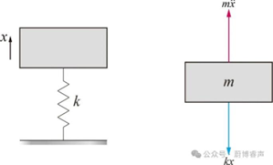</center>

上式的自由振动响应为:

$$
x=C e^{\lambda t}
$$
其中，$C$为待定常数,联立上面两式可得到系统的特征值为:

$$
\lambda_{1,2}= \pm j \omega_n
$$
式中，$\omega_n=\sqrt{k / m}$ ，因此可以得到式的解为：

$$
x(t)=C_1e^{j \omega_n t}+C_2e^{-j \omega_n t}
$$

根据欧拉公式，可以将上式改写为:

$$
x(t)=A_1\cos \omega_n t+A_2\sin \omega_n t
$$

其中，$A_1, A_2$为待定常数。假设系统的初始位移为$x_0$ ，初始速度为$\dot{x}_0$ ，从而得到系统的响应为:

$$
x(t)=\frac{\dot{x}_0}{\omega_n} \sin \omega_n t+x_0\cos \omega_n t
$$
将上式可以重新表示为:

$$x(t)=A \sin \left(\omega_n t+\theta\right)$$

其中:

$$A=\sqrt{x_0^2+\left(\frac{\dot{x}_0}{\omega_n}\right)^2}, \quad \theta=\arctan \left(\frac{x_0\omega_n}{\dot{x}_0}\right)
$$

从上式可以看出，无阻尼系统的自由振动为简谐振动。式中，$A$,$ω_n$,$θ$分别表示简谐振动的幅值(amplitude)、固有圆频率(circular frequency)、相位角(phase angle)。工程上常采用固有频率(natural frequency)，用以表征单位时间内振动的重复次数，单位为Hz。它与固有圆频率的关系为:

$$
\omega_n=2\pi f=\frac{2\pi}{T}
$$

式中，T为简谐振动的周期。如下图所示:
!<center> 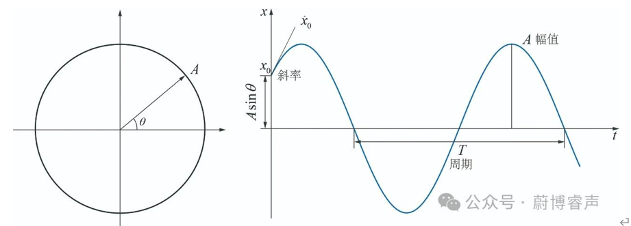 </center>

###### 6.2.1.1.2 粘性阻尼系统的自由振动

考虑上图单自由度粘性阻尼系统的自由振动微分方程

!<center> 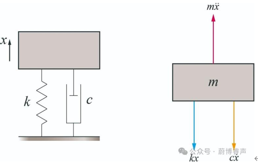</center>
$$
m \ddot{x}+c \dot{x}+k x=0
$$
式中，$m, c, k$分别表示系统的质量，粘性阻尼系数和刚度；$\ddot{x}, \dot{x}$和$x$分别代表系统的加速度，速度和位移。将系统的特征值代入方程可得:

$$m \lambda^2+c \lambda+k=0$$

式中，$\lambda$为系统特征值，上式的根为:

$$\lambda_{1,2}=-\frac{c}{2m} \pm \sqrt{\left(\frac{c}{2m}\right)^2-\frac{k}{m}}$$

由于阻尼的不同取值会造成不同形式的解，因此定义临界阻尼(critical damping)使得的根式为零，即

$$\left(\frac{c_c}{2m}\right)^2-\frac{k}{m}=0$$

故而可以得到:

$$c_c=2m \sqrt{\frac{k}{m}}=2m \omega_n$$

定义临界阻尼比(critical damping ratio)，有:

$$\zeta=\frac{c}{c_c}$$

这样，根可以重新表达为:

$$\lambda_{1,2}=-\zeta \omega_n \pm \sqrt{\zeta^2-1} \omega_n$$

考虑以下情况:
- 临界阻尼情形(ζ=1)
上面根式可化简为:

$$\lambda_{1,2}=-\omega_n$$

此时，系统的响应满足

$$x(t)=\left(C_1+C_2t\right) e^{-\omega_n t}$$

利用初始位移与速度条件，最终可以得到系统的响应为:

$$x(t)=\left[x_0+\left(\dot{x}_0+\omega_n x_0\right) t\right] e^{-\omega_n t}$$

- 欠阻尼情形(ζ<1)
定义阻尼固有频率$\omega_d=\sqrt{1-\zeta^2} \omega_n$ 上面根式可化简为:

$$\lambda_{1,2}=-\zeta \omega_n \pm j \omega_d$$

此时，系统的响应为:

$$x(t)=e^{-\zeta \omega_n t}\left(C_1e^{j \omega_d t}+C_2e^{-j \omega_a t}\right)$$

利用初始位移与速度条件，可以得到系统的响应为:

$$x(t)=e^{-\zeta \omega_n t}\left(x_0\cos \omega_d t+\frac{\dot{x}_0+\zeta \omega_n x_0}{\omega_d} \sin \omega_d t\right)$$

!<center> 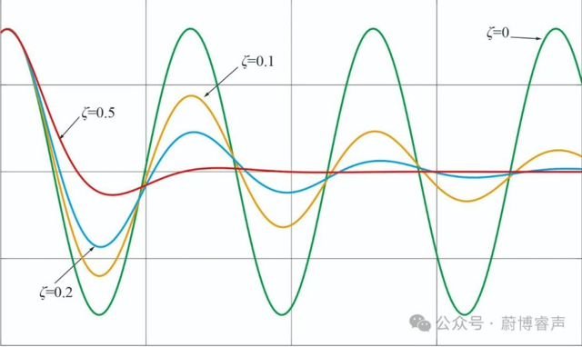
</center> 

从上图可以发现，随着阻尼的增加时，振动响应的幅值衰减越快。

- 过阻尼情形(ζ<1)
由于结构动力学主要研究的是欠阻尼系统的振动响应，这里就不再赘述过阻尼系统的响应。
##### 6.2.1.2	模态分析的基本概念

考虑自由度为n的无阻尼自由振动系统，其动力学方程可以表示为：

$$M \ddot{x}+K x=0$$
其中，$ M∈R^(n×n) $，$ K∈R^(n×n) $, 分别表示系统的质量矩阵和刚度矩阵。由于单自由度无阻尼自由系统的振动为简谐振动。同样，一个多自由度无阻尼系统的自由振动也是简谐振动。因此简谐振动的位移$x(t)$可以表示为：

$$x(t)=A \cos (\omega t+\phi)$$

其中：$A$是振幅，$ω$是角频率，$ϕ$是初相位。根据欧拉公式

$$e^{i \theta}=\cos (\theta)+i \sin (\theta)$$

可以将cos表示为:

$$\cos (\theta)=\frac{e^{i \theta}+e^{-i \theta}}{2}$$

将实数域向复数域转换：

$$x(t)=A \cos (\omega t+\phi)=A \cdot \frac{e^{i(\omega t+\phi)}+e^{-i(\omega t+\phi)}}{2}$$

我们可以引入复数表示：

$$z(t)=A e^{i(\omega t+\phi)}$$

如果初始相位角为0，上式亦可表示为：

$$\boldsymbol{x}=\varphi e^{\mathrm{j} t}$$

其中$x \in R^{n \times1}$, $φ∈ R^{n \times1}$ 。上式表示多自由度系统中各点同时做同相或反相的同频简谐振动。可得：

$$\left(-\omega^2M+\boldsymbol{K}\right) \varphi=\mathbf{0}$$

上式为一广义特征值问题，$ω^2$为特征值，$φ$ 为特征向量。上式有非零解的充要条件是:

$$\left|\boldsymbol{K}-\omega^2\boldsymbol{M}\right|=0$$

根据线性代数理论，若系统质量矩阵为正定矩阵，刚度矩阵为正定或半正定矩阵，则上式存在n个非负的实特征值 ，对应的特征向量 为实矢量，且满足:

$$\left(-\omega_i^2\boldsymbol{M}+\boldsymbol{K}\right) \boldsymbol{\varphi}_i=\mathbf{0}$$

由于系统的固有频率和主振型都为实数，所以也将上述模态分析称为实模态分析。将求解上式得到系统的特征值，按升序排列，即 $ω_1<ω_2<⋯<ω_n$。$ω_i$ 称为系统的第r阶固有频率(natural frequency)，对应的特征向量称为系统的第r阶振型(modal shape)。将n个特征向量按列排列组成一个n×n的矩阵，即

$$\Phi=\left[\begin{array}{llll}\varphi_1& \varphi_2& \cdots & \varphi_n\end{array}\right]$$

称为系统的模态矩阵。由于上式的系数矩阵为奇异矩阵，因此$φ_i$为无限多组。虽然$φ_i$中的各分量始终保持着一定的比例关系，但是它自身并不是确定的。所以，需要将特征向量$φ_i$进行归一化(normalization)处理。其中，最为常用的两种方法分别是:
- 最大幅值归一化
该方法的原理是将模态向量中绝对值最大的元素取为1。
- 质量归一化
该方法通过对模态向量进行比例缩放，使其满足如下关系式:

$$\varphi_r^I M \varphi_r=1$$

正是这一特点，决定了模态分析得到的振型幅值没有绝对的物理意义。HAWTC当中的模态是取了叶片的前三阶模态和塔架的前4阶模态来计算，输入形式是归一化后的系数拟合形式，这一点域OpenFAST是一样的，但HAWTC支持模态的自行计算，得益于FEML模块，HAWTC可以计算梁和框架系统的模态。以上介绍了模态分析的计算原理。那么怎样去理解模态呢？它可以理解为在某一固有频率下，系统中各点按照某一固定比例同时做同相或反相的同频简谐振动。当外部激励频率与某阶模态的固有频率接近时，在合适的作用点更容易激励起与之振型相似的振动。
同时,为了实现与Bladed相同的计算精度,HawtC2将通过TurbineL模块计算更多的叶片模态,以实现高精度计算.

!<center> 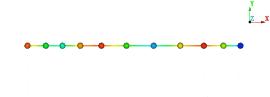</center> 
##### 6.2.1.3 模态叠加理论
模态叠加法与有限元方法密切相关，是有限元方法的降阶模型。其基本思想是以有限元为平台,反复利用瞬态分析求解风力机在周期性载荷作用下的稳态响应。瞬态分析包括完全法、缩减法和模态叠加法。完全法计算量大且计算时间较长;缩减法不能在时间单元上添加载荷且所有荷载必须加载用户定义的主自由度上;模态叠加法相对于其它方法计算速度较快、效率高。风力机中叶片和塔架的多自由度运动方程为：

$$[\boldsymbol{M}]\{\boldsymbol{\ddot{u}}\}+[\boldsymbol{C}]\{\boldsymbol{\dot{u}}\}+[\boldsymbol{K}]\{\boldsymbol{u}\}=\{\boldsymbol{F}(\boldsymbol{t})\}$$

对于节点位移向量来说，可以将其表示为： 

$$u=[\psi] \eta$$

其中：模态系数表示为$\boldsymbol{\eta}=\left[\begin{array}{llll}u_1& u_2& \cdots & u_n\end{array}\right]^T$,$[ψ]^T$为系统的振型矩阵,则系统的强迫振动方程为：

$$
[\boldsymbol{M}][\boldsymbol{\psi}] \boldsymbol{\ddot{\eta}}+[\boldsymbol{C}][\boldsymbol{\psi}] \boldsymbol{\dot{\eta}}+[\boldsymbol{K}][\boldsymbol{\psi}] \boldsymbol{\eta}=\{\boldsymbol{F}(\boldsymbol{t})\}
$$

上式左右乘以特征振型$[ψ]^T$可得:

$$
[\boldsymbol{\psi}]^{\mathrm{T}}[\boldsymbol{M}][\boldsymbol{\psi}] \ddot{\boldsymbol{\eta}}+[\boldsymbol{\psi}]^{\mathrm{T}}[\boldsymbol{C}][\boldsymbol{\psi}] \dot{\boldsymbol{\eta}}+[\boldsymbol{\psi}]^{\mathrm{T}}[\boldsymbol{K}][\boldsymbol{\psi}] \boldsymbol{\eta}=[\boldsymbol{\psi}]^{\mathrm{T}}\{\boldsymbol{F}(\boldsymbol{t})\}
$$

由于$[ψ]$具有正交性,则主坐标下的方程为:

$$
[\boldsymbol{I}] \boldsymbol{\ddot{\eta}}+[\boldsymbol{\psi}]^{\mathrm{T}}[\boldsymbol{C}][\boldsymbol{\psi}] \boldsymbol{\dot{\eta}}+[\boldsymbol{\Lambda}] \boldsymbol{\eta}=\{\boldsymbol{R}(\boldsymbol{t})\}
$$

由主振型的正交性可得:

$$
[\boldsymbol{\psi}]^{\mathrm{T}}[\boldsymbol{C}][\boldsymbol{\psi}] \boldsymbol{\dot{\eta}}=\left\{\begin{array}{cc}2\omega_j \xi_i, & i=j \\0, & i \neq j\end{array}\right.
$$

式中: $ξ_i$为第i阶模态振型的阻尼比; $ω_i$为第i阶模态振型的频率, 采用模态叠加法可以得到各个节点自由度上的位移响应为:

$$
u(t)=\Psi_1\xi_1(t)+\Psi_2\xi_2(t)+\cdots+\Psi_n \xi_n(t)=\sum_{i=1} \Psi_i \xi_i(t)
$$


### 6.3 非线性有限元梁(BeamL)

#### 6.3.1 共旋非线性梁理论(CRT)

#### 6.3.2 几何精确梁理论GEBT

### 6.3.3 非线性梁与MBD的耦合方法

### 6.4 支持结构动力学(SubFEML)

### 6.4.3 支持结构与MBD的耦合方法

### 6.5 TMDI动力学

#### 6.5.1 塔架TMDI

#### 6.5.2 叶片TMDI

## 7 岩土工程动力学(SoilL)

有多种方法可以使用HawtC2模型化土壤与结构的相互作用。最简单的方法（例如固定结构或线性弹簧）可以通过模板进行建模，而更复杂的模型（例如 PISA 模型或滞回阻尼）可以通过导入支撑结构进行建模。还可以通过阻尼器来建模阻尼效果。在HawtC2中，弹簧被建模为“支撑力”。支撑可以应用于支撑结构的任何节点（不一定在海床下方）。同样地，阻尼器也可以添加到任何节点上。即使通常用它们来模拟土壤与结构的相互作用，也可以用它们来模拟任何其他需要弹簧或阻尼器的效果。Jonkman 等人 [Jonkman et al. (2010k)]给出了简单岩土工程模型的概述,下图显示了一些可以在HawtC中建模的简单模型。

!<center>

<figcaption>简单的状图模型</figcaption>
</center>

### 7.1 土壤刚度

当支撑结构的一部分位于地下时，可以对土壤刚度（包括平移和旋转刚度）进行建模。支撑结构（例如单桩或桁架塔）的参数“土壤刚度”定义了将施加到地下节点的载荷。施加到节点上的载荷可以定义为:

$$
\boldsymbol{F}(\boldsymbol{t})=\boldsymbol{k}_s \cdot \eta(\boldsymbol{t}) \cdot\left(\boldsymbol{L}_u /2+\boldsymbol{L}_d /2\right)
$$

 其中:

- $k_s$ 是土壤刚度, 单位为 $\mathrm{N} \cdot \mathrm{m}^{-2}$ 对于土壤的平移刚度,单位是: $\mathrm{N} \cdot \mathrm{rad}^{-1}$ 是对于土壤的旋转刚度
- $\quad\eta(t)$ 是节点的位移
- $L_u$ and $L_d$ 是节点上方和下方元素的长度，如果它们仍然在地面以下。例如，如果节点位于海底，则只有节点下方的元素对该方程有贡献
  在SoilL的代码中，土壤刚度被建模为节点上的线性弹簧。因此弹簧的刚度可以计算为

$$
k=k_s \cdot\left(L_u /2+L_d /2\right)
$$

eg:
土壤（线性）刚度默认为:$k_s=500000\mathrm{~N} \cdot \mathrm{~m}^{-2}$,所有元件的长度L=5 m。因此，土壤刚度为:

$$
k=500000\mathrm{~N} \cdot \mathrm{~m}^{-2} \cdot\left(5 /2+5 /2\right)=250000\mathrm{~N} \cdot \mathrm{~m}^{-2}
$$

请注意，对于海床上的节点，如前所述，只有节点下方的单元会对土壤刚度产生贡献。因此，施加到海床节点的弹簧刚度将是前一个示例中节点弹簧刚度的一半.

### 7.2 线性弹簧模型

在SoilL 当中,线性弹簧应用于节点，并作为支撑力进行建模，其刚度为 N/m（平移弹簧）或 N/rad（旋转弹簧）。当弹簧作用于节点时，该节点将承受载荷:

$$
L_i=K \cdot d_i
$$

其中:

- $L_i$是沿与自由度 相对应方向的载荷（力或力矩）
- $K$是弹簧刚度
- $d_i$是节点的位移（或旋转）

### 7.3 阻尼-缓冲器模型

在SoilL 当中,阻尼可建模为非线性荷载。阻尼因子可以作为参数包括在支撑结构部分，或者在定义导入结构的支撑结构文本文件中。阻尼荷载计算如下

$$
L=D_f \cdot V
$$

其中:

- $L$是施加到节点上的阻尼负载的大小
- $D_f$是阻尼因子
- $V$是节点速度的大小

显然的是阻尼载荷施加于节点速度的相反方向。

### 7.4 非线性弹簧模型

HawtC2 提供了实现非线性弹簧的功能，即弹簧的刚度取决于节点的位移。非线性弹簧可以用作平移弹簧或旋转弹簧。非线性弹簧以位移与力的查找表形式（所谓的 P-y 曲线）输入到描述导入的支撑结构的文本文件中。当一个节点发生位移时，其会受到一个与位移在弹簧方向上的投影值相对应的力，并且该力的方向与位移方向相反。如果位移介于查找表中的两个值之间，力将在最接近的值之间进行线性插值。下图展示了一个 P-y 曲线的示例：

<div align=center><div align=left>

非线性弹簧可以应用于所有六个自由度，这使得PISA模型(Byrne, Byron W., Harvey J. Burd, Lidija Zdravković, Ross A. McAdam, David M. G. Taborda, Guy T. Houlsby, Richard J. Jardine, Christopher M. Martin, David M. Potts, and Kenneth G. Gavin. “PISA: New Design Methods for Offshore Wind Turbine Monopiles.” Revue Française de Géotechnique, no. 158 (2019): 3. https://doi.org/10.1051/geotech/2019009.)得以在代码当中实现
当非线性弹簧应用于模型时，如果查找表包含如下定义的力$F$和位移$d$为:

$$
F=\left[F_1, F_2, F_3\cdots F_n\right]
$$

$$
d=\left[d_1, d_2, d_3\cdots d_n\right]
$$

然后对于位移  $d_x$ 使得  $d_i \leq d_x<d_{i+1}$, 刚度 $K\left(d_x\right)$ 被定义为:

$$
K\left(d_x\right)=\frac{F_{i+1}-F_i}{d_{i+1}-d_i}
$$

相同的定义适用于非线性旋转弹簧：旋转刚度是通过表中的力矩和旋转位移计算所得

## 8 控制理论(ControL)

本节说明可变速部分中的参数如何定义发电机的转矩与RPM曲线。转矩与RPM曲线描述了发电机转矩与发电机RPM的关系。为了说明可变速部分的参数如何定义该曲线，这里我们将以NREL 5MW 涡轮机的发电机为例，其定义可参见Jonkman 等人(Jonkman, Jason M., S. Butterfield, Walt Musial, and G. Scott. “Definition of a 5-MW Reference Wind Turbine for Offshore System Development.” NREL, February 2009.)。

### 8.1 简单的变桨控制

##### 最优控制曲线

在这里我们假设涡轮机始终在最佳条件下工作，这意味着产生的功率由以下公式给出：

$$
P=\frac{1}{2} \cdot C_{P, \max } \rho A v^3
$$

其中:

- $C_{P, \max }$是最大功率系数
- $\rho$是空气密度
- $A$是转子的投影面积
- $v$是是风速

我们现在将尖速比纳入方程中。尖速比定义为$T S R=\frac{\frac{2\pi \omega_r}{60} r}{v}$ ，其中$\omega_r$是转子的旋转速度，以每分钟转数（RPM）表示，$r$是转子的半径。
NREL 5 兆瓦涡轮的变速箱比为 97,因此TSR可以用发电机转速表示为$T S R=\frac{2\pi \omega_g \cdot r}{97\cdot60\cdot v}$通过用风力系数表达风速，并将该表达式代入功率方程，我们可以得到:

$$
P=\frac{1}{2} \cdot C_{P, \max } \rho A\left(\frac{2\pi \cdot r}{97\cdot60T S R}\right)^3\cdot \omega_g^3
$$

功率和发电机扭矩$T$通过公式$P=T \cdot \omega_g \frac{60}{2\pi}$关联（注意在这个公式中转速必须以$rad \cdot s^{-1}$给出）. 这得出了最佳扭矩的以下公式:

$$
T_{o p t}=K_{o p t} \cdot \omega_g^2
$$

$$
\quad K_{o p t}=\frac{1}{2} \cdot C_{P, \max } \rho A\left(\frac{r}{97\cdot T S R}\right)^3\left(\frac{2\pi}{60}\right)^2
$$

从文献当中可以获取$K_{\text {opt }}=0.02557N m \cdot R P M^{-2}$这给出了以下最佳扭矩曲线，即一种策略对应的曲线，在该策略中始终实现最佳功率系数：
!<center>

图 ：最优控制曲线

</center>

##### 区域 1

对于低转速情况下，发电机不会产生任何扭矩。这个转速范围被称为区域 1，对NREL 5MW 而言，该范围是 0 到 670 RPM。在这一区域内，发电机的扭矩与RPM曲线将是平坦的，如下图所示：

!<center>

图 ：区域1示意图

</center>

第一区域的上限由参数 "Transition RPM region 1 to 1.5" 给出，并定义为额定发电机速度的百分比。对于 NREL 5 MW 风机，额定发电机速度为 1173.7 RPM，因此 "Transition RPM region 1 to 1.5" 参数的值将为 57.08%。下限始终为 0。

##### 区域 1.5

在区域 1.5 中，曲线从 0 线性变化到最佳扭矩曲线。对于 NREL 5 MW 涡轮机，区域 1.5 的上限为 871 RPM，其对应的曲线如下：

!<center>
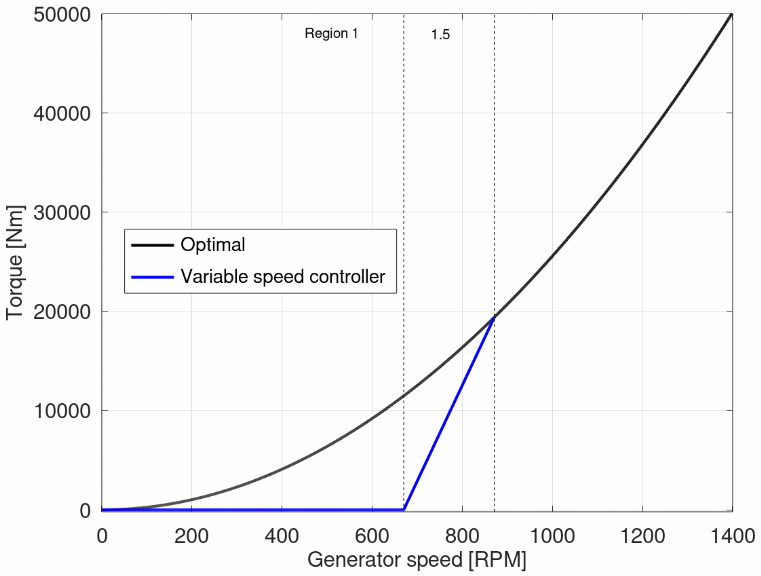

</center>

区域 1.5 的上限由参数“Transition RPM region 1.5 to 12”给出，并定义为额定发电机速度的百分比。对于 NREL 5 MW 涡轮机，额定发电机速度为 1173.7 rpm，因此“Transition RPM region 1.5 to 12”参数的值为 74.21%。

##### 区域 2

在区域 2 中，曲线遵循最优转矩曲线，因此涡轮机在最大功率系数下运行。曲线将如下所示：

!<center>


</center>

区域 2 的上限定义为区域 2.5 的下限，其将在下一部分进行计算。$K_opt$的值确定最佳曲线的系数由比例因子区域 2 参数给出，并定义为额定转矩与额定转速平方的比率的百分比。由于额定转速为 1173.7，额定转矩为 43093 Nm，我们此前发现:

$k_opt=0.02557N m \cdot R P M^2$
，这意味着比例因子区域 2 参数将为:$0.02557/ \frac{43093}{1173.7^2}=81.76\%$

##### 区域 2.5

区域 2.5 是另一个线性区域。在 NREL 5MW 案例中，其上限对应 99%。由于这是到区域 3 的过渡点，此点产生的功率将等于额定功率。请注意，这里我们讨论的是机械功率，而不是电功率。两者之间的区别在于发电机效率。在 NREL 5MW 风机的情况下，额定电功率为 5MW，发电机效率为 94.4%，因此额定机械功率为 5.29661MW。在区域 2.5 的上限处产生的扭矩因此为 43528 Nm。注意，这是额定扭矩的 1%更高，因为我们在额定速度的 99%生产额定功率。
下图中显示了区域 2.5 的上限为一个红点，额定扭矩为一条水平虚线。

!<center>


</center>

为了找到区域 2.5 的下限，首先计算线性曲线的斜率，使其在对应于发电机滑差的转速下与 x 轴相交。在 NREL 5 MW 的情况下，发电机滑差为 10%，这意味着区域 2.5 的线性曲线将在比额定转速低 10%的转速处与 x 轴相交，即 1056.33 RPM。这在下图中通过红色虚线进行了说明：

!<center>


</center>

区域 2.5 的下限（同时也是区域 2 的上限）被设定为红线与最佳扭矩曲线的交点，如下面的图所示：

!`<center>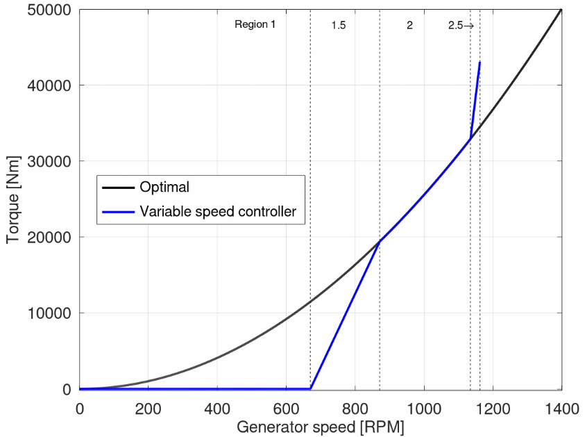</center>

区域 2.5 的上限由参数“区域 2.5 至 3 的转速过渡点”定义，作为额定速度的百分比。区域 2.5 的斜率基于上述解释的滑差参数计算。

##### 区域 3

在区域 3 中，叶片开始调整桨距以保持恒定的功率输出。根据之前建立的关系，该区域的转矩定义为 转矩与转速的关系曲线如下所示：

!<center>
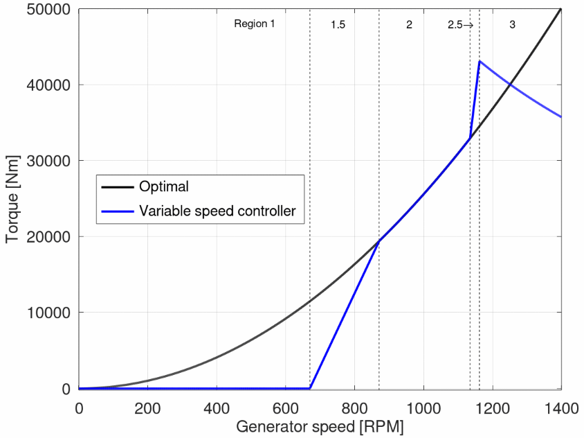

</center>

### 8.2 Bladed接口控制器

### 8.3 DTU-HAWC2接口控制器

### 8.4 NREL-OpenFAST接口控制器

请参考Bladed接口控制器部分，OpenFAST主要采用了DISCON接口控制器。

## 9 疲劳与极限载荷后处理(PostL)

## 10 风力机智能模块(WTAI)

### 10.1 目标预测器

#### 10.1.1 贝叶斯神经网络

##### 10.1.1.1 基础理论

##### 10.1.1.2 API 接口调用

我们给出使用C# 语言调用程序API的接口示例,同样,也可以使用C++,Python等调用.dll接口:

```csharp
//使用命名空间
using OpenWECD.WTAI.Prodictor
// 创建示例数据
var data = ReadMatrixFromFile(@"E:\HawtC2_MoptAPI\SCI\Res\output.txt")[(0,500),(1,11)];
// 数据结构为一个矩阵，每一行是一个个体，前variableCount列是变量，后targetCount列是目标
// 定义变量数量和目标数量
int variableCount = 4;
int targetCount = 6;
  
// 创建贝叶斯网络
var bayesianNetwork = new BayesianNetwork(variableCount, targetCount);
  
// 训练网络
bayesianNetwork.Train(data);
  
// 测试预测
var input = Vector<double>.Build.Dense(new double[] {0.822492	,0.348648,	4.281359,	0.471864});
var prediction = bayesianNetwork.Predict(input);
  
Console.WriteLine("输入: " + string.Join(" ", input));
Console.WriteLine("预测: " + string.Join(" ", prediction));
  
// 与实际值比较
var actual = Vector<double>.Build.Dense(new double[] {5.051915	,3.074206,	491.646108,	200.797831	,16388.781619,	7007.493491
});
Console.WriteLine("实际: " + string.Join(" ", actual));
```

#### 10.1.2 BP神经网络

##### 10.1.2.1 基础理论

##### 10.1.2.2 API 接口调用

我们给出使用C# 语言调用程序API的接口示例,同样,也可以使用C++,Python等调用.dll接口:

```csharp
//使用命名空间
using OpenWECD.WTAI.Prodictor
// 创建示例数据
var data = ReadMatrixFromFile(@"E:\HawtC2_MoptAPI\SCI\Res\output.txt")[(0,500),(1,11)];
// 数据结构为一个矩阵，每一行是一个个体，前variableCount列是变量，后targetCount列是目标
// 定义变量数量和目标数量
int variableCount = 4;
int targetCount = 6;
  
// 创建贝叶斯网络
var BPNetwork = new BPNetwork(layerSizes: layers,
                                          learningRate: 0.001
                                            batchSize: 2
                                            epochs: 1000,
                                            Varnum:variableCount,
                                            Objnum: targetCount);
// 训练网络
BPNetwork.Train(data);
  
// 测试预测
var input = Vector<double>.Build.Dense(new double[] {0.822492	,0.348648,	4.281359,	0.471864});
var prediction = BPNetwork.Predict(input);
  
Console.WriteLine("输入: " + string.Join(" ", input));
Console.WriteLine("预测: " + string.Join(" ", prediction));
  
// 与实际值比较
var actual = Vector<double>.Build.Dense(new double[] {5.051915	,3.074206,	491.646108,	200.797831	,16388.781619,	7007.493491
});
Console.WriteLine("实际: " + string.Join(" ", actual));
```

### 10.2 时域预测器

## 11 多目标优化(MoptL)

## 12 应用程序接口(APIL)

## 13 CLI系统介绍与使用

CLI (Command Line Interface) 系统是一种基于文本的交互式用户界面,用户可以通过输入命令来与计算机进行交互和控制。CLI 系统通常由以下几个组成部分:
-	命令解释器(Shell)：负责解释和执行用户输入的命令。常见的 Shell 包括 Bash、PowerShell 等。
-	命令行工具：提供各种功能性的命令行工具,如 ls、cd、mkdir 等用于文件管理,以及 ping、traceroute 等网络诊断工具。
-	配置文件：用于设置 Shell 的各种参数和行为,如路径、别名、环境变量等。

HAWTC支持CLI系统交互，一方面利用CLI可以实现UI与计算的分离，使得计算代码与UI界面进行分别开发，有利于软件维护，此外CLI系统还有以下优点：

-	高效和灵活：用户可以快速输入命令,进行复杂的操作。
-	自动化和脚本化：CLI 命令可以被编写成脚本,实现自动化任务。
-	访问底层系统：CLI 系统可以直接访问底层操作系统的功能和资源。
-	轻量和跨平台：CLI 系统通常占用系统资源较少,并且可以跨平台运行
HAWTC 拥有UI的发版计划，这与Bladed软件以及Qbladed软件的发展是一致的，但是HAWTC与bladed和QBlade纯在路线差别，HAWTC支持UI与计算的分离，因此UI和计算的BUG不会相互影响，有利于独立开发和开源维护。此外，HAWTC作为C#语言的应用程序，虽然性能不如C++和Fortran但是拥有极高的开发效率和调试手段，对于用户的二次开发和维护非常友好。经过本人测试，HAWTC的性能约为Fortran的一半，但是，开发效率和代码量是Fortran的1/10。因此，对于普通非计算机专业的从业人员来说，可以把时间花费在算法优化和模型改进上，而不是过多纠结于代码实现。

### 13.1 CLI 命令行工具
#### 13.1.1 Put 命令
#### 13.1.2 Tool 命令

##### 13.1.2.1.	convertyaml 命令

首先简单介绍yaml文件，YAML（YAML Ain't Markup Language）是一种人类可读的数据序列化格式，常用于配置文件和数据交换。它以简洁的语法和易于理解的结构著称。其主要拥有一下特点：
-	易读性：YAML 使用缩进表示层级结构，格式清晰，易于阅读。
-	数据类型：支持多种数据类型，如字符串、数字、布尔值、数组和对象。
-	注释：支持注释，方便开发者添加说明。

与传统的XML文件等格式相比，YAML 的语法相对简单，不需要闭合标签，减少了冗余。YAML 的缩进方式使得层级关系一目了然，易于理解。YAML 不使用繁琐的标签，直接用键值对表示数据，更接近自然语言。通过引入YAML,可以实现单个文件下的风机模型建立，而不需要像OpenFAST和HAWC那样许多文件的模型文件系统，有效隔离了不同模型之间公有数据的影响，大幅改善不必要的模型错误。HAWTC 的YAML是可读的，与Bladed一样，使用YAML文件是UI模式下的唯一输入文件格式。使用YAML使得HAWTC支持了整机一体化优化等先进计算方法，大幅降低风机的设计门槛，有效提高工作进度（一体化设计并不完全开源，需要作者授权，此外作者也开发了针对商业软件Bladed的一体化设计软件BASID-BASID是作者硕士期间独立开发完成的，授权请联系江苏省风力机设计高技术重点实验室）
convertyaml 命令的作用是读取各个模块的主文件，并将其转换为单个的yaml文件，这个命令主要方便了模型的统一而不需要原来对个文本文件，降低出错的概率，用户可以在初期完成模型建立和运行后，将分布的模型文件转换为yaml文件，并进一步优化，或者根据UI界面直接生成。
模块关键字包括：aerol、mbd、hast、WindL、HydroL、ControL、Beaml、FEML、MoptL、pstAPI，PreAPI，IecWind
该命令的格式为：

```shell
CLI tool convertyaml 模块名称 输入文件路径 输出文件路径
```
其中的输入文件路径指的是完整的文本路径，下面是一个示例,注意！可以不给定最后的文件名称，系统会在输入文件相同文件夹下生成文件

示例：
```shell
G:\2026\OpenhastV7\build\HawtC2.exe CLI Tool convertyaml aerol G:\2026\OpenhastV7\TestResults\DATA\22MW_onshore\Aero\Openhast_AeroL_Main_22MW.dat G:\2026\OpenhastV7\TestResults\DATA\22MW_onshore\Aero\clitest.yml
```

##### 13.1.2.2 Addyaml 命令
该命令是将两个或者多个yaml文件转换合成为一个文件，该命令的格式为：

```shell
CLI Tool Addyaml yaml文件1路径 yaml文件2路径 yaml文件3路径……yaml合成后的路径
```
示例：
```shell
G:\2026\OpenhastV7\build\HawtC2.exe CLI Tool Addyaml G:\2026\OpenhastV7\TestResults\DATA\AeroL.yaml G:\2026\OpenhastV7\TestResults\DATA\BeamL.yaml G:\2026\OpenhastV7\TestResults\DATA\ControL.yaml G:\2026\OpenhastV7\TestResults\DATA\Hast.yaml G:\2026\OpenhastV7\TestResults\DATA\HydroL.yaml G:\2026\OpenhastV7\TestResults\DATA\MBD.yaml G:\2026\OpenhastV7\TestResults\DATA\WindL.yaml G:\2026\OpenhastV7\TestResults\DATA\addyamltest.yaml
```

##### 13.1.2.3	GenMainyaml 命令
该命令是hst主文件智能化的转为yaml文件，该文件与hst文件同名称且保存在相同文件夹下，该命令的格式为：

```shell
CLI Tool GenMainyaml hst文件路径
```
示例：
```shell
G:\2026\OpenhastV7\build\HawtC2.exe CLI tool GenMainyaml G:\2026\OpenhastV7\demo\openhast_x64\IEA_22MW_onshore\HawtC_22MW_PowerProduction_land.hst
```

对于整机一体化的多目标优化模块来说，转换后的文件与opt文件同名称且保存在相同文件夹下，但是后缀为ymlopt，以下为案例
示例：
```shell
G:\2026\OpenhastV7\build\HawtC2.exe CLI tool GenMainyaml G:\2026\OpenhastV7\demo\openhast_x64\IEA_22MW_onshore\HawtC_22MW_PowerProduction_Land_2var.opt
```


##### 13.1.2.4 Interpolate插值命令

该命令主要用于插值，一般用于数据的前处理等步骤该命令的格式为：

```shell
- Interpolate txt 用于文本文件的插值，支持线性与非线性插值，默认文本都是数据，没有表头
- CLI Tool Interpolate txt 输入文件的新的x坐标文件路径 要对新x插值的文件路径（第一列为x,其他列为y）插值后的文件路径
```

示例：
```shell
G:\2026\OpenhastV7\build\HawtC2.exe CLI tool Interpolate txt G:\2026\共旋论文\data\DTU_10MW\SteadyState\aerolx.txt G:\2026\共旋论文\data\DTU_10MW\SteadyState\temp.txt G:\2026\共旋论文\data\DTU_10MW\SteadyState\result.txt
```
## 致谢


## 软件许可与开发

该软件目前由王同光教授与王珑教授知道,赵子祯在读博士独立开发，期待更多志同道合的兴趣人士加入我的工作。该软件为了防止侵权，目前采用授权但完全免费的方法。请勿在没有许可的情况下使用本软件或者文档内容发表文章、专利等内容，造成的任何学术不端及其他后果，由侵权人员负责！

#### <center> 参考文献</center>
