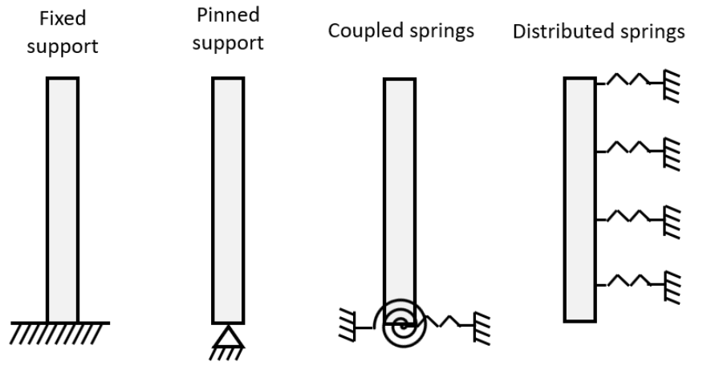
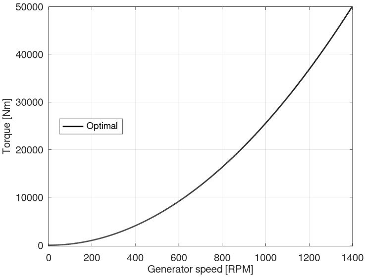
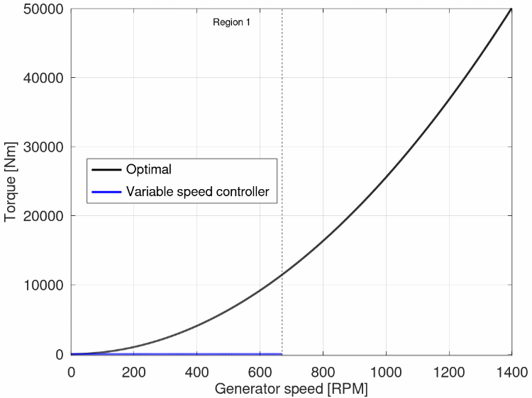
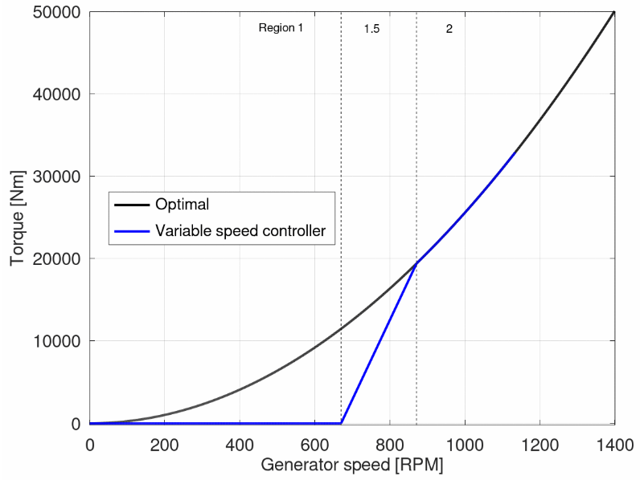
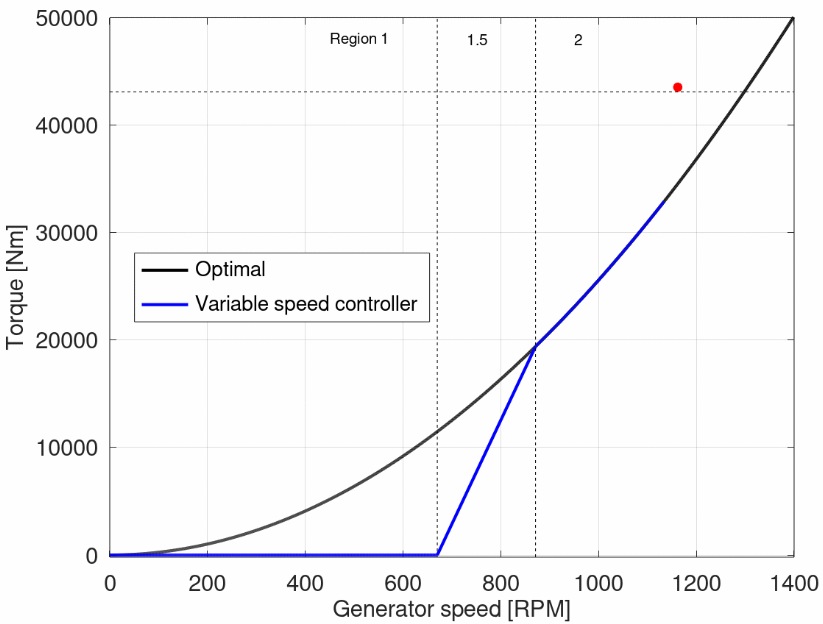
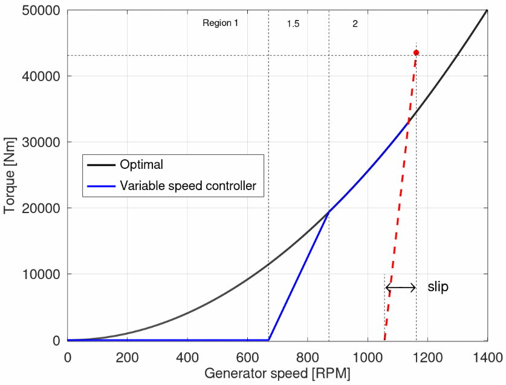

 
 
 
 
 
 
 
 
 

 
 
 
 
 
 
 
 
 

# 目录
- [HawtC2 Theory Manual](#hawtc2-theory-manual)
- [目录](#目录)
  - [引言](#引言)
  - [1 术语缩略表](#1-术语缩略表)
  - [2 气动力](#2-气动力)
    - [2.1 风场(WindL)](#21-风场windl)
      - [2.1.1 风廓线幂律](#211-风廓线幂律)
      - [2.1.2 威布尔分布](#212-威布尔分布)
      - [2.1.3 湍流风](#213-湍流风)
      - [2.1.4 IEC极端事件](#214-iec极端事件)
      - [2.1.5 阶跃风](#215-阶跃风)
      - [2.1.6 线性风](#216-线性风)
    - [2.2 气动载荷(AeroL)](#22-气动载荷aerol)
      - [2.2.1 BEM算法](#221-bem算法)
        - [2.2.1.1 稳态BEM方法](#2211-稳态bem方法)
        - [2.2.1.2 非定常BEM方法](#2212-非定常bem方法)
        - [2.2.1.3 Glauert校正](#2213-glauert校正)
      - [2.2.2 支撑结构上的气动载荷](#222-支撑结构上的气动载荷)
      - [2.2.3 轮毂和机舱上的气动载荷](#223-轮毂和机舱上的气动载荷)
      - [2.2.4 塔影效应](#224-塔影效应)
        - [2.2.4.1 势流塔影模型](#2241-势流塔影模型)
        - [2.2.4.2 Powles塔阴影模型](#2242-powles塔阴影模型)
      - [2.2.5 三维旋转效应](#225-三维旋转效应)
      - [2.2.6 气动系数插值](#226-气动系数插值)
  - [3 海洋动力学(HydroL)](#3-海洋动力学hydrol)
  - [4 结构动力学](#4-结构动力学)
    - [4.1 多体动力学(MBDL)](#41-多体动力学mbdl)
    - [4.2 有限元(FEML)](#42-有限元feml)
    - [4.3 非线性有限元梁(BeamL)](#43-非线性有限元梁beaml)
    - [4.4 支持结构动力学(SubFEML)](#44-支持结构动力学subfeml)
  - [5 岩土工程动力学(SoilL)](#5-岩土工程动力学soill)
    - [5.1 土壤刚度](#51-土壤刚度)
    - [5.2 线性弹簧模型](#52-线性弹簧模型)
    - [5.3 阻尼-缓冲器模型](#53-阻尼-缓冲器模型)
    - [5.4 非线性弹簧模型](#54-非线性弹簧模型)
  - [6 控制理论(ControL)](#6-控制理论control)
        - [最优控制曲线](#最优控制曲线)
        - [区域 1](#区域-1)
        - [区域 1.5](#区域-15)
        - [区域 2](#区域-2)
        - [区域 2.5](#区域-25)
        - [区域 3](#区域-3)
  - [7 疲劳与极限载荷后处理(PostL)](#7-疲劳与极限载荷后处理postl)
  - [8 多目标优化(MoptL)](#8-多目标优化moptl)
  - [9 应用程序接口(APIL)](#9-应用程序接口apil)
  - [致谢:](#致谢)
  - [参考文献：](#参考文献)

## 引言

## 1 术语缩略表

## 2 气动力

### 2.1 风场(WindL)

#### 2.1.1 风廓线幂律
#### 2.1.2 威布尔分布
#### 2.1.3 湍流风
#### 2.1.4 IEC极端事件
#### 2.1.5 阶跃风
#### 2.1.6 线性风

### 2.2 气动载荷(AeroL)

#### 2.2.1 BEM算法

##### 2.2.1.1 稳态BEM方法

##### 2.2.1.2 非定常BEM方法

##### 2.2.1.3 Glauert校正

#### 2.2.2 支撑结构上的气动载荷

#### 2.2.3 轮毂和机舱上的气动载荷

#### 2.2.4 塔影效应

##### 2.2.4.1 势流塔影模型

##### 2.2.4.2 Powles塔阴影模型

#### 2.2.5 三维旋转效应

#### 2.2.6 气动系数插值

## 3 海洋动力学(HydroL)

## 4 结构动力学

### 4.1 多体动力学(MBDL)

### 4.2 有限元(FEML)

### 4.3 非线性有限元梁(BeamL)

### 4.4 支持结构动力学(SubFEML)

## 5 岩土工程动力学(SoilL)
有多种方法可以使用HawtC2模型化土壤与结构的相互作用。最简单的方法（例如固定结构或线性弹簧）可以通过模板进行建模，而更复杂的模型（例如 PISA 模型或滞回阻尼）可以通过导入支撑结构进行建模。还可以通过阻尼器来建模阻尼效果。在HawtC2中，弹簧被建模为“支撑力”。支撑可以应用于支撑结构的任何节点（不一定在海床下方）。同样地，阻尼器也可以添加到任何节点上。即使通常用它们来模拟土壤与结构的相互作用，也可以用它们来模拟任何其他需要弹簧或阻尼器的效果。Jonkman 等人 [Jonkman et al. (2010k)]给出了简单岩土工程模型的概述,下图显示了一些可以在HawtC中建模的简单模型。
 

 

### 5.1 土壤刚度
当支撑结构的一部分位于地下时，可以对土壤刚度（包括平移和旋转刚度）进行建模。支撑结构（例如单桩或桁架塔）的参数“土壤刚度”定义了将施加到地下节点的载荷。施加到节点上的载荷可以定义为:
$${F(t)}=k_s \cdot \eta(t) \cdot\left(L_u /2+L_d /2\right)$$ 
 其中: 
 - $k_s$ 是土壤刚度, 单位为 $\mathrm{N} \cdot \mathrm{m}^{-2}$ 对于土壤的平移刚度,单位是: $\mathrm{N} \cdot \mathrm{rad}^{-1}$ 是对于土壤的旋转刚度
 - $\quad\eta(t)$ 是节点的位移
 - $L_u$ and $L_d$ 是节点上方和下方元素的长度，如果它们仍然在地面以下。例如，如果节点位于海底，则只有节点下方的元素对该方程有贡献
在SoilL的代码中，土壤刚度被建模为节点上的线性弹簧。因此弹簧的刚度可以计算为
$$k=k_s \cdot\left(L_u /2+L_d /2\right)$$
eg:
土壤（线性）刚度默认为:$k_s=500000\mathrm{~N} \cdot \mathrm{~m}^{-2}$,所有元件的长度L=5 m。因此，土壤刚度为:
$$k=500000\mathrm{~N} \cdot \mathrm{~m}^{-2} \cdot\left(5 /2+5 /2\right)=250000\mathrm{~N} \cdot \mathrm{~m}^{-2}$$
请注意，对于海床上的节点，如前所述，只有节点下方的单元会对土壤刚度产生贡献。因此，施加到海床节点的弹簧刚度将是前一个示例中节点弹簧刚度的一半.

### 5.2 线性弹簧模型
在SoilL 当中,线性弹簧应用于节点，并作为支撑力进行建模，其刚度为 N/m（平移弹簧）或 N/rad（旋转弹簧）。当弹簧作用于节点时，该节点将承受载荷:
$$L_i=K \cdot d_i$$
其中:
- $L_i$是沿与自由度 相对应方向的载荷（力或力矩） 
- $K$是弹簧刚度
- $d_i$是节点的位移（或旋转）

### 5.3 阻尼-缓冲器模型
在SoilL 当中,阻尼可建模为非线性荷载。阻尼因子可以作为参数包括在支撑结构部分，或者在定义导入结构的支撑结构文本文件中。阻尼荷载计算如下
$$L=D_f \cdot V$$
其中:
- $L$是施加到节点上的阻尼负载的大小
- $D_f$是阻尼因子
- $V$是节点速度的大小

显然的是阻尼载荷施加于节点速度的相反方向。

### 5.4 非线性弹簧模型
HawtC2 提供了实现非线性弹簧的功能，即弹簧的刚度取决于节点的位移。非线性弹簧可以用作平移弹簧或旋转弹簧。非线性弹簧以位移与力的查找表形式（所谓的 P-y 曲线）输入到描述导入的支撑结构的文本文件中。当一个节点发生位移时，其会受到一个与位移在弹簧方向上的投影值相对应的力，并且该力的方向与位移方向相反。如果位移介于查找表中的两个值之间，力将在最接近的值之间进行线性插值。下图展示了一个 P-y 曲线的示例：
 

 
非线性弹簧可以应用于所有六个自由度，这使得PISA模型(Byrne, Byron W., Harvey J. Burd, Lidija Zdravković, Ross A. McAdam, David M. G. Taborda, Guy T. Houlsby, Richard J. Jardine, Christopher M. Martin, David M. Potts, and Kenneth G. Gavin. “PISA: New Design Methods for Offshore Wind Turbine Monopiles.” Revue Française de Géotechnique, no. 158 (2019): 3. https://doi.org/10.1051/geotech/2019009.)得以在代码当中实现
当非线性弹簧应用于模型时，如果查找表包含如下定义的力$F$和位移$d$为:

$$F=\left[F_1, F_2, F_3\cdots F_n\right]$$
$$d=\left[d_1, d_2, d_3\cdots d_n\right]$$
然后对于位移  $d_x$ 使得  $d_i \leq d_x<d_{i+1}$, 刚度 $K\left(d_x\right)$ 被定义为:

$$K\left(d_x\right)=\frac{F_{i+1}-F_i}{d_{i+1}-d_i}$$
相同的定义适用于非线性旋转弹簧：旋转刚度是通过表中的力矩和旋转位移计算所得

## 6 控制理论(ControL)
本节说明可变速部分中的参数如何定义发电机的转矩与RPM曲线。转矩与RPM曲线描述了发电机转矩与发电机RPM的关系。为了说明可变速部分的参数如何定义该曲线，这里我们将以NREL 5MW 涡轮机的发电机为例，其定义可参见Jonkman 等人(Jonkman, Jason M., S. Butterfield, Walt Musial, and G. Scott. “Definition of a 5-MW Reference Wind Turbine for Offshore System Development.” NREL, February 2009.)。
##### 最优控制曲线
在这里我们假设涡轮机始终在最佳条件下工作，这意味着产生的功率由以下公式给出：

$$P=\frac{1}{2} \cdot C_{P, \max } \rho A v^3$$
其中:
- $C_{P, \max }$是最大功率系数
- $\rho$是空气密度
- $A$是转子的投影面积
- $v$是是风速

我们现在将尖速比纳入方程中。尖速比定义为$T S R=\frac{\frac{2\pi \omega_r}{60} r}{v}$ ，其中$\omega_r$是转子的旋转速度，以每分钟转数（RPM）表示，$r$是转子的半径。
NREL 5 兆瓦涡轮的变速箱比为 97,因此TSR可以用发电机转速表示为$T S R=\frac{2\pi \omega_g \cdot r}{97\cdot60\cdot v}$通过用风力系数表达风速，并将该表达式代入功率方程，我们可以得到:
$$P=\frac{1}{2} \cdot C_{P, \max } \rho A\left(\frac{2\pi \cdot r}{97\cdot60T S R}\right)^3\cdot \omega_g^3$$

功率和发电机扭矩$T$通过公式$P=T \cdot \omega_g \frac{60}{2\pi}$关联（注意在这个公式中转速必须以$rad \cdot s^{-1}$给出）. 这得出了最佳扭矩的以下公式:
$$T_{o p t}=K_{o p t} \cdot \omega_g^2$$
$$\quad K_{o p t}=\frac{1}{2} \cdot C_{P, \max } \rho A\left(\frac{r}{97\cdot T S R}\right)^3\left(\frac{2\pi}{60}\right)^2$$

从文献当中可以获取$K_{\text {opt }}=0.02557N m \cdot R P M^{-2}$这给出了以下最佳扭矩曲线，即一种策略对应的曲线，在该策略中始终实现最佳功率系数：
 

 

##### 区域 1
对于低转速情况下，发电机不会产生任何扭矩。这个转速范围被称为区域 1，对NREL 5MW 而言，该范围是 0 到 670 RPM。在这一区域内，发电机的扭矩与RPM曲线将是平坦的，如下图所示：
 

 
第一区域的上限由参数 "Transition RPM region 1 to 1.5" 给出，并定义为额定发电机速度的百分比。对于 NREL 5 MW 风机，额定发电机速度为 1173.7 RPM，因此 "Transition RPM region 1 to 1.5" 参数的值将为 57.08%。下限始终为 0。

##### 区域 1.5
在区域 1.5 中，曲线从 0 线性变化到最佳扭矩曲线。对于 NREL 5 MW 涡轮机，区域 1.5 的上限为 871 RPM，其对应的曲线如下：
 

 
区域 1.5 的上限由参数“Transition RPM region 1.5 to 12”给出，并定义为额定发电机速度的百分比。对于 NREL 5 MW 涡轮机，额定发电机速度为 1173.7 rpm，因此“Transition RPM region 1.5 to 12”参数的值为 74.21%。

##### 区域 2
在区域 2 中，曲线遵循最优转矩曲线，因此涡轮机在最大功率系数下运行。曲线将如下所示：
 

 
区域 2 的上限定义为区域 2.5 的下限，其将在下一部分进行计算。$K_opt$的值确定最佳曲线的系数由比例因子区域 2 参数给出，并定义为额定转矩与额定转速平方的比率的百分比。由于额定转速为 1173.7，额定转矩为 43093 Nm，我们此前发现:$k_{\text {opt }}=0.02557N m \cdot R P M^2$ ，这意味着比例因子区域 2 参数将为: $0.02557/ \frac{43093}{1173.7^2}=81.76\%$

##### 区域 2.5
区域 2.5 是另一个线性区域。在 NREL 5MW 案例中，其上限对应 99%。由于这是到区域 3 的过渡点，此点产生的功率将等于额定功率。请注意，这里我们讨论的是机械功率，而不是电功率。两者之间的区别在于发电机效率。在 NREL 5MW 风机的情况下，额定电功率为 5MW，发电机效率为 94.4%，因此额定机械功率为 5.29661MW。在区域 2.5 的上限处产生的扭矩因此为 43528 Nm。注意，这是额定扭矩的 1%更高，因为我们在额定速度的 99%生产额定功率。
下图中显示了区域 2.5 的上限为一个红点，额定扭矩为一条水平虚线。
 

 

为了找到区域 2.5 的下限，首先计算线性曲线的斜率，使其在对应于发电机滑差的转速下与 x 轴相交。在 NREL 5 MW 的情况下，发电机滑差为 10%，这意味着区域 2.5 的线性曲线将在比额定转速低 10%的转速处与 x 轴相交，即 1056.33 RPM。这在下图中通过红色虚线进行了说明：
 

 

区域 2.5 的下限（同时也是区域 2 的上限）被设定为红线与最佳扭矩曲线的交点，如下面的图所示：
 

 

区域 2.5 的上限由参数“区域 2.5 至 3 的转速过渡点”定义，作为额定速度的百分比。区域 2.5 的斜率基于上述解释的滑差参数计算。
##### 区域 3
在区域 3 中，叶片开始调整桨距以保持恒定的功率输出。根据之前建立的关系，该区域的转矩定义为 转矩与转速的关系曲线如下所示：
 

 

## 7 疲劳与极限载荷后处理(PostL)

## 8 多目标优化(MoptL)

## 9 应用程序接口(APIL)

## 致谢:

## 参考文献：
